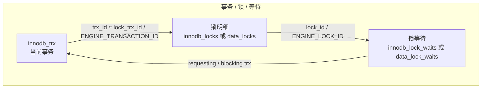

线上出现「语句一直转圈」「连接数暴涨」时，往往需要同时看：**谁在跑、等了什么锁、谁在挡路**。InnoDB 把事务与锁的信息暴露在系统表（及 8.0 起的 Performance Schema）里，再结合 **MVCC** 能理解「为什么同一行在不同会话里看到不同版本」。下文与站内 [MySQL 进阶：架构与存储](/post/20311105.html) 可对照阅读。

## MySQL 主版本差异（与本文相关）

自 **MySQL 8.0.1** 起，`information_schema` 中的 **`INNODB_LOCKS`、`INNODB_LOCK_WAITS` 已移除**，锁与等待改查 **`performance_schema.data_locks`**、**`data_lock_waits`**（见[官方手册](https://dev.mysql.com/doc/refman/8.0/en/performance-schema-data-lock-waits-table.html)）。**`INNODB_TRX`** 在 8.0 仍位于 `information_schema`。

| 版本线      | 事务                            | 锁与等待                                           | 锁等待诊断                                            |
| ----------- | ------------------------------- | -------------------------------------------------- | ----------------------------------------------------- |
| **5.5–5.7** | `information_schema.innodb_trx` | `innodb_locks`、`innodb_lock_waits`                | 下文「5.5–5.7」脚本可直接用（权限与 `sql_mode` 另说） |
| **8.0+**    | `information_schema.innodb_trx` | `performance_schema.data_locks`、`data_lock_waits` | 优先 **`sys.innodb_lock_waits`**；或自写 PFS 联表     |

**`sql_mode`**（如 `ONLY_FULL_GROUP_BY`）会影响 `GROUP BY` 等语句是否报错，与「大版本」正交，巡检 SQL 若报错可先查实例配置。

## 诊断表关系（5.x 与 8.0+）



- 等锁时，`innodb_trx.trx_requested_lock_id` 可与旧版 `innodb_locks.lock_id` 对齐；8.0 则通过 `data_lock_waits` 与 `data_locks` 的 `ENGINE_LOCK_ID` 关联。
- 等待表描述 **谁在等谁**（requesting ↔ blocking）。

### INNODB_TRX：常用字段

| 字段                    | 含义                                 | 备注                                                |
| ----------------------- | ------------------------------------ | --------------------------------------------------- |
| `trx_id`                | 事务 ID                              | 与锁表、MVCC 版本链中的事务标识相关                 |
| `trx_state`             | 运行状态                             | 含 `LOCK WAIT` 等                                   |
| `trx_started`           | 事务开始时间                         | 用于长事务判断                                      |
| `trx_requested_lock_id` | 等待中的锁 ID                        | 等锁时非空（5.x 与 `innodb_locks` 联用）            |
| `trx_wait_started`      | 开始等待锁的时间                     | —                                                   |
| `trx_rows_locked`       | 估算的锁行数                         | 近似值；含 delete-marked 等边界情况                 |
| `trx_rows_modified`     | 本事务修改行数                       | 与 `trx_weight` 等一起参与事务代价评估              |
| `trx_tables_locked`     | 当前语句涉及的「表级锁结构」相关计数 | **不是**行锁总行数；行级规模看 `trx_rows_locked` 等 |
| `trx_lock_structs`      | 锁结构数量                           | 可含间隙锁、next-key 等                             |
| `trx_mysql_thread_id`   | 对应 `PROCESSLIST.ID`                | 用于 `KILL`                                         |
| `trx_query`             | 当前 SQL                             | 事务空闲时可能为空                                  |

长事务、大量锁会拖慢 **purge**，可能推高 **History list length** 与 undo 占用，需结合 `SHOW ENGINE INNODB STATUS` 与监控判断。

### 5.x `innodb_locks` 与 8.0 `data_locks`（手册差异）

据 [MySQL 8.0 手册](https://dev.mysql.com/doc/refman/8.0/en/performance-schema-data-locks-table.html)：在 5.x 的 **`INNODB_LOCKS`** 中，若某事务已持有锁，**仅当另有事务在等待该锁时**才会显示该锁；**`data_locks`** 则会列出**已持有或正在等待**的锁（并带 `LOCK_STATUS` 等），信息更全。

## MVCC 与隔离级别

**多版本并发控制**（MVCC，Multi-Version Concurrency Control）的目标可以记成一句话：**尽量让普通读不必一直等写、写也不必一直等读**。做法是：对每一行逻辑上保留多个**历史版本**（存在 undo 里），读的时候只根据**快照（Read View）**判断「这一条版本该不该被本次读看见」，而不是跟着别人的未提交修改跑。

下面用「隐藏列 → 版本链 → Read View → 可见性 → 数字例子 → purge」的顺序拆开说；具体字段名与判断顺序以 InnoDB 源码与[官方手册](https://dev.mysql.com/doc/refman/8.0/en/innodb-multi-versioning.html)为准，这里保证**直觉与主线正确**。

### 隐藏列：每一行多存了什么

业务表上每一行在引擎里还会带若干**隐藏字段**（概念上常记为）：

- **`DB_TRX_ID`**：最近一次修改该行**当前聚簇索引记录版本**的事务 ID（全局递增，如 100、101、102…）。
- **`DB_ROLL_PTR`**：回滚指针，指向 **undo log** 里**上一版本**的位置，用来沿链往回找旧值。
- **`DB_ROW_ID`**：表没有合适主键时，InnoDB 可能生成的隐式行 ID（有主键/唯一键时你通常感觉不到它）。

可以把它想成：相册里每一页除了画面，还有标签「最后谁改的」和「上一张底片在仓库哪一格（undo）」。

### 版本链：Undo 怎么串起来

举例：一行 `id=1`，初始由**事务 50**插入，`name='张三'`。

- **事务 100** 执行 `UPDATE` 把 `name` 改成「李四」并提交时，大致会发生：把旧内容写入 **undo**，当前记录改为「李四」，**`DB_TRX_ID=100`**，回滚指针指向 undo 里那份「张三」。
- 若**事务 120** 再改成「王五」，undo 里再挂一节，链从新到旧更长。

读操作**不修改**这条链上的数据，只在需要时从**最新版本**出发，沿 `DB_ROLL_PTR` 往旧版本走，直到找到**对当前 Read View 可见**的那一版。

### Read View：快照里记了什么

做 **一致性读**（普通 `SELECT` 的快照语义）时，InnoDB 会构造 **Read View**，可简化理解成「在某一时刻，系统里哪些事务还没结束」的一张清单，外加几个边界 ID。常见教程会用下面三个量（名字与不同资料/源码符号可能略有出入，**对应关系以「活跃事务 + 上下界」理解即可**）：

- **`up_limit_id`**：快照创建时，**活跃事务 ID 里偏小的那一侧边界**（可粗想成：比它还小的 trx_id，对应版本多半是「快照前已提交」的）。
- **`low_limit_id`**：快照创建时，**下一个将要分配的事务 ID**（可粗想成：大于等于它的 trx_id，属于快照之后才出现的事务）。
- **`m_ids`**：快照创建时**仍在活跃（未提交）**的事务 ID 集合。

比喻：像在某一时刻拍了一张「当时还有谁没交卷」的合影；以后读数据时，用这张照片决定「哪些别人提交的版本我能看见」。

### 可见性判断（沿版本链从新到旧）

对当前候选版本的事务 ID（行内常记为 **DB_TRX_ID**，下文简写为 **T**），典型判断顺序可记成（**实现上的分支顺序以引擎为准**，此处便于手算）：

1. **T** 等于当前读请求所在事务自己的 `trx_id` → 一般视为**自己的修改**，可见。
2. **T** 小于 `up_limit_id` → 多半表示该版本在快照的「稳定区」，**可见**。
3. **T** 落在 `m_ids` 里 → 快照时仍未提交的事务产生的版本，**不可见**，沿 undo 找更旧版本。
4. **T** 大于等于 `low_limit_id` → 快照之后才出现的事务，**不可见**，继续找旧版本。

若整条链都找不到可见版本，结果就表现为「这一行对本次读不可见」或空（视查询条件而定）。

### 数字走读：RR 与 RC 差在哪

下面数字**只为演示规则**，与真实分配 trx_id、活跃集合的时机可能略有出入，以「跟一遍逻辑」为主。

假设表上 `id=1` 当前**已提交**的最新一行是事务 **100** 改的：`name='李四'`，`DB_TRX_ID=100`。

- **事务 A**（`trx_id=200`）第一次执行一致性读 `SELECT ... WHERE id=1`，此时创建 Read View。假定快照时刻活跃事务只有 **180、190**（示意），则：
  - `up_limit_id = 180`
  - `low_limit_id = 201`（下一个将分配的 trx_id）
  - `m_ids = {180, 190}`

  对当前版本 `T=100`：有 `100 < 180` → **可见**，A 读到「李四」。

- 接着 **事务 B**（`trx_id=210`）执行 `UPDATE ... SET name='王五'` **并提交**。聚簇索引上最新版本变为 `T=210`，「王五」。

- **事务 A** 第二次 `SELECT`：
  - **RR（默认可重复读）**：**复用**第一次的 Read View。对 `T=210`：`210` 不在 `m_ids`，且 `210 ≥ 201` → 按规则应视为不可见；沿 undo 找到旧版本 `T=100`，`100 < 180` → **仍可见「李四」**。这就是「同一事务内多次读一致」。
  - **RC（读已提交）**：**每次一致性读新建** Read View，新快照里活跃集合与边界已变化，通常能见到 B **已提交**的「王五」。

结论：**RR 与 RC 的关键差异**就是 **Read View 何时创建、是否复用**；顺带区分「一致性读」与 `SELECT ... FOR UPDATE` 等**锁定读**（后者不走这套纯快照语义）。

### purge：为什么要后台清理

旧版本占着 undo，不能无限堆。**purge 线程**在「没有任何 Read View 还需要某段旧版本」之后，才能真正回收，腾出空间。若**长事务**长时间不结束，老快照一直存在，可能推高 **History list length**、undo 膨胀，与上文「锁与长事务」一节的问题会叠在一起。

### 隔离级别与读行为（速览）

| 级别             | 快照读（概念）                 | 备注                                |
| ---------------- | ------------------------------ | ----------------------------------- |
| READ UNCOMMITTED | 语义上允许脏读                 | 一般不依赖完整 MVCC 快照语义        |
| READ COMMITTED   | 每次一致性读常建新快照         | 可读到别的事务新提交的版本          |
| REPEATABLE READ  | 事务内首次一致性读建快照并复用 | InnoDB 默认；幻读场景还涉及间隙锁等 |
| SERIALIZABLE     | 普通 `SELECT` 常为锁定读       | 与纯 MVCC 快照读行为不同            |

**锁定读**（`SELECT ... FOR UPDATE` / `LOCK IN SHARE MODE`）按锁语义访问当前版本，与上表「普通一致性读」不是同一条路径。

## 巡检 SQL

### 5.5–5.7（`information_schema`）

默认只生成 `KILL` 建议，**不自动执行**；阈值与排除用户可按环境修改。

```sql
/* 长事务 / 锁等待 / 长 Sleep — 5.5–5.7，仅生成 KILL 建议 */

SET @AGE_SEC_LONG_XACT := 300;
SET @SLEEP_SEC_LONG    := 300;
SET @LIMIT_ROWS        := 200;
SET @EXCLUDE_USERS     := 'repl,mysql.sys,system user';

DROP TEMPORARY TABLE IF EXISTS tmp_ex_users;
CREATE TEMPORARY TABLE tmp_ex_users(user_name VARCHAR(128) PRIMARY KEY);
INSERT INTO tmp_ex_users(user_name)
SELECT TRIM(SUBSTRING_INDEX(SUBSTRING_INDEX(@EXCLUDE_USERS, ',', n), ',', -1)) AS u
FROM (
  SELECT 1 n UNION SELECT 2 UNION SELECT 3 UNION SELECT 4 UNION SELECT 5
) t
WHERE TRIM(SUBSTRING_INDEX(SUBSTRING_INDEX(@EXCLUDE_USERS, ',', n), ',', -1)) <> '';

/* 1) 长事务 */
SELECT
  t.trx_id,
  t.trx_mysql_thread_id AS thread_id,
  t.trx_state,
  t.trx_started,
  TIMESTAMPDIFF(SECOND, t.trx_started, NOW()) AS trx_age_sec,
  t.trx_rows_locked,
  t.trx_rows_modified,
  p.USER, p.HOST, p.DB, p.COMMAND,
  p.TIME AS pl_time_sec,
  p.STATE,
  LEFT(p.INFO, 1024) AS sql_sample
FROM information_schema.innodb_trx t
LEFT JOIN information_schema.PROCESSLIST p ON p.ID = t.trx_mysql_thread_id
LEFT JOIN tmp_ex_users ex ON ex.user_name = p.USER
WHERE TIMESTAMPDIFF(SECOND, t.trx_started, NOW()) > @AGE_SEC_LONG_XACT
  AND (ex.user_name IS NULL OR p.USER IS NULL)
ORDER BY trx_age_sec DESC
LIMIT @LIMIT_ROWS;

SELECT
  CONCAT('KILL ', t.trx_mysql_thread_id, ';') AS kill_stmt,
  t.trx_id, t.trx_state,
  TIMESTAMPDIFF(SECOND, t.trx_started, NOW()) AS trx_age_sec,
  p.USER, p.HOST, p.DB, p.COMMAND, p.STATE
FROM information_schema.innodb_trx t
JOIN information_schema.PROCESSLIST p ON p.ID = t.trx_mysql_thread_id
LEFT JOIN tmp_ex_users ex ON ex.user_name = p.USER
WHERE TIMESTAMPDIFF(SECOND, t.trx_started, NOW()) > @AGE_SEC_LONG_XACT
  AND (ex.user_name IS NULL)
ORDER BY trx_age_sec DESC
LIMIT @LIMIT_ROWS;

/* 2) 锁等待链 */
SELECT
  r.trx_id AS waiting_trx_id,
  r.trx_mysql_thread_id AS waiting_thread,
  TIMESTAMPDIFF(SECOND, r.trx_started, NOW()) AS waiting_trx_age_sec,
  b.trx_id AS blocking_trx_id,
  b.trx_mysql_thread_id AS blocking_thread,
  TIMESTAMPDIFF(SECOND, b.trx_started, NOW()) AS blocking_trx_age_sec
FROM information_schema.innodb_lock_waits w
JOIN information_schema.innodb_trx r ON r.trx_id = w.requesting_trx_id
JOIN information_schema.innodb_trx b ON b.trx_id = w.blocking_trx_id
ORDER BY blocking_trx_age_sec DESC
LIMIT @LIMIT_ROWS;

SELECT DISTINCT
  CONCAT('KILL ', b.trx_mysql_thread_id, ';') AS kill_stmt,
  b.trx_id,
  TIMESTAMPDIFF(SECOND, b.trx_started, NOW()) AS trx_age_sec,
  p.USER, p.HOST, p.DB, p.COMMAND, p.STATE
FROM information_schema.innodb_lock_waits w
JOIN information_schema.innodb_trx b ON b.trx_id = w.blocking_trx_id
LEFT JOIN information_schema.PROCESSLIST p ON p.ID = b.trx_mysql_thread_id
LEFT JOIN tmp_ex_users ex ON ex.user_name = p.USER
WHERE ex.user_name IS NULL OR p.USER IS NULL
ORDER BY trx_age_sec DESC
LIMIT @LIMIT_ROWS;

/* 3) 长时间 Sleep */
SELECT
  p.ID AS thread_id, p.USER, p.HOST, p.DB, p.COMMAND,
  p.TIME AS sleep_sec, p.STATE, LEFT(p.INFO, 1024) AS last_sql
FROM information_schema.PROCESSLIST p
LEFT JOIN tmp_ex_users ex ON ex.user_name = p.USER
WHERE p.COMMAND = 'Sleep'
  AND p.TIME > @SLEEP_SEC_LONG
  AND (ex.user_name IS NULL)
ORDER BY p.TIME DESC
LIMIT @LIMIT_ROWS;

SELECT
  CONCAT('KILL ', p.ID, ';') AS kill_stmt,
  p.USER, p.HOST, p.DB, p.TIME AS sleep_sec
FROM information_schema.PROCESSLIST p
LEFT JOIN tmp_ex_users ex ON ex.user_name = p.USER
WHERE p.COMMAND = 'Sleep'
  AND p.TIME > @SLEEP_SEC_LONG
  AND (ex.user_name IS NULL)
ORDER BY p.TIME DESC
LIMIT @LIMIT_ROWS;

SHOW VARIABLES LIKE 'version%';
SHOW ENGINE INNODB STATUS\G

DROP TEMPORARY TABLE IF EXISTS tmp_ex_users;
```

### 8.0+（锁等待）

**首选**安装 **`sys`** 后使用视图（列名以实例为准）：

```sql
SELECT
  waiting_trx_id,
  waiting_pid,
  waiting_query,
  blocking_trx_id,
  blocking_pid,
  blocking_query,
  wait_age_secs
FROM sys.innodb_lock_waits
ORDER BY wait_age_secs DESC
LIMIT 50;
```

自联 `performance_schema` 时，`data_lock_waits` **没有** `wait_started` 一类字段；阻塞侧锁详情通过 **`BLOCKING_ENGINE_LOCK_ID`** 与 **`data_locks.ENGINE_LOCK_ID`** 关联（并带上 **`ENGINE = 'INNODB'`**）。与 `innodb_trx` 关联时用手册建议的 **`ENGINE_TRANSACTION_ID` ↔ `trx_id`**：

```sql
SELECT
  lw.REQUESTING_ENGINE_TRANSACTION_ID  AS waiting_trx_id,
  lw.REQUESTING_THREAD_ID,
  lw.BLOCKING_ENGINE_TRANSACTION_ID      AS blocking_trx_id,
  dl.LOCK_MODE,
  dl.LOCK_TYPE,
  dl.LOCK_STATUS,
  dl.LOCK_DATA,
  b_trx.trx_mysql_thread_id              AS blocking_mysql_thread,
  b_trx.trx_query                        AS blocking_query
FROM performance_schema.data_lock_waits lw
JOIN information_schema.innodb_trx b_trx
  ON lw.BLOCKING_ENGINE_TRANSACTION_ID = b_trx.trx_id
JOIN performance_schema.data_locks dl
  ON lw.BLOCKING_ENGINE_LOCK_ID = dl.ENGINE_LOCK_ID
 AND lw.ENGINE = dl.ENGINE
WHERE lw.ENGINE = 'INNODB'
LIMIT 50;
```

长事务与 Sleep 段仍可沿用上一节 **`innodb_trx` + `PROCESSLIST`** 的思路。

```sql
SHOW ENGINE INNODB STATUS\G
-- 表级元数据锁等待（与 InnoDB 行锁不同场景）
SELECT * FROM sys.schema_table_lock_waits;
```

## 核心要点

- **5.x**：`innodb_trx` → `innodb_locks` / `innodb_lock_waits` → `PROCESSLIST`；**8.0+** 行锁改 **`data_locks` / `data_lock_waits`**，优先 **`sys.innodb_lock_waits`**。
- **`trx_tables_locked` 不是行锁总数**；规模可看 `trx_rows_locked`、`trx_lock_structs` 等（均为诊断用近似）。
- **MVCC**：**RR** 在事务内首次一致性读建立快照并复用；**RC** 每次一致性读新快照。
- **`KILL` 前确认会话**，优先缩短事务、优化 SQL 与索引，而非依赖线上频繁杀连接。
