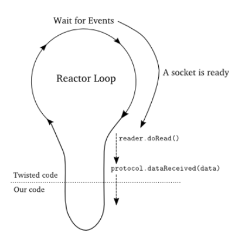

### 1.介绍

​	熟悉scrpay爬虫框架的人，对Twisted应该不太陌生，scrapy底层请求就是基于Twisted框架实现的。

​	**官方定义：**

Twisted is an event-based framework for internet applications, supporting Python 2.7 and Python 3.5+. It includes modules for many different purposes, including the following:

- `twisted.web`: HTTP clients and servers, HTML templating, and a WSGI server
- `twisted.conch`: SSHv2 and Telnet clients and servers and terminal emulators
- `twisted.words`: Clients and servers for IRC, XMPP, and other IM protocols
- `twisted.mail`: IMAPv4, POP3, SMTP clients and servers
- `twisted.positioning`: Tools for communicating with NMEA-compatible GPS receivers
- `twisted.names`: DNS client and tools for making your own DNS servers
- `twisted.trial`: A unit testing framework that integrates well with Twisted-based code.

Twisted supports all major system event loops -- `select` (all platforms), `poll` (most POSIX platforms), `epoll` (Linux), `kqueue` (FreeBSD, macOS), IOCP (Windows), and various GUI event loops (GTK+2/3, Qt, wxWidgets). Third-party reactors can plug into Twisted, and provide support for additional event loops.

### 2.核心模块：

#### 2.1 reactor模式

1. 我们的代码与Twisted代码运行在同一个线程中。
2. 当我们的代码运行时，Twisted代码是处于暂停状态的。
3. 同样，当Twisted代码处于运行状态时，我们的代码处于暂停状态。
4. reactor事件循环会在我们的回调函数返回后恢复运行。
5. 在一个回调函数执行过程中，实际上Twisted的循环是被有效地阻塞在我们的代码上的。因此，**我们应该确保回调函数不要浪费时间（尽快返回）**。特别需要强调的是，我们应该尽量避免在回调函数中使用会阻塞I/O的函数。否则，我们将失去所有使用reactor所带来的优势
#### 注意
1. Twisted的reactor只有通过调用reactor.run()才启动。
2. reactor循环是在其开始的线程中运行，也就是运行在主线程中。
3. 一旦启动，reactor就会在程序的控制下（或者具体在一个启动它的线程的控制下）一直运行下去。
4. reactor空转时并不会消耗任何CPU的资源。
5. 并不需要显式的创建reactor，只需要引入就OK了。
#### 2.2.twisted抽象层之Transpotts对象

​		一个Twisted的Transport对象具体代表-个可以收发字节的单条连接。其实也就是代表一个TCP或UDP的套接字连接的抽象，每一次数据的收发就是一 次具体 的/O操作。因此twisted其实就是通过利用/O多路复用控制每一个套接字的每次数据收发操作。实现的异步I/O，这也是前面几个模块(asyncio、tornado等)的底层 原理, ;只不过twisted将其开放出来，可供我们直接控制。但是一般情况下， 我们不会自己实现一个Transport, 而是直接使用twisted已经帮我们实现的类。

#### 2.3.**twisted抽象层之Protocols对象**

​		Protocols对象代表的就是一个Transports对象的连接所对应的协议的抽象，比如HTTP、FTP或自定义协议等协议，为一个具体的连接提供协议解析。程序每建立一条连接， 都需要一个协议实例。 也就是说，每一个Transports对象都会有一 个Protocols对象。Twisted内部已经内置了许多Protocols协议对象，如后面将用到封装了HTTP协议的Protocols对象。

#### 2.4.twisted抽象层之Protocol Factories

​		由于我们可以自己定义Protocol类，并且要将其交给twisted来控制使用，因此twlsted需要一 种方式来为- -个新的连接创建- -个合适的协议。这就是Protocol Factores的作用。

####  2.5.twisted中的回调: Deferred

​	用于回调在异步程序中大量被使用，并且正确的使用这一-机制需要一-些技巧。因此，Twisted开 发者设计了一种抽象机制Deferred-让程序员在使用回调时更加简便。

https://twistedmatrix.com/documents/current/core/howto/defer.html
https://twistedmatrix.com/documents/current/api/twisted.internet.defer.html

###  一些方法

- reactor.callInThread： 可以新起一个线程，用来处理耗时逻辑，需注意线程安全

- reactor.callFromThread： 和上面相反，在别的线程调用，去回到reactor主线程执行逻辑

- threads.deferToThread： 将任务放到线程池去执行以免阻塞主线程，特点是返回的是deferred对象，这样我们可以加入回调逻辑

- reactor.suggestThreadPoolSize: 建议用于调度传递给IReactorInThreads.callInThread的函数的内部线程池的大小。

- getThreadPool：返回 IReactorInThreads.callInThread 使用的线程池，如有必要，请首先创建它

- reactor.run/stop 启动、停止主线程

- reactor.callLater 延迟执行

- reactor.callWhenRunning reactor运行之后运行...

- reactor.callFromRunning 立刻执行

- blockingCallFromThread：Run a function in the reactor from a thread, and wait for the result synchronously. If the function returns a [`Deferred`](https://twistedmatrix.com/documents/20.3.0/api/twisted.internet.defer.Deferred.html), wait for its result and return that.

- https://twistedmatrix.com/documents/current/api/twisted.internet.interfaces.IReactorThreads.html

- https://twistedmatrix.com/documents/current/core/howto/threading.html#auto3

- https://twistedmatrix.com/documents/current/core/howto/index.html

- https://twistedmatrix.com/documents/current/web/howto/client.html

