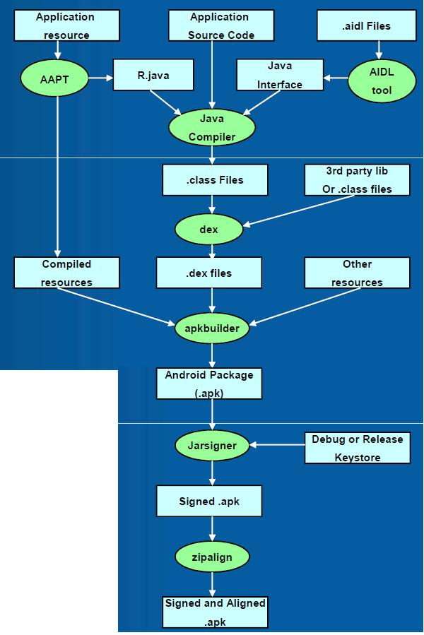

# apk文件认识

APK文件其实是zip格式，但后缀名被修改为apk。我们修改ZIP后缀名方式可以看到内部的文件结构，或者用压缩工具直接解压

## apk文件目录结构

- AndroidManifest.xml

    - 这里的AndroidManifest.xml就是源代码中的AndroidManifest.xml编译后所得到的文件。AndroidManifest.xml是安卓应用程序的全局配置文件，该文件保存了apk的包名，版本信息，sdk版本，Activity ,Service, Boardcast Receiver, Content Provider等应用组件的配置信息。还有程序所需要的权限也是在AndroidManifest.xml这个文件中声明的。

- classes.dex

    - 虽然Android开发的源语言是java，但是Android应用程序却不在标准的java虚拟机上运行。Google为Android平台专门设计了一套用于运行Android程序的虚拟机，这就是Dalvik虚拟机（Dalvik Virtual Machine）。而classes.dex就是运行在Dalvik虚拟机上的可执行文件。

    - 传统的Java程序，首先先把Java文件编译成class文件，字节码都保存在了class文件中，Java虚拟机可以通过解释执行这些class文件。

        而Dalvik虚拟机是在Java虚拟机进行了优化，执行的是Dalvik字节码，而这些Dalvik字节码是由Java字节码转换而来，一般情况下，Android应用在打包时通过AndroidSDK中的dx工具将Java字节码转换为Dalvik字节码。

        dx工具可以对多个class文件进行合并，重组，优化，可以达到减小体积，缩短运行时间的目的

- resources.arsc

    - 资源索引表, 记录资源文件和资源ID之间的映射关系

- res文件夹

    - 是resource的缩写，存放资源文件，存在这个文件夹下的所有文件都会映射到Android工程的.R文件中，生成对应的ID，访问的时候直接使用资源ID，即R.id.filename。
        res 文件夹下可以包含多个文件夹，其中

        anim存放动画文件；
        drawable目录存放图像资源；
        layout目录存放布局文件；
        values目录存放一些特征值，colors.xml存放color颜色值，dimens.xml定义尺寸值，string.xml定义字符串的值，styles.xml定义样式对象；
        xml文件夹存放任意xml文件，在运行时可以通过Resources.getXML()读取；
        raw是可以直接复制到设备中的任意文件，他们无需编译。

- META-INF文件夹

    - 保存应用的签名信息，签名信息可以验证APK文件的完整性。AndroidSDK在打包APK时会计算APK包中所有文件的完整性，并且把这些完整性保存到META-INF文件夹下，应用程序在安装的时候首先会根据META-INF文件夹校验APK的完整性，这样就可以保证APK中的每一个文件都不能被篡改。以此来确保APK应用程序不被恶意修改或者病毒感染，有利于确保Android应用的完整性和系统的安全性。

        META-INF目录下包含的文件有CERT.RSA，CERT.DSA，CERT.SF和MANIFEST.MF，其中CERT.RSA是开发者利用私钥对APK进行签名的签名文件，CERT.SF、MANIFEST.MF记录了文件中文件的SHA-1哈希值。

- lib

    - 存放应用程序依赖的native库文件，一般是用C/C++编写，这里的lib库可能包含4中不同类型，根据CPU型号的不同，大体可以分为ARM，ARM-v7a，MIPS，X86，分别对应着ARM架构，ARM-V7架构，MIPS架构和X86架构。

        不同的CPU架构对应着不同的目录，每个目录中可以放很多对应版本的so库，且这个目录的结构固定，用户只能按照这个目录存放自己的so库。目前市场上使用的移动终端大多是基于ARM或者ARM-V7a架构的，X86和MIPS架构的移动智能终端比较少，所以有些应用程序lib目录下只包含armeabi目录或者armeabi-v7a目录。

## apk文件生成的过程(https://blog.csdn.net/aha_jasper/article/details/104944929)

Android完整打包流程

1. aapt阶段：aapt工具编译res资源文件，把大部分xml文件编译成二进制文件（图片文件除外），同时生成

    R.Java文件和resources.arsc文件，里面保存了资源的ID和在APK中的路径。

2. aidl阶段：如果项目中有使用AIDL，那么就会把.aidl文件编译成.java文件。

3. javaCompiler阶段：将所有.java文件(包括R文件和AIDL生成的.java文件)，通过javac工具生成class文件。

4. dex阶段：将生成的.class文件和第三方库的.class文件通过dx工具生成classes.dex文件(如果有分包，那么可能有多个)。

5. apkBuilder阶段：aapt阶段中的资源文件、dex文件和第三方的非java资源包(.so)，通过apkbuilder工具生成未签名的apk包。

6. jarSigner阶段：签名，jarsigner工具，如果是debug模式用默认签名，release模式用开发者的签名。

7. zipAligin阶段：对齐，通过zipalign工具对apk中的未压缩资源（图片、视频）进行“对齐操作”，让资源按4字节的边界进行对齐，使得资源访问速度更快。

8. 流程图如下：



# AndroidManifest.xml 最全详解

原文：https://blog.csdn.net/u012486840/article/details/52468931

## 关于AndroidManifest.xml文件格式

在android的apk文件中的AndroidManifest.xml文件并不是普通的纯文本格式，无法用普通的文件编辑器打开。apk使用的AXML格式，之所以用这种格式是为了解决apk加载时的性能问题，二进制的AXML比纯文本相比，在分析处理的速度和内存占用都有明显的优势

## 概述

　AndroidManifest.xml清单文件是每个Android程序中必须的文件，它是整个Android程序的全局描述文件，除了能声明程序中的Activities，Content Providers，Services，和Intent Receivers，还能指定应用的名称、使用的图标、包含的组件以及permissions和instrumentation（安全控制和测试）。

## 文件基础结构

```
<?xmlversion="1.0"encoding="utf-8"?>
<manifest>
 
    <uses-sdk/> 
    <uses-configuration/> 
    <uses-feature/>  
 
    <uses-permission/>
    <permission/>
    <permission-tree/>
    <permission-group/>
    <instrumentation/> 
 
    <supports-screens/>
 
    <application> 
       <activity> 
           <intent-filter>
               <action/> 
               <category/> 
           </intent-filter> 
      </activity>
       <activity-alias> 
           <intent-filter></intent-filter> 
           <meta-data/> 
      </activity-alias> 
       <service> 
           <intent-filter></intent-filter> 
           <meta-data/> 
       </service>
       <receiver>
           <intent-filter></intent-filter> 
           <meta-data/> 
       </receiver> 
       <provider> 
           <grant-uri-permission/>
           <meta-data/> 
       </provider> 
       <uses-library/> 
    </application>  
 
</manifest>
```


### `<manifest>`元素

`<manifest xmlns:android="http://schemas.android.com/apk/res/android" android:versionCode="55" android:versionName="8.3" platformBuildVersionName="8.0.0" platformBuildVersionCode="26" package="com.iCitySuzhou.suzhou001">`

首先，所有的xml都必须包含<manifest>元素。这是文件的根节点。它必须要包含<application>元素，并且指明xmlns:android和package属性。                                                                                                                      

#### xmlns:android

这个属性定义了Android命名空间。必须设置成"[http://schemas.android.com/apk/res/android](https://link.jianshu.com?t=http%3A%2F%2Fschemas.android.com%2Fapk%2Fres%2Fandroid)"。不要手动修改。

#### package

这是一个完整的Java语言风格包名。包名由英文字母（大小写均可）、数字和下划线组成。每个独立的名字必须以字母开头。

构建APK的时候，构建系统使用这个属性来做两件事：

- 1、生成R.java类时用这个名字作为命名空间（用于访问APP的资源）
    比如：package被设置成com.sample.teapot，那么生成的R类就是：com.sample.teapot.R
- 2、用来生成在manifest文件中定义的类的完整类名。比如package被设置成com.sample.teapot，并且activity元素被声明成<activity android:name=".MainActivity">，完整的类名就是com.sample.teapot.MainActivity。

包名也代表着唯一的application ID，用来发布应用。但是，要注意的一点是：在APK构建过程的最后一步，package名会被build.gradle文件中的applicationId属性取代。如果这两个属性值一样，那么万事大吉，如果不一样，那就要小心了。

#### android:versionCode

内部的版本号。用来表明哪个版本更新。这个数字不会显示给用户。显示给用户的是versionName。这个数字必须是整数。不能用16进制，也就是说不接受"0x1"这种参数

#### android:versionName

显示给用户看的版本号。

### `<application>`元素

此元素描述了应用的配置。这是一个必备的元素，它包含了很多子元素来描述应用的组件，它的属性影响到所有的子组件。许多属性（例如icon、label、permission、process、taskAffinity和allowTaskReparenting）都可以设置成默认值。

#### android:allowBackup

表示是否允许APP加入到备份还原的结构中。如果设置成false，那么应用就不会备份还原。默认值为true。

#### android:fullBackupContent

这个属性指向了一个xml文件，该文件中包含了在进行自动备份时的完全备份规则。这些规则定义了哪些文件需要备份。此属性是一个可选属性。默认情况下，自动备份包含了大部分app文件。

#### android:supportsRtl

声明你的APP是否支持RTL（Right To Left）布局。如果设置成true，并且targetSdkVersion被设置成17或更高。很多RTL API会被集火，这样你的应用就可以显示RTL布局了。如果设置成false或者targetSdkVersion被设置成16或更低。哪些RTL API就不起作用了。

该属性的默认的值是false。

#### android:icon

APP的图标，以及每个组件的默认图标。可以在组价中自定义图标。这个属性必须设置成一个引用，指向一个可绘制的资源，这个资源必须包含图片。系统不设置默认图标。

#### android:label

一个用户可读的标签，以及所有组件的默认标签。子组件可以用他们的label属性定义自己的标签，如果没有定义，那么就用这个标签。

标签必须设置成一个字符串资源的引用。这样它们就能和其他东西一样被定位，比如@string/app_name。当然，为了开发方便，你也可以定义一个原始字符串。

#### android:theme

该属性定义了应用使用的主题的，它是一个指向style资源的引用。各个activity也可以用自己的theme属性设置自己的主题。

#### android:name

Application子类的全名。包括前面的路径。例如com.sample.teapot.TeapotApplication。当应用启动时，这个类的实例被第一个创建。这个属性是可选的，大多数APP都不需要这个属性。在没有这个属性的时候，Android会启动一个Application类的实例。

# apk启动流程

https://juejin.cn/post/6844904116561379341

