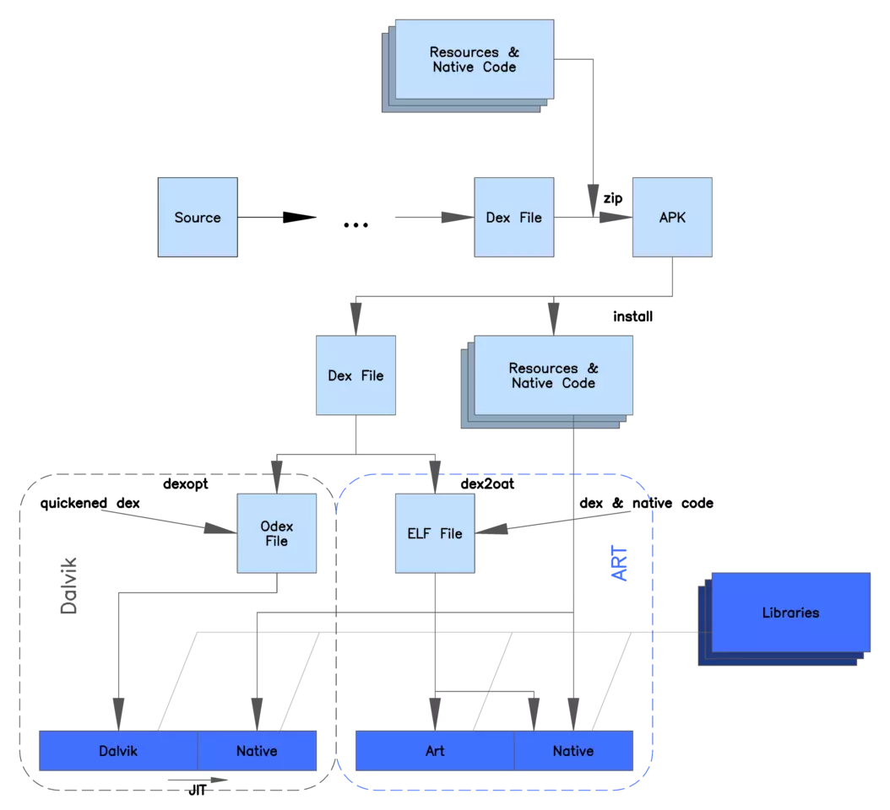

# Dalvik和ART

## Dalvik

- 虽然android平台使用java语言开发，但是android程序却不是运行在java的虚拟机上。它是由google公司专门为android平台设计一个虚拟机，用于运行android程序

- Android 运行环境主要指的Dalvik虚拟机技术，也就是安卓虚拟机DVM。Android中的所有Java程序都是运行在DVM上的，每个Android应用进程对应着一个独立的Dalvik虚拟机实例并在其解释下执行。DVM没有遵循Java虚拟机规范，不能直接执行Java的.class文件，而是执行.dex文件。它使用的是寄存器架构而不是JVM中常见的栈架构。其中.dex（Dalvik Executable）文件是通过.class文件转化而来，安卓使用Java语法编写应用程序，可以直接使用大部分的Java API等。

    虽然DVM也是用Java编程语言，Dalvik虚拟机和一般JAVA虚拟机(Java VM)并不兼容，他们两个的区别是JVM标准执行的是.class的字节码(bytecode ),而是DVM执行的是其专有的(.dex)执行文件。在编译过程中，Java把类编译成一个或多个.class字节码文件，然后打包到jar中。JVM会从jar文件中获得相应的.class文件和jre字节码。DVM虽然也是是用Java语言进行编程， Java程序通过编译后，还需要通过SDK中的dex工具.class文件转化打包成.dex格式文件，DVM再从其中读取指令和数据。

    JVM与DVM 二者最大的区别在于JVM是以基于栈的虚拟机(Stack-based)，而DVM是基于寄存器的虚拟机(Register-based)。基于寄存器的虚拟机虽然比基于堆栈的虚拟机在硬件通用性上要差一些，但是它的代码执行效率却更好。 显然，后者最大的好处在于可以根据硬件实现更大的优化，这更适合移动设备的特点。DVM非常适合在移动终端上使用，与PC相比，它不需要很快的CPU和大量的内存空间. Google的测算显示，64MB的内存已经能让系统正常运转了。 其中24MB被用于底层系统的初始化和启动。另外20MB被用于启动高层服务。

    Java类文件在编译过后，会产生至少一个.class文件包含大量冗余信息，dex文件格式会把所有 的.class文件内容整合到一个.dex文件中。通常一个应用apk只有一个classes.dex，但是开启了multiDexEnabled true分包可以生成多个.dex文件。即减少了整体文件的尺寸和IO操作，也提高了类的查找速度。增加了对新的操作码的支持，使文件结构尽量简洁，使用等长的指令，借以提高解析速度。

- dalvik虚拟机的特点：

    -  体积下，占用内存空间小
    -  体积小执行速度快
    -  所有的android程序都运行在android系统的进程中，每个进程都与一个dalvik虚拟机实例对应

# ART

ART(Android Runtime)是Android 4.4发布的，用来替换Dalvik虚拟，Android 4.4之前默认采用的还是DVM，系统会提供一个选项来开启ART模式。在Android 5.0时，默认采用ART，DVM从此退出历史舞台。

**Dalvik虚拟机执行的是dex字节码，ART虚拟机执行的是本地机器码。**

>  Dalvik执行的是dex字节码，依靠JIT编译器去解释执行，运行时动态地将执行频率很高的dex字节码翻译成本地机器码，然后在执行，但是将dex字节码翻译成本地机器码是发生在应用程序的运行过程中，并且应用程序每一次重新运行的时候，都要重新做这个翻译工作，因此，即使采用了JIT，Dalvik虚拟机的总体性能还是不能与直接执行本地机器码的ART虚拟机相比。 安卓运行时从Dalvik虚拟机替换成ART虚拟机，并不要求开发者重新将自己的应用直接编译成目标机器码，也就是说，应用程序仍然是一个包含dex字节码的apk文件。所以在安装应用的时候，dex中的字节码将被编译成本地机器码，之后每次打开应用，执行的都是本地机器码。移除了运行时的解释执行，效率更高，启动更快。（安卓在4.4中发布了ART运行时） 

## Dalvik与ART的区别

1、ART与Dalvik最大的不同在于，在启用ART模式后，系统在安装应用的时候会进行一次预编译，在安装应用程序时会先将代码转换为机器语言存储在本地，这样在运行程序时就不会每次都进行一次编译了，执行效率也大大提升。

2、ART占用空间比Dalvik大（字节码变为机器码之后，可能会增加10%-20%），这就是“时间换空间大法”。

3、预编译也可以明显改善电池续航，因为应用程序每次运行时不用重复编译了，从而减少了 CPU 的使用频率，降低了能耗。

# JIT和AOT

## JIT

JIT意思是**Just In Time Compiler**，就是**即时编译技术**

Dalvik虚拟机可以看做是一个Java虚拟机。在 Android系统初期，每次运行程序的时候，Dalvik负责将dex翻译为机器码交由系统调用。这样有一个**缺陷**：**每次执行代码，都需要Dalvik将操作码代码翻译为机器对应的微处理器指令，然后交给底层系统处理，运行效率很低**。

为了提升效率Android在2.2版本中添加了**JIT编译器**，当App运行时，每当遇到一个新类，JIT编译器就会对这个类进行即时编译，经过编译后的代码，会被优化成相当精简的原生型指令码（即native code），这样在下次执行到相同逻辑的时候，速度就会更快。JIT 编译器可以对执行次数频繁的 dex/odex 代码进行编译与优化，将 dex/odex 中的 Dalvik Code（Smali 指令集）翻译成相当精简的 Native Code 去执行，JIT 的引入使得 Dalvik 的性能提升了 3~6 倍

**JIT缺陷**

- 每次启动应用都需要重新编译（没有缓存）
- 运行时比较耗电，耗电量大

## AOT

AOT是指**Ahead Of Time**，从字面来看是说**提前编译**

JIT是运行时编译，是**动态编译**，可以对执行次数频繁的dex代码进行编译和优化，减少以后使用时的翻译时间，虽然可以加快Dalvik运行速度，但是有一个很大的问题：将dex翻译为本地机器码也要占用时间。 所以Google在4.4推出了全新的虚拟机运行环境ART（Android RunTime），用来替换Dalvik（4.4上ART和Dalvik共存，用户可以手动选择，5.0 后Dalvik被替换）。

AOT 是**静态编译**，应用在安装的时候会启动 dex2oat 过程把 dex预编译成 ELF 文件，每次运行程序的时候不用重新编译。 ART 对 Garbage Collection（GC）过程的也进行了改进：

1. 只有一次 GC 暂停（Dalvik 需要两次）
2. 在 GC 保持暂停状态期间并行处理
3. 在清理最近分配的短时对象这种特殊情况中，回收器的总 GC 时间更短
4. 优化了垃圾回收的工效，能够更加及时地进行并行垃圾回收，这使得 GC_FOR_ALLOC 事件在典型用例中极为罕见
5. 压缩 GC 以减少后台内存使用和碎片

**AOT的缺陷**

- 应用安装和系统升级之后的应用优化比较耗时（重新编译，把程序代码转换成机器语言）
- 优化后的文件会占用额外的存储空间（缓存转换结果）

## JIT和AOT共存

Android 7.0上，JIT 编译器被再次使用，采用AOT/JIT 混合编译的策略，特点是：

1. 应用在安装的时候dex不会再被编译
2. App运行时,dex文件先通过解析器被直接执行，热点函数会被识别并被JIT编译后存储在 `jit code cache` 中并生成profile文件以记录热点函数的信息。
3. 手机进入 IDLE（空闲） 或者 Charging（充电） 状态的时候，系统会扫描 App 目录下的 profile 文件并执行 AOT 过程进行编译。

# dexopt和dex2oat

