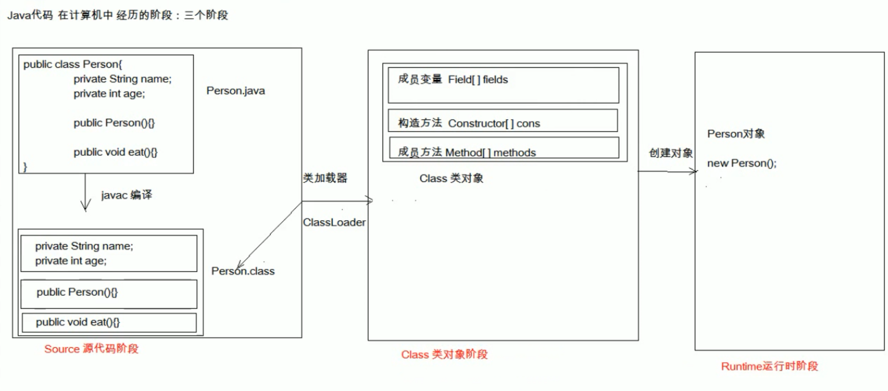

## java的文件加载过程




## 正射和反射

一般情况下，我们使用某个类时必定知道它是什么类，是用来做什么的。于是我们直接对这个类进行实例化，之后使用这个类对象进行操作。

```java
Apple apple = new Apple(); //直接初始化，「正射」
apple.setPrice(4);
```

上面这样子进行类对象的初始化，我们可以理解为「正」。

而反射则是一开始并不知道我要初始化的类对象是什么，自然也无法使用 new 关键字来创建对象了。

这时候，我们使用 JDK 提供的反射 API 进行反射调用：

```java
Class clz = Class.forName("com.chenshuyi.reflect.Apple");
Method method = clz.getMethod("setPrice", int.class);
Constructor constructor = clz.getConstructor();
Object object = constructor.newInstance();
method.invoke(object, 4);
```

上面两段代码的执行结果，其实是完全一样的。但是其思路完全不一样，第一段代码在未运行时就已经确定了要运行的类（Apple），而第二段代码则是在运行时通过字符串值才得知要运行的类（com.chenshuyi.reflect.Apple）。

## 什么是反射？

可以参考：https://blog.csdn.net/qq_35029061/article/details/84025745

**反射就是在运行时才知道要操作的类是什么，并且可以在运行时获取类的完整构造，并调用对应的方法。**

## 在 Java API 中，获取 Class 类对象有三种方法：

**第一种，使用 Class.forName 静态方法。**当你知道该类的全路径名时，你可以使用该方法获取 Class 类对象。

```
Class clz = Class.forName("java.lang.String");
```

**第二种，使用 .class 方法。**

这种方法只适合在编译前就知道操作的 Class。

```
Class clz = String.class;
```

**第三种，使用类对象的 getClass() 方法。**

```
String str = new String("Hello");
Class clz = str.getClass();
```

## 通过反射创建类对象

通过反射创建类对象主要有两种方式：通过 Class 对象的 newInstance() 方法、通过 Constructor 对象的 newInstance() 方法。

第一种：通过 Class 对象的 newInstance() 方法。

```
Class clz = Apple.class;
Apple apple = (Apple)clz.newInstance();
```

第二种：通过 Constructor 对象的 newInstance() 方法

```
Class clz = Apple.class;
Constructor constructor = clz.getConstructor();
Apple apple = (Apple)constructor.newInstance();
```

通过 Constructor 对象创建类对象可以选择特定构造方法，而通过 Class 对象则只能使用默认的无参数构造方法。下面的代码就调用了一个有参数的构造方法进行了类对象的初始化。

```
Class clz = Apple.class;
Constructor constructor = clz.getConstructor(String.class, int.class);
Apple apple = (Apple)constructor.newInstance("红富士", 15);
```

## 通过反射获取类属性、方法、构造器等

**通过 Class 类获取成员变量、成员方法、接口、超类、构造方法等**

​       getName()：获得类的完整名字。
　　getFields()：获得类的public类型的属性。
　　getDeclaredFields()：获得类的所有属性。包括private 声明的和继承类。
　　getMethods()：获得类的public类型的方法。
　　getDeclaredMethods()：获得类的所有方法。包括private 声明的和继承类。
　　getMethod(String name, Class[] parameterTypes)：获得类的特定方法，name参数指定方法的名字，parameterTypes 参数指定方法的参数类型。
　　getConstructors()：获得类的public类型的构造方法。
　　getConstructor(Class[] parameterTypes)：获得类的特定构造方法，parameterTypes 参数指定构造方法的参数类型。
　　newInstance()：通过类的不带参数的构造方法创建这个类的一个对象。

示例如下：

我们通过 Class 对象的 getFields() 方法可以获取 Class 类的属性，但无法获取私有属性。

```
Class clz = Apple.class;
Field[] fields = clz.getFields();
for (Field field : fields) {
    System.out.println(field.getName());
}
```

输出结果是：

```
price
```

而如果使用 Class 对象的 getDeclaredFields() 方法则可以获取包括私有属性在内的所有属性：

```
Class clz = Apple.class;
Field[] fields = clz.getDeclaredFields();
for (Field field : fields) {
    System.out.println(field.getName());
}
```

输出结果是：

```
name
price
```

与获取类属性一样，当我们去获取类方法、类构造器时，如果要获取私有方法或私有构造器，则必须使用有 declared 关键字的方法。

## demo：

```java
public class Apple {

    private int price;

    public int getPrice() {
        return price;
    }

    public void setPrice(int price) {
        this.price = price;
    }

```


```java
package indi.jane.study.reflect_demo;
import java.lang.reflect.Constructor;
import java.lang.reflect.Field;
import java.lang.reflect.Method;

public class DemoReflect {
    public static void main(String[] args) throws Exception{
        //正常的调用
        Apple apple = new Apple();
        apple.setPrice(5);
        System.out.println("Apple Price:" + apple.getPrice());
        // 使用反射调用
        Class clz = Class.forName("indi.jane.study.reflect_demo.Apple");
        // 获取 Class 类的属性，但无法获取私有属性
        Field[] fields = clz.getFields();
        for (Field field : fields) {
            System.out.println(field.getName());
        }
        // 获取私有属性在内的所有属性
        Field[] fields2 = clz.getDeclaredFields();
        for (Field field : fields2) {
            System.out.println("" + field.getName());
        }
        // 使用反射调用
        Method setPriceMethod = clz.getMethod("setPrice", int.class);
        Method getPriceMethod = clz.getMethod("getPrice");
        Constructor appleConstructor = clz.getConstructor();
        Object appleObj = appleConstructor.newInstance();
        setPriceMethod.invoke(appleObj, 14);
        System.out.println("Apple Price:" + getPriceMethod.invoke(appleObj));
    }
}

```

