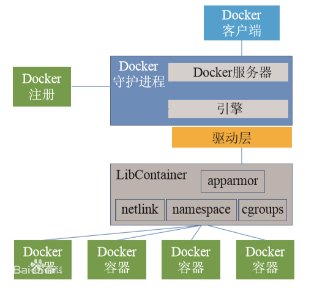
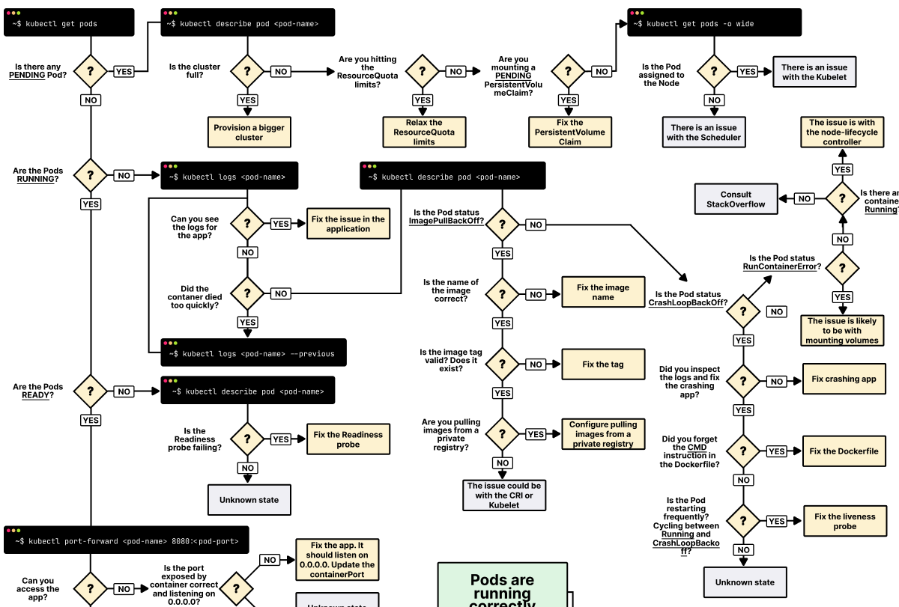

线上查「Pod 为什么 Pending」「为什么 OOMKilled」时，往往要同时看：**调度约束、镜像与事件、资源限制与节点真实用量**。下文把虚拟化层次、K8s 核心概念、工作负载类型、调度与资源、内存/cgroup 要点，以及 Pod 排错流程串成一篇，便于自己复习与检索。

## 虚拟化层次：Hypervisor 与容器

**硬件级虚拟化（Hypervisor）**：在硬件之上运行 **虚拟机监控器（VMM / Hypervisor）**，为每台客户机（guest）模拟一套硬件，客户机内核各自独立。典型场景是一台物理机同时跑 Linux、Windows 等不同内核的系统。

**操作系统级虚拟化（容器）**：共享宿主机内核，在进程级做隔离（命名空间、cgroups 等），因此**更轻、启动更快**，但隔离语义与虚拟机不同，**安全与多租户边界**要按运行时与内核能力来设计。

**Docker 与虚拟机对比**：容器把**应用及其依赖**打成可移植单元；虚拟机则虚拟整台机器。容器常用来标准化交付；是否「更安全」取决于配置与威胁模型，不宜一句概括。


## Docker 核心概念（镜像 / 容器 / 仓库）

- **镜像（Image）**：只读模板，包含运行所需文件与元数据；**不包含运行时的可变数据**。
- **容器（Container）**：镜像的运行实例，类比「类与对象」；本质是**受隔离约束的进程**（独立 rootfs、网络、进程空间等，视运行时配置而定）。
- **仓库（Registry）**：镜像分发与版本管理；**Repository / Tag / 镜像** 的层次关系便于协作与回滚。



## Kubernetes 架构与控制面

**为什么叫 k8s**：**k** 与末尾 **s** 之间省略了 **ubernete** 八个字母，即 **Kubernetes → k8s**。

### 控制面与数据面（常见划分）

| 角色   | 组件                        | 作用                                               |
| ------ | --------------------------- | -------------------------------------------------- |
| 控制面 | **kube-apiserver**          | 集群 API 入口，其它组件多通过它协作                |
| 控制面 | **kube-scheduler**          | 为未绑定节点的 Pod 选择节点                        |
| 控制面 | **kube-controller-manager** | 各类控制器（副本、Endpoint 等）                    |
| 控制面 | **etcd**                    | 持久化集群状态（具体部署因发行版而异）             |
| 节点   | **kubelet**                 | 节点代理，按 PodSpec 启停容器                      |
| 节点   | **kube-proxy**              | 维护 Service 与节点网络规则（实现因模式而异）      |
| 节点   | **容器运行时**              | 通过 **CRI** 创建/管理容器（containerd、CRI-O 等） |

集群内 **DNS**（如 CoreDNS）为 Service 提供名字解析。以上为基础认知即可；生产集群还可能有 **cloud-controller-manager**、准入、网络插件等，依环境而定。

官方概念总览：[Kubernetes Concepts](https://kubernetes.io/zh-cn/docs/concepts/overview/)。

### 重要对象：Master/Node、Pod

- **控制面节点**（常称 control plane）：承载 apiserver、scheduler、controller 等（高可用时多副本）。
- **工作节点（Node）**：运行 **kubelet**、**kube-proxy**、**容器运行时**。
- **Pod**：调度与原子管理的最小单位；可含一个或多个容器，共享网络与存储卷（在同 Pod 内）。**Pod IP** 一般指该 Pod 在集群网络中的地址（实现依赖 CNI）。

### kubectl 与 YAML 要点

- **apiVersion / kind**：随资源类型与集群版本变化，不能死记一条。
- **metadata**：name、namespace、labels 等。
- **spec**：容器、卷、策略等；具体字段查对应 API。

**YAML 注释**使用 **`#`**（不是引号 `"`）。缩进用空格、**不要用 Tab**（通用约定）。

**关于 `kubectl run`**：旧版常用 `kubectl run` 带 `--replicas` 创建 Deployment；**当前 kubectl 更推荐用清单（Deployment）或 `kubectl create deployment`** 管理多副本，避免依赖已变更的默认生成行为。以你本机 `kubectl version` 与官方文档为准。

常用命令示例：

```bash
kubectl apply -f app.yaml
kubectl get deployment
kubectl get pod -o wide
kubectl describe pod pod-name
kubectl logs pod-name
kubectl exec -it pod-name -- bash   # 多容器时加 -c container-name
kubectl scale deployment test-k8s --replicas=5
kubectl port-forward pod-name 8090:8080
kubectl rollout history deployment test-k8s
kubectl rollout undo deployment test-k8s
kubectl rollout undo deployment test-k8s --to-revision=2
kubectl delete deployment test-k8s
```

## 工作负载：无状态、有状态与定时任务

### 无状态（Deployment 等）

- 实例之间**不依赖本地持久状态**；同一请求的多个副本**逻辑上可互换**（应用需自行保证）。
- Pod **名字、IP 常随重建变化**；扩缩容顺序一般不要求严格有序。
- 原文写「多个 Pod 背后是共享存储」**易误解**：典型无状态 Web **不要求**共享持久盘；若挂存储，多为**只读配置/静态资源**或外部对象存储，与 StatefulSet 的「每副本独立 PVC」不同。

### 有状态（StatefulSet）

- **稳定网络标识**（如 `web-0`、`web-1`）、**有序**扩缩、常与 **PVC** 绑定实现**每副本独立数据**。
- **PV**：集群级存储资源抽象；**PVC**：应用侧存储申请。二者解耦便于换底层存储实现。

**注意**：完整 StatefulSet 往往还需 **Headless Service** 等以配合 DNS 与网络标识；上面仅为结构示意，落地请以官方示例为准。

```yaml
apiVersion: apps/v1
kind: StatefulSet
metadata:
  name: my-stateful-app
spec:
  selector:
    matchLabels:
      app: my-stateful-app
  replicas: 1
  template:
    metadata:
      labels:
        app: my-stateful-app
    spec:
      containers:
        - name: nginx
          image: nginx:1.7.9
          ports:
            - containerPort: 80
```

### 定时任务（CronJob / Job）

- **CronJob**：按 cron 表达式周期创建 **Job**。
- **Job**：`completions`、`parallelism` 控制总成功次数与并行度。

**apiVersion**：请使用 **`batch/v1`**（`batch/v1beta1` 已弃用）。

```yaml
apiVersion: batch/v1
kind: CronJob
metadata:
  name: pi
spec:
  schedule: "*/1 * * * *"
  jobTemplate:
    spec:
      completions: 10
      parallelism: 5
      template:
        spec:
          containers:
            - name: pi
              image: perl
              command: ["perl", "-Mbignum=bpi", "-wle", "print bpi(2000)"]
          restartPolicy: OnFailure
```

### Job / Pod 上几个易混字段

| 字段                              | 所属对象               | 含义（简要）                                                                                                                                                                                               |
| --------------------------------- | ---------------------- | ---------------------------------------------------------------------------------------------------------------------------------------------------------------------------------------------------------- |
| **terminationGracePeriodSeconds** | **Pod**                | 先发 **SIGTERM**，等待该秒数后再 **SIGKILL**，便于优雅退出                                                                                                                                                 |
| **activeDeadlineSeconds**         | **Job**（`.spec`）     | Job 自开始后**最长活跃时间**，超时则终止该 Job 相关 Pod                                                                                                                                                    |
| **startingDeadlineSeconds**       | **CronJob**（`.spec`） | **不是**「Pod 启动超时」。表示若某次调度**错过计划时间**后，在多少秒内仍允许启动该次 Job；过期则计为失败（具体行为见[官方 CronJob](https://kubernetes.io/docs/concepts/workloads/controllers/cron-jobs/)） |

## 调度：节点标签、亲和性、污点与容忍

- **nodeSelector**：简单 `key: value` 匹配节点标签。
- **nodeAffinity**：更丰富的「必须满足 / 偏好」规则。
- **Taint / Toleration**：节点「排斥」Pod，除非 Pod **容忍**该污点；常用于专用节点（如 GPU）、隔离负载。

**示例：节点标签与亲和性**

```bash
kubectl label nodes <NodeA> zone=us-east
kubectl label nodes <NodeB> zone=us-west
```

```yaml
apiVersion: v1
kind: Pod
metadata:
  name: mypod
spec:
  containers:
    - name: mycontainer
      image: myimage
  affinity:
    nodeAffinity:
      requiredDuringSchedulingIgnoredDuringExecution:
        nodeSelectorTerms:
          - matchExpressions:
              - key: zone
                operator: In
                values:
                  - us-east
```

**示例：污点与容忍**（污点格式 `key=value:Effect`）

```bash
kubectl taint nodes <NodeA> gpu=true:NoSchedule
```

```yaml
apiVersion: v1
kind: Pod
metadata:
  name: gpu-pod
spec:
  containers:
    - name: gpu-container
      image: your_gpu_image
  tolerations:
    - key: "gpu"
      operator: "Exists"
      effect: "NoSchedule"
```

可同时使用 `nodeSelector`、`affinity`、`tolerations`；规则之间是**且**的关系，需同时满足才可能调度成功。

**资源请求与限制**（节选）：

```yaml
resources:
  requests:
    memory: "1Gi"
    cpu: "500m"
  limits:
    cpu: "300m"
    memory: "700Mi"
```

巨页（HugePages）资源名形如 **`hugepages-2Mi`**、**`hugepages-1Gi`**，需与节点巨页配置一致。官方说明：[为 Pod 分配内存](https://kubernetes.io/zh-cn/docs/tasks/configure-pod-container/assign-memory-resource/)。

**节点资源占用（概念）**：常关注「请求之和 / 可分配量」与「实际用量 / 容量」两类比例；具体以监控与 `kubectl top` 为准，不同云厂商控制台定义可能略有差异。

## 内存、cgroup 与 OOM（Linux 基础）

下列路径以 **cgroup v1 的 memory 控制器** 为例（`memory.limit_in_bytes` 等）。**cgroup v2** 上对应指标文件名不同（如 `memory.max`、`memory.current`），容器运行时若使用 v2，请在节点上对照实际挂载点查阅。

### RSS 与 Page Cache

- **RSS（Resident Set Size）**：进程实际驻留在 RAM 中的部分，含代码段、栈、堆、共享库等映射到物理页的部分；**malloc 成功不等于立刻占满 RSS**，往往**按需缺页**才涨 RSS。
- **Page Cache**：读写文件时，内核缓存文件页以加速 IO；通常可被回收，**不等同于「应用堆内存」**。

原文一处笔误：**「page cache 是 page cache 的缩写」** 无意义，应理解为 **页面缓存（Page Cache）**。

### Memory Cgroup 与 memory.stat

在 **v1** 语境下常记：

- **`memory.usage_in_bytes`**：该 cgroup 内统计到的使用量，**一般包含 RSS 与 cache 等**（与控制器版本与统计口径有关，以文档为准）。
- **`memory.limit_in_bytes`**：内存上限（注意文件名是 **`limit_in_bytes`**，不是 `limit_in_byte`）。
- 判断「应用自身常驻」时，多看 **`memory.stat` 中的 `rss`**；cache 会干扰「看起来像爆了内存」的判断。

`memory.stat` 中常见项（节选）：**rss**、**cache**、**inactive_file** / **active_file**、**swap** 等；不同内核/版本字段可能略有增减。

**OOM**：当 cgroup 内无法再满足内存需求且回收无效时，可能触发 **OOM Killer** 杀进程。容器场景下表现为 Pod **OOMKilled**。

### Valgrind / Memcheck（应用内存调试）

**Valgrind Memcheck** 用于检测未初始化读、泄漏、非法释放等；适合**开发/测试**定位代码级问题。**生产容器**通常不会默认跑 Valgrind，性能开销大。

### 排查思路（简版）

1. `kubectl describe pod` 看 **OOMKilled** 与 **limits**。
2. 节点/容器内结合 **`memory.stat`**、监控中的 **working set**（如 `container_memory_working_set_bytes`）看是否顶满 limit。
3. 应用侧用 **pprof**、语言运行时工具或 Memcheck 等做深查。

`top`、`pmap`、`gcore`+`gdb` 等用于**进程级**分析；与 **K8s 事件**结合才能闭环。

### free 与 MemAvailable

- `free` 默认单位常为 **KiB**（可用 `-h` 人类可读）。
- **`available`（或 `/proc/meminfo` 的 MemAvailable）** 是内核**估算**的可回收后可用量，**并不等于**简单的 `free + buff/cache` 恒等式；把「可用内存」直接等同于该公式是**不严谨**的。

## Pod 问题排查（流程与命令）

下面决策树为社区常见整理，适合对照 Events 与日志缩小范围（原图来自 learnkube 公开资源，已落盘到本站 `images/kubernetes/`）。



**常用顺序**：`kubectl get pods -o wide` → `kubectl describe pod`（重点 **Events**）→ `kubectl logs` / `kubectl logs --previous`。

| 现象                 | 可先查                                                                 |
| -------------------- | ---------------------------------------------------------------------- |
| **Pending**          | 资源、Quota、污点/亲和性、PVC 绑定；`describe` 里 **FailedScheduling** |
| **ImagePullBackOff** | 镜像名、Tag、`imagePullSecrets`、仓库网络                              |
| **CrashLoopBackOff** | `--previous` 日志、探针、依赖与配置                                    |
| **OOMKilled**        | `limits.memory`、应用真实峰值、working set                             |
| **Ready=0**          | Readiness 探针、应用健康检查路径与超时                                 |

通用命令备忘：

```bash
kubectl get pods -o wide
kubectl describe pod <pod>
kubectl logs <pod> -c <container> --previous
kubectl top pod <pod> --containers
kubectl get events --sort-by=.metadata.creationTimestamp
```

阿里云容器监控与配额相关说明可参考：[容器服务监控](https://help.aliyun.com/zh/cms/user-guide/ack)（产品与控制台以厂商文档为准）。

## 容器运行时与 Docker 的关系

- **Docker Engine** 历史上包含运行时与镜像构建能力；底层常依赖 **containerd** 等。
- **Kubernetes** 通过 **CRI** 对接 **containerd、CRI-O** 等；**不要求**节点上必须用 `docker` 命令。
- **rkt** 已停止积极演进，仅作历史了解即可。

## 核心要点

- **虚拟机 vs 容器**：虚拟硬件多内核 vs 共享内核的进程隔离；适用场景不同。
- **K8s**：控制面（API、调度、控制器）+ 节点（kubelet、kube-proxy、运行时）；**Pod** 是最小调度单元。
- **工作负载**：无状态多用 **Deployment**；要稳定标识与有序与每副本存储用 **StatefulSet**；周期任务用 **CronJob/Job**，API 用 **`batch/v1`**。
- **调度**：**标签 / 亲和性** 选节点，**污点 / 容忍** 做排斥与专用池；规则同时满足才可能调度。
- **资源**：`requests` 影响调度与公平性，`limits` 与 OOM 相关；看内存是否紧建议结合 **RSS / working set**，勿单看含大量 cache 的汇总。
- **排错**：**Events + logs(--previous)** 优先；再分 Pending / 镜像 / 崩溃 / OOM / 探针几类对症。
- **易错字段**：**`startingDeadlineSeconds` 在 CronJob 上**，含义是**错过计划后的容忍窗口**，不是 Pod 启动超时。

---

_整理自个人学习笔记；**apiVersion、指标路径与 kubectl 行为随版本变化**，上线前请以你集群版本对应的[官方文档](https://kubernetes.io/zh-cn/docs/home/)为准。_
