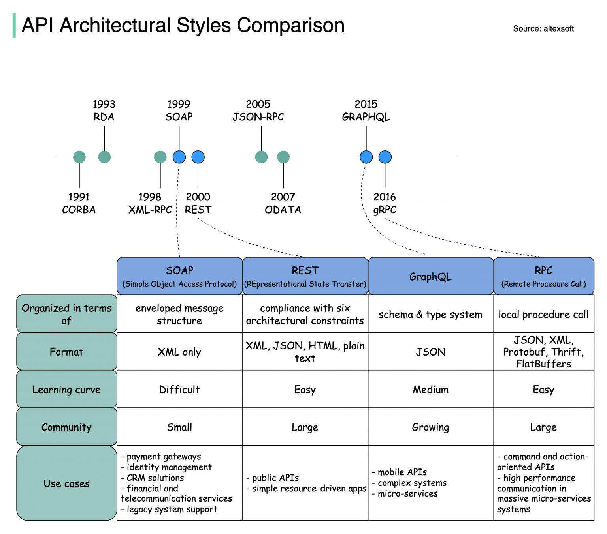

# 关于RPC和REST还有SOAP

具体看看这个：https://www.iculture.cc/cybersecurity/pig=25911?only_author=1

## REST

REST，是Representational State Transfer 的简写，中文描述表述性状态传递（是指某个瞬间状态的资源数据的快照，包括资源数据的内容、表述格式(XML、JSON)等信息。）。REST 是一种软件架构风格。 这种风格的典型应用，就是HTTP。

- 如何理解
  - 引用阮一峰博客的文字：
    -（1）每一个URI代表一种资源；
    　　-（2）客户端和服务器之间，传递这种资源的某种表现层；
    　　-（3）客户端通过四个HTTP动词，对服务器端资源进行操作，实现"表现层状态转化"。

## RPC

- RPC，是Remote Procedure Call Protocol的简写，中文描述是远程过程调用，它可以实现客户端像调用本地服务(方法)一样调用服务器的服务(方法)。它本身并不是一个具体的协议，而是一种调用方式。

- RPC框架要做到的最基本的三件事：
  1、服务端如何确定客户端要调用的函数；
  在远程调用中，客户端和服务端分别维护一个【ID->函数】的对应表， ID在所有进程中都是唯一确定的。客户端在做远程过程调用时，附上这个ID，服务端通过查表，来确定客户端需要调用的函数，然后执行相应函数的代码。
  2、如何进行序列化和反序列化；
  客户端和服务端交互时将参数或结果转化为字节流在网络中传输，那么数据转化为字节流的或者将字节流转换成能读取的固定格式时就需要进行序列化和反序列化，序列化和反序列化的速度也会影响远程调用的效率。
  3、如何进行网络传输（选择何种网络协议）；
  多数RPC框架选择TCP作为传输协议，也有部分选择HTTP。如gRPC使用HTTP2。不同的协议各有利弊。TCP更加高效，而HTTP在实际应用中更加的灵活。
- 俩者区别
  - REST 是服务端把方法写好，客户端并不知道具体方法。客户端只想获取资源，所以发起HTTP请求，而服务端接收到请求后根据URI经过一系列的路由才定位到方法上面去。
  - PRC是服务端提供好方法给客户端调用，客户端需要知道服务端的具体类，具体方法，然后像调用本地方法一样直接调用它。

## SOAP

SOAP（Simple Objects Access Protocol），它是一种 XML 格式、高度标准化的 Web 通信协议

## GraphQL
https://graphql.cn/learn/serving-over-http/
HTTP 通常与 REST 相关联，REST 使用“资源”作为其核心概念。相比之下，GraphQL 的概念模型是一个实体图。因此，GraphQL 中的实体无法通过 URL 识别。相反，GraphQL 服务器在单个 URL /入口端点（通常是 /graphql）上运行，并且所有提供服务的 GraphQL 请求都应被导向此入口端点。
# python实现远程调用的三种方式

``` python
1.基于xml-rpc
import SimpleXMLRPCServer

class calculate:
def add(self, x, y):
    return x + y

def multiply(self, x, y):
    return x * y

def subtract(self, x, y):
    return abs(x-y)

def divide(self, x, y):
    return x/y

obj = calculate()
server = SimpleXMLRPCServer.SimpleXMLRPCServer(("localhost", 8088))
#将实例注册给rpc server
server.register_instance(obj)
print("Listening on port 8088")
server.serve_forever()
#调用
import xmlrpclib
server = xmlrpclib.ServerProxy("http://localhost:8088")

2.基于json-rpc
	俩种：
		1.jsonrpclib
		2.python-jsonrpc
3.zerorpc
import zerorpc

class caculate(object):
def hello(self, name):
    return 'hello, {}'.format(name)

def add(self, x, y):
    return x + y

def multiply(self, x, y):
    return x * y

def subtract(self, x, y):
    return abs(x-y)

def divide(self, x, y):
    return x/y

s = zerorpc.Server(caculate())

s.bind("tcp://0.0.0.0:4242")
s.run()
#调用
import zerorpc
c = zerorpc.Client()
c.connect("tcp://127.0.0.1:4242")
```

​	