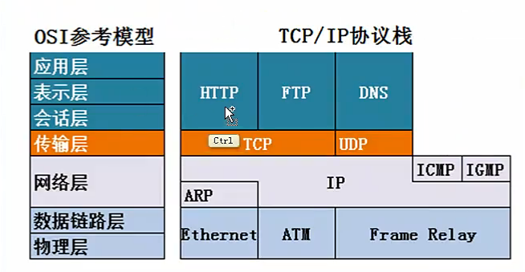
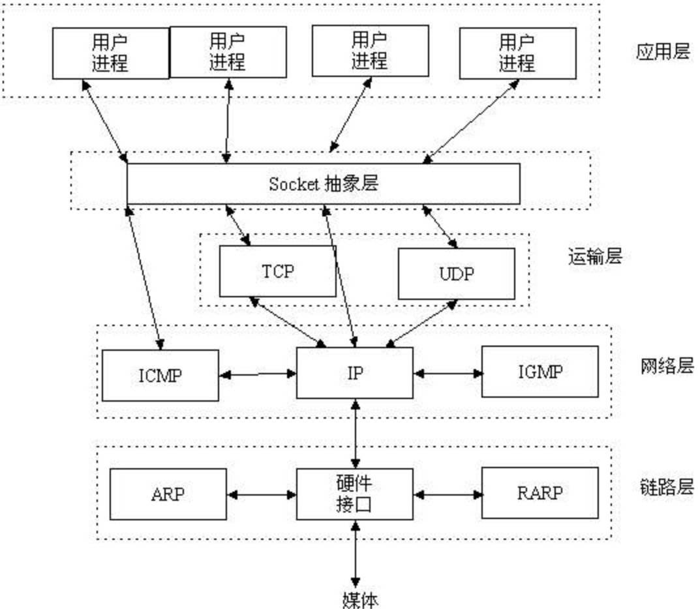
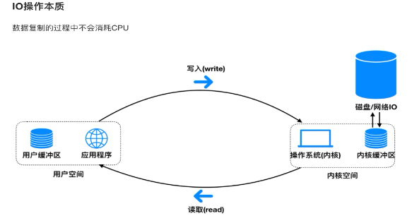
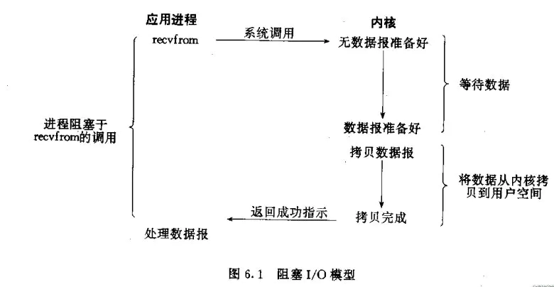
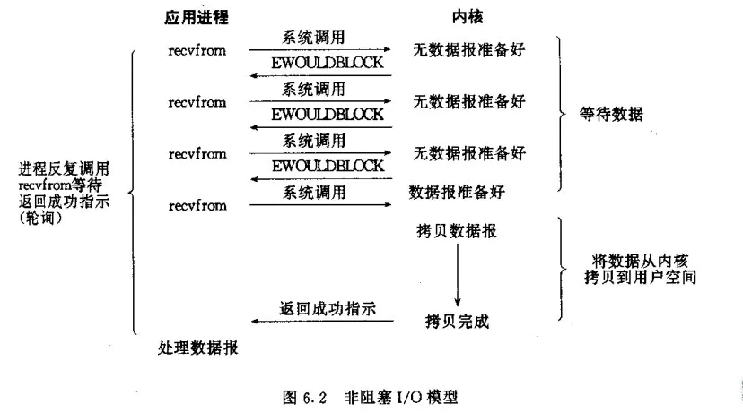
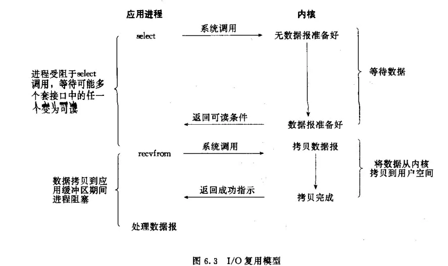
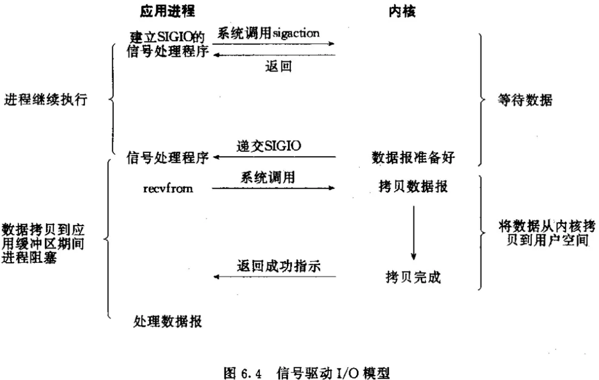
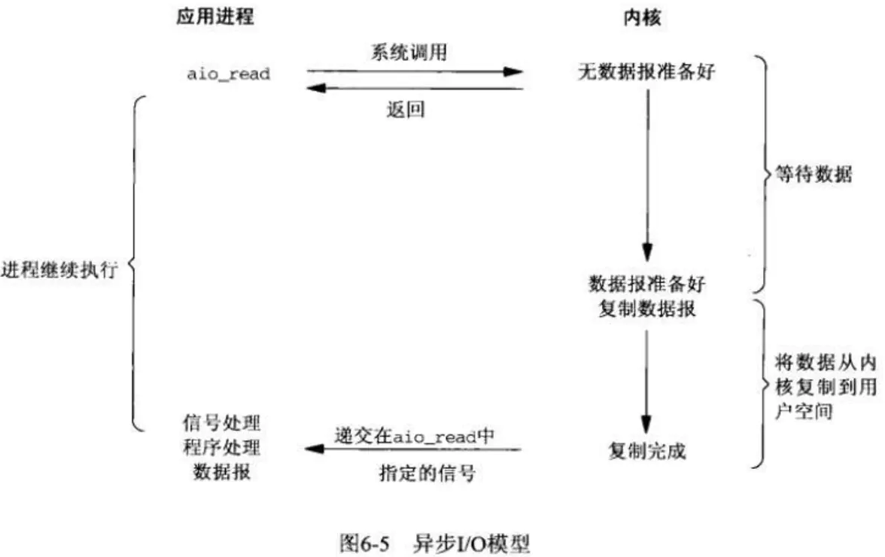

## 什么是爬虫？

#### 百度说：

网络爬虫，是一种按照一定的规则，自动地抓取万维网信息的程序或者脚本。

#### 某书上说：

它是指自动的连接到互联网站点，读取网页中的内容或者存放在网络上的各种信息，并按照某种策略对目标的信息进行采集。

#### 大神说：

但凡你看得到摸得到的数据，我都能拿下来。

## 我理解的爬虫概念

#### 1. 我理解这个词汇爬虫（spider），它是一种动作，像一只蜘蛛一样在一张很大网（web）在爬行。假设这张网是一张很大的图，每个顶点代表就是一类信息。

#### 

## 我如何理解爬虫（web端）

既然说信息都放在一张很大很大网上，那么首先理解这张网（web）。

### 这张网的基础组成

#### html（超文本传输协议）

**超文本标记语言**（英语：HyperText Markup Language 简称：HTML）是一种用于创建网页的标准标记语言。

**网页浏览器**可以读取HTML文件，并将其渲染成可视化网页

**HTML元素**是构建网站的基石。HTML允许嵌入图像与对象，并且可以用于创建交互式表单，它被用来结构化信息——例如标题、段落和列表等等，也可用来在一定程度上描述文档的外观和语义。

#### css（层叠样式表）

CSS 描述了在屏幕、纸质、音频等其它媒体上的元素应该如何被渲染的问题。

#### JavaScript ( JS)

- 介绍维基百科地址：https://zh.wikipedia.org/wiki/JavaScript

- 发展初期，JavaScript的标准并未确定，同期有Netscape的JavaScript，微软的JScript和CEnvi的ScriptEase三足鼎立。1997年，在ECMA（欧洲计算机制造商协会）的协调下，由Netscape、Sun、微软、Borland组成的工作组确定统一标准：ECMA-262。

- JavaScript 的标准是 ECMAScript 。截至 2012 年，所有的现代浏览器都完整的支持  ECMAScript 5.1，旧版本的浏览器至少支持 ECMAScript 3 标准。2015年6月17日，ECMA国际组织发布了 ECMAScript 的第六版，该版本正式名称为 ECMAScript 2015，但通常被称为 ECMAScript 6 或者 ES6。自此，ECMAScript 每年发布一次新标准。本文档目前覆盖了最新 ECMAScript 的草案，也就是 ECMAScript2020


#### 传输协议

- http（超文本传输协议）
    - 工作在应用层，基于tcp传输，默认端口80
- 进阶版https（http+（ssl/tls) ）（默认端口443）
    - 由于http协议在传输的过程中没有任何加密，，导致传输非常不安全，因此，在http基础上添加了一种非对称加密，保护传输的可靠性。
- tcp协议
    - 面向连接的，可靠的数据传输协议。位于传输层

#### 传输的地址

- url
    - 在WWW（万维网）上，任何一个信息资源都有统一的并且在网上唯一的地址，这个地址就叫做URL。URL也被称为网页地址，是因特网上标准的资源的地址(Address)
    - url格式的基本组成
        - 第一部分-协议（scheme）
            - 该URL的协议是什么
        - 第二部分-域名（domain）
            - 是指存放资源的服务器的[域名系统](https://baike.baidu.com/item/域名系统)(DNS) 主机名或 IP 地址
            - 域名分为顶级域名www.baidu.com、二级域名baike.baidu.com、三级域名baike.tieba.baidu.com
        - 第三部分-端口（port）
            - 用来区分同一台服务器上不同服务的标识
        - 第三部分-路劲（path）
            - 由零或多个“/”符号隔开的字符串，一般用来表示主机上的一个目录或文件地址。
        - 第四部分-参数（parameters）
            - 这是用于指定特殊参数的可选项

- ip地址
    - 它能够唯一确定Internet上每台计算机、每个用户的位置。Internet上主机与主机之间要实现通信，每一台主机都必须要有一个地址，而且这个地址应该是唯一的，不允许重复。依靠这个唯一的主机地址，就可以在Internet浩瀚的海洋里找到任意一台主机。
- dns和域名
    - 由于IP地址具有不方便记忆并且不能显示地址组织的名称和性质等缺点，人们设计出了域名，并通过网域名称系统（DNS，Domain Name System）来将域名和IP地址相互映射，使人更方便地访问互联网，而不用去记住能够被机器直接读取的IP地址数串。

### web浏览器和服务器交互的过程

1. 从浏览器解析主机名
2. 浏览器查询主机ip地址（dns）
3. 浏览器获取端口号80或者443
4. 浏览器发起tcp连接（三次握手建立连接）**tcp双向传输**
    - 第一次：客户端发送请求到服务器，服务器知道客户端发送，自己接收正常。
    - 第二次：服务器发给客户端，客户端知道自己发送、接收正常，服务器接收、发送正常。
    - 第三次：客户端接收服务器，服务器知道客户端发送，接收正常，自己接收，发送也正常。
5. 浏览器发送请求的报文
6. 服务器返回响应的报文
7. 浏览器渲染http或https响应的内容
8. 关闭连接（TCP四次挥手）
    - 第一次：客户端请求断开
    - 第二次：服务器确认客户端的断开请求
    - 第三次：服务器请求断开
    - 第四次：客户端确认服务器的断开

### socket

socket是应用层和tcp/ip协议簇通信的中间软件的抽象层，它是一组**接口**。



### socket编程

```python
import socket
import ssl

def set_headers(head):
    headers = ["{}:{}".format(k, item) for k, item in head.items()]
    headers.insert(0, "GET / HTTP/1.1")
    headers.append("\r\n")
    res = "\r\n".join(headers)
    return res.encode("utf-8")


def client(url, charset=None, headers=None):
    conn = socket.socket(socket.AF_INET, socket.SOCK_STREAM)
    # 默认添加请求头
    if headers == None:
        headers = 'User-Agent: Mozilla/4.0 (compatible; MSIE 7.0; Windows NT 5.1)'
    # http协议处理
    if 'http://' in url:
        url = url.replace('http://', '')
        port = 80
    # https协议处理
    if 'https://' in url:
        conn = ssl.wrap_socket(conn)
        url = url.replace('https://', '')
        port = 443
    url = url if '/' in url else url + '/'
    urlSplit = url.split('/', 1)
    # 连接服务器
    conn.connect((urlSplit[0], port))
    # 发送报文处理
    # bMsg = 'GET /{1} HTTP/1.1\r\nHost: {0}\r\n{2}\r\nConnection: close\r\n\r\n'.format(urlSplit[0], urlSplit[1],                                                                    # headers)
    client_headers = {
        "Connection": "close",
        # "Connection": "keep-alive",
        "User-Agent": "Mozilla/5.0 (Windows NT 10.0; Win64; x64) AppleWebKit/537.36 (KHTML, like Gecko) Chrome/81.0.4044.138 Safari/537.36",
    }
    # 发送报文
    # print(bMsg.encode())
    print(set_headers(client_headers))
    bMsg = set_headers(client_headers)
    conn.send(bMsg)
    html = ''
    # 循环接收html字节数据
    while True:
        data = conn.recv(1024)
        if data:
            try:
                html += data.decode(charset)
            except Exception as e:
                pass
        else:
            conn.close()
            break
    return html.split('\r\n\r\n')[1]


# 运行
if __name__ == '__main__':
    import time
    start = time.time()
    html = client('https://www.baidu.com', charset='utf-8')
    print(html)
    print("程序结束: {}".format(time.time() - start))
# print('with out hook')
# a = requests.get('https://www.baidu.com/')
# print(a.raw._fp.msg, a.content)
# print('done!')

```

### IO



- io是input/output输入输出的缩写。它描述了计算机的输入输出数据流动的过程。
- 一次io的过程
    - 进程发起读取数据的io调用
    - 操作系统把外部的数据加载到内核区
    - 操作系统把数据拷贝到进程的缓冲区
- 基于上面的过程，我们可以看出，后面俩步的过程之间，就有很多问题，由此产生了很多模型
    - 阻塞 I/O（blocking IO）
    - 非阻塞 I/O（nonblocking IO）
    - I/O 多路复用（ IO multiplexing）
    - 信号驱动 I/O（ signal driven IO）
    - 异步 I/O（asynchronous IO）

#### 阻塞IO模型

进程会一直阻塞，直到数据拷贝完成 应用程序调用一个IO函数，导致应用程序阻塞，等待数据准备好。数据准备好后，从内核拷贝到用户空间，IO函数返回成功指示。阻塞IO模型图如下所示：




#### 非阻塞IO模型

通过进程反复调用IO函数，在数据拷贝过程中，进程是阻塞的。模型图如下所示:




#### IO复用模型

主要是select和epoll。一个线程可以对多个IO端口进行监听，当socket有读写事件时分发到具体的线程进行处理。模型如下所示：




#### 信号驱动IO模型

信号驱动式I/O：首先我们允许Socket进行信号驱动IO,并安装一个信号处理函数，进程继续运行并不阻塞。当数据准备好时，进程会收到一个SIGIO信号，可以在信号处理函数中调用I/O操作函数处理数据。过程如下图所示：




#### 异步IO模型

相对于同步IO，异步IO不是顺序执行。用户进程进行aio_read系统调用之后，无论内核数据是否准备好，都会直接返回给用户进程，然后用户态进程可以去做别的事情。等到socket数据准备好了，内核直接复制数据给进程，然后从内核向进程发送通知。IO两个阶段，进程都是非阻塞的。异步过程如下图所示：




#### IO复用之select、poll、epoll简介

epoll是linux所特有，而select是POSIX所规定，一般操作系统均有实现。

##### select

select本质是通过设置或检查存放fd标志位的数据结构来进行下一步处理。缺点是：

1. 单个进程可监视的fd数量被限制，即能监听端口的大小有限。一般来说和系统内存有关，具体数目可以cat /proc/sys/fs/file-max察看。32位默认是1024个，64位默认为2048个
2. 对socket进行扫描时是线性扫描，即采用轮询方法，效率低。当套接字比较多的时候，每次select()都要遍历FD_SETSIZE个socket来完成调度，不管socket是否活跃都遍历一遍。会浪费很多CPU时间。如果能给套接字注册某个回调函数，当他们活跃时，自动完成相关操作，就避免了轮询，这正是epoll与kqueue做的
3. 需要维护一个用来存放大量fd的数据结构，会使得用户空间和内核空间在传递该结构时复制开销大

##### poll

poll本质和select相同，将用户传入的数据拷贝到内核空间，然后查询每个fd对应的设备状态，如果设备就绪则在设备等待队列中加入一项并继续遍历，如果遍历所有fd后没有发现就绪设备，则挂起当前进程，直到设备就绪或主动超时，被唤醒后又要再次遍历fd。它没有最大连接数的限制，原因是它是基于链表来存储的，但缺点是：

1. 大量的fd的数组被整体复制到用户态和内核空间之间，不管有无意义。
2. poll还有一个特点“水平触发”，如果报告了fd后，没有被处理，那么下次poll时再次报告该ffd。

##### epoll

epoll支持水平触发和边缘触发，最大特点在于边缘触发，只告诉哪些fd刚刚变为就绪态，并且只通知一次。还有一特点是，epoll使用“事件”的就绪通知方式，通过epoll_ctl注册fd，一量该fd就绪，内核就会采用类似callback的回调机制来激活该fd，epoll_wait便可以收到通知。epoll的优点：

1. 没有最大并发连接的限制。
2. 效率提升，只有活跃可用的FD才会调用callback函数。
3. 内存拷贝，利用mmap()文件映射内存加速与内核空间的消息传递。

#### select、poll、epoll区别总结：

|        |    支持一个进程打开连接数     |                  IO效率                  |                   消息传递方式                   |
| :----: | :---------------------------: | :--------------------------------------: | :----------------------------------------------: |
| select |  32位机器1024个，64位2048个   |                 IO效率低                 | 内核需要将消息传递到用户空间，都需要内核拷贝动作 |
|  poll  |   无限制，原因基于链表存储    |                 IO效率低                 | 内核需要将消息传递到用户空间，都需要内核拷贝动作 |
| epoll  | 有上限，但很大，2G内存20W左右 | 只有活跃的socket才调用callback，IO效率高 |       通过内核与用户空间共享一块内存来实现       |

### 爬虫和上面的描述有什么关系

爬虫的本质是**网络io**，从网络请求数据下载到本地客户端。socket是对于爬虫就是底层网络请求的一个接口。

### 多进程，多线程

#### 多进程

- 进程是操作系统分配资源的最小单元, 线程是操作系统调度的最小单元。
- 一个应用程序至少包括1个进程，而1个进程包括1个或多个线程，线程的尺度更小。
- 每个进程在执行过程中拥有独立的内存单元，而一个线程的多个线程在执行过程中共享内存。

多进程 python版

```python
from multiprocessing import Pool, cpu_count
import os
import time


def long_time_task(i):
    print('子进程: {} - 任务{}'.format(os.getpid(), i))
    time.sleep(2)
    print("结果: {}".format(8 ** 20))


if __name__=='__main__':
    print("CPU内核数:{}".format(cpu_count()))
    print('当前母进程: {}'.format(os.getpid()))
    start = time.time()
    p = Pool(4)
    for i in range(5):
        p.apply_async(long_time_task, args=(i,))
    print('等待所有子进程完成。')
    p.close()
    p.join()
    end = time.time()
    print("总共用时{}秒".format((end - start)))
```

#### 多线程

- 线程是cpu调度和分配的基本单位

多线程 python版

```python
import threading
import time


def long_time_task(i):
    print('当前子线程: {} 任务{}'.format(threading.current_thread().name, i))
    time.sleep(2)
    print("结果: {}".format(8 ** 20))


if __name__=='__main__':
    start = time.time()
    print('这是主线程：{}'.format(threading.current_thread().name))
    thread_list = []
    for i in range(1, 3):
        t = threading.Thread(target=long_time_task, args=(i, ))
        thread_list.append(t)

    for t in thread_list:
        t.start()

    for t in thread_list:
        t.join()

    end = time.time()
    print("总共用时{}秒".format((end - start)))
```

#### 进程切换与线程切换的区别？

https://blog.csdn.net/github_37382319/article/details/97273713

#### 全局解释器锁（GIL)和多进程多线程

- GIL
    - 全局解释器锁（英语：Global Interpreter Lock，缩写GIL），是计算机程序设计语言解释器用于同步线程的一种机制，它使得任何时刻仅有一个线程在执行。[1]即便在多核心处理器上，使用 GIL 的解释器也只允许同一时间执行一个线程。常见的使用 GIL 的解释器有CPython与Ruby MRI
    - 多进程没有GIL限制可以利用多核处理器，但是多进程适合计算密集型任务。

多进程和多线程对比

```python
from multiprocessing import Pool, cpu_count
import os
import time
import logging


logging.basicConfig(level=logging.INFO, format="%(process)d %(processName)s %(thread)d %(message)s")
log = logging
# def long_time_task(i):
#     print('子进程: {} - 任务{}'.format(os.getpid(), i))
#     time.sleep(2)
#     print("结果: {}".format(8 ** 20))


def get_download(i):
    import requests
    s = requests.get(url="https://www.baidu.com/")
    return s.status_code


def calc_num(i):
    sum = 0 
    for _ in range(10000000):
        sum += 1
    # log.info(sum)
    return sum


if __name__=='__main__':
    # print("CPU内核数:{}".format(cpu_count()))
    # print('当前母进程: {}'.format(os.getpid()))
    start = time.time()
    p = Pool(8)
    for i in range(8):
        p.apply_async(get_download, args=(i,), callback=lambda x: print("{} is callback".format(x)))
    print('等待所有子进程完成。')
    p.close()
    p.join()
    end = time.time()
    print("总共用时{}秒".format((end - start)))
   
```

```python
import threading
import time
import logging


logging.basicConfig(
    level=logging.INFO,
    format="%(process)d %(processName)s %(thread)d %(message)s")
log = logging

# def long_time_task(i):
#     print('当前子线程: {} 任务{}'.format(threading.current_thread().name, i))
#     time.sleep(2)
#     print("结果: {}".format(8 ** 20))
#


def calc_num(i):
    sum = 0
    for _ in range(10000000):
        sum += 1
    log.info(sum)
    return sum


def get_download(i):
    import requests
    s = requests.get(url="https://www.baidu.com/")
    print(s.url)
    return s.status_code


if __name__ == '__main__':
    start = time.time()
    print('这是主线程：{}'.format(threading.current_thread().name))
    thread_list = []
    for i in range(4):
        t = threading.Thread(target=calc_num, args=(i,))
        thread_list.append(t)

    for t in thread_list:
        t.start()

    for t in thread_list:
        t.join()

    end = time.time()
    print("总共用时{}秒".format((end - start)))

```

#### 协程

在python中，对于io来说，多进程没啥效率，多线程也只是单线程并发，既然这样好不如单线程直接来。要么换语言。

Python由于众所周知的GIL的原因，导致其线程无法发挥多核的并行计算能力（当然，后来有了multiprocessing，可以实现多进程并行）。既然在GIL之下，同一时刻只能有一个线程在运行，那么对于CPU密集的程序来说，线程之间的切换开销就成了拖累，而以I/O为瓶颈的程序正是协程所擅长的：

多任务并发（非并行），每个任务在合适的时候挂起（发起I/O）和恢复(I/O结束)

Python中的协程经历了很长的一段发展历程。其大概经历了如下三个阶段：

- **最初的生成器变形yield/send**
- **引入@asyncio.coroutine和yield from**
- **在最近的Python3.5版本中引入async/await关键字**

```python
from inspect import  getgeneratorstate


def coro(a):
    print("-> start : a = ", a)
    b = yield a+1
    print("-> recive : b ", b)
    c = yield a+b
    print("-> recive : c ", c)
    d = yield
    print("-> recive : d ", d)
try:
    my_coro = coro(1)
    print(1, getgeneratorstate(my_coro))
    print("1-next ->", my_coro.__next__())
    print(2, getgeneratorstate(my_coro))
    my_coro.send(2)
    print("2-next ->", my_coro.__next__())
    # my_coro.send(3)
    # my_coro.send(4)


except Exception as e:
    print(e)
    print(3, getgeneratorstate(my_coro))


```

```python
import asyncio
import time


def now(): return time.time()


# callback事件回调处理
def event_handler(future):
    if future:
        print("回调：" + future.result())
    else:
        print("回调失败")


# 1.定义一个协程函数
async def hello(name):
    return name
start_time = now()

# 2.调用协程函数获取协程对象（coroutine协程对象）
coroutine_obj = hello("world")
print(type(coroutine_obj))

# 3.获取默认的事件循环对象
loop = asyncio.get_event_loop()  # 获取当前线程的事件循环，loop是单例

# 4.根据协程对象创建task，下面三种方式都可以创建task
task = loop.create_task(coroutine_obj)
#task = asyncio.ensure_future(coroutine_obj)
#task = asyncio.Task(coroutine_obj)
print(type(task))

# 5.设置回调函数
task.add_done_callback(event_handler)

end_time = now()

# 6.启动事件循环
loop.run_until_complete(task)
print("耗时间：" + str(start_time - end_time))

```

协程完整的工作流程是这样的

- 定义/创建协程对象
- 将协程转为task任务
- 定义事件循环对象容器
- 将task任务扔进事件循环对象中触发

几个重要的概念

- `event_loop 事件循环`：程序开启一个无限的循环，程序员会把一些函数（协程）注册到事件循环上。当满足事件发生的时候，调用相应的协程函数。
- `coroutine 协程`：协程对象，指一个使用async关键字定义的函数，它的调用不会立即执行函数，而是会返回一个协程对象。协程对象需要注册到事件循环，由事件循环调用。
- `future 对象`： 代表将来执行或没有执行的任务的结果。它和task上没有本质的区别
- `task 任务`：一个协程对象就是一个原生可以挂起的函数，任务则是对协程进一步封装，其中包含任务的各种状态。Task 对象是 Future 的子类，它将 coroutine 和 Future 联系在一起，将 coroutine 封装成一个 Future 对象。
- `async/await 关键字`：python3.5 用于定义协程的关键字，async定义一个协程，await用于挂起阻塞的异步调用接口。其作用在一定程度上类似于yield。

### 总结

- 在异步编程模型与多线程模型之间还有一个不同：在多线程程序中，对于停止某个线程启动另外一个线程，其决定权并不在程序员手里而在操作系统那里，因此，程序员在编写程序过程中必须要假设在任何时候一个线程都有可能被停止而启动另外一个线程。相反，在异步模型中，一个任务要想运行必须显式放弃当前运行的任务的控制权。这也是相比多线程模型来说，最简洁的地方。 值得注意的是：将异步编程模型与同步模型混合在同一个系统中是可以的。但在介绍中的绝大多数时候，我们只研究在单个线程中的异步编程模型。