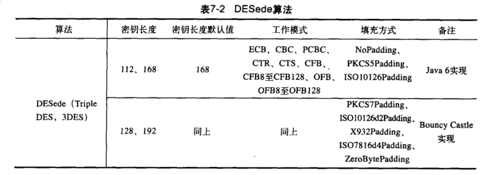
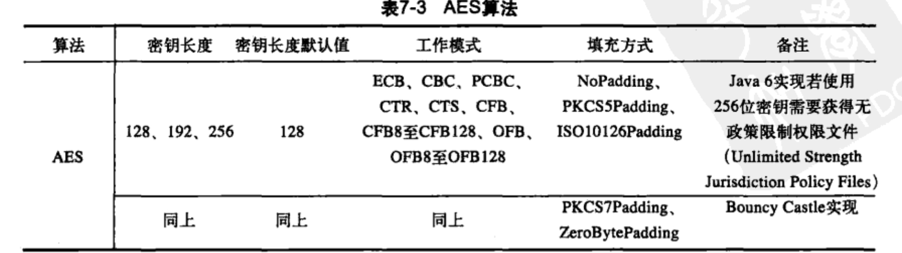
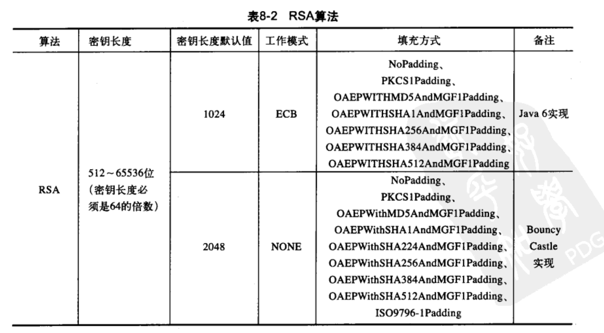
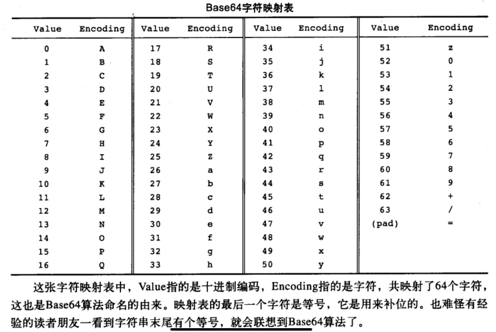
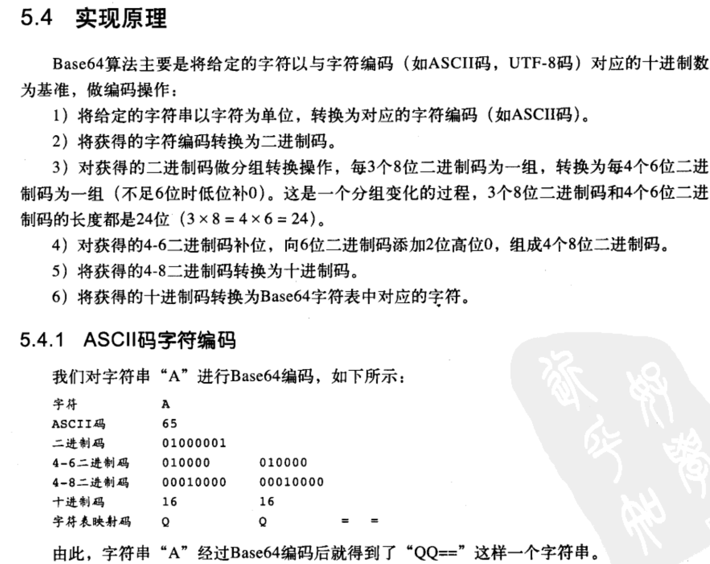
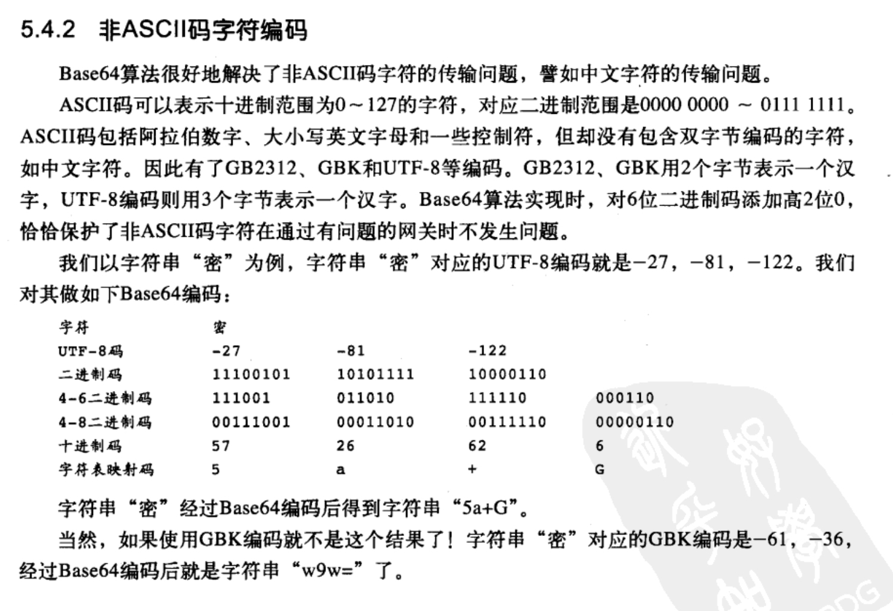

# 对称加密体制

对称加密体制分为俩种：

1. 对明文的单个位或者字节进行运算（流密码）

- 使用最广泛的流密码是RC4。

2. 把明文信息划分为不同的组结构，分别对每个分组进行加密和解密（分组密码）

- 在分组加密算法中，有ECB,CBC,CFB,OFB这几种算法模式。
- ECB-电子密码本模式
  - 优点
    - 容易理解，便于实现并行操作，没有误差传递
  - 缺点
    -  不能隐藏明文模式，如果明文重复，对应的密文也会重复，密文内容很容易被篡改
  - 用途
    -  适合加密密匙，随机数等短数据
- CBC-秘文链接模式
  -  优点
     -  加密后的密文上下文关联，，明文中重复的信息也不会产生相同的密文，如果密文被篡改，或者破坏，无法完成解密还原。
  -  缺点
     -  不利于并行计算，如果加密过程出错，导致加密失败
  -  用途
     -  加密任何长度的数据；适合计算产生检测数据完整性的消息认证码
- CFB-密文反馈模式
  -  优点
     -  隐藏明文，每一个分组的加密结果必受前面所有分组的内容影响，即使出现多次相同的明文，均产生不同的密文，分组密码转换为流模式。
  -  缺点
     -  不利于并行计算
  -  用途
     -  检查明文密文的篡改
- OFB-输出反馈模式
  -  优点
     -  隐藏明文，分组密码转换为流模式，无误差传送
  -  缺点
     -  不利于并行计算，安全性比CFB差
  -  用途
     -  适用于加密较大的数据，比如语音和图像
- 对称加密的一些算法
  - DES
    - DES算法和DESede算法统称DES系列算法。DES算法是对称加密算法领域中典型的算法，为后续的对称加密算法的发展奠定了坚实的基础。但是随着计算机的发展DES算法已经越来越不安全，因此诞生了一些新的算法
    - DESede
      - 对DES做了改良，但是这种算法吹速度慢，密钥激素三时间加长，加密效率不高
      - 

- ASE
  - DESede虽然改进了，安全性提高了，但是效率低和实现慢完全不能满足需求。
  - 

- IDEA
  - 国际数据加密标准，常常见于电子邮件加密
- PBE
  - 基于口令的加密算法，其加密的特点在于口令由用户自己掌管采用随机数（盐）杂凑多重加密保证数据安全性，PBE算法没有密匙概念。PBE算法算法并没有真正的构建加密解密的算法，而是对已经知道的对称算法做了包装

# 非对称加密体制

- 非对称加密有俩个密匙：公开的密匙，私有的密匙
  公开的密匙进行加密，私有的进行解密
- DH（密钥交换算法）
  - 就是由甲方产出一对密钥（公钥、私钥），乙方依照甲方公钥产生乙方密钥对（公钥、私钥）。以此为基线，作为数据传输保密基础，同时双方使用同一种对称加密算法构建本地密钥（SecretKey）对数据加密。这样，在互通了本地密钥（SecretKey）算法后，甲乙双方公开自己的公钥，使用对方的公钥和刚才产生的私钥加密数据，同时可以使用对方的公钥和自己的私钥对数据解密。
  - 整个流程：
  - 1.甲乙双方初始化各自的密钥对，甲方构建出密钥对keyPair1-->乙方使用甲方的密钥对中的公钥publicKey1构建出自己的密钥对keyPair2
  - 2.甲乙双方构建各自的本地密钥，甲方使用自己的私钥privateKey1+乙方的公钥publicKey2构建出自己的本地密钥key1，乙方使用自己的私钥privateKey2+甲方的公钥publicKey1构建出自己的本地密钥key2，最后会发现key1==key2，这两个本地密钥将会是接下来对对称加密所使用的密钥
  - 3.发送方（甲方或乙方均可）使用本地密钥+对称加密算法对待加密数据进行加密，传递给接收方
  - 4.接收方使用本地密钥+对称加密算法对待解密数据进行解密
- RSA
  - 甲方构建密钥对儿，将公钥公布给乙方，将私钥保留。
    甲方使用私钥加密数据，然后用私钥对加密后的数据签名，发送给乙方签名以及加密后的数据；乙方使用公钥、签名来验证待解密数据是否有效，如果有效使用公钥对数据解密。
    乙方使用公钥加密数据，向甲方发送经过加密后的数据；甲方获得加密数据，通过私钥解密。

  - 

# 散列函数（hash）

- 特性：
  - 消息长度不受限制
  - 俩个散列值不同，俩个散列值的原来数据也不同
  - 散列函数运算不可逆
  - 不同消息的散列值一定不同
- 用途：
  消息完整的验证，常见算法md（消息摘要算法），sha（安全散列算法），mac（消息认证码算法）
- MD
  - MD5算法是由前面的ＭD2，MD3，MD4演变而来。它需要获取一个随机长度的信息并产生一个128位的信息摘要，再把这个128位的二进制摘要换成16进制（每四位二进制数转化为1个十六进制的数），最后得到一个32位的字符串。
  - MD5算法如今已经不再安全，只能期待下一代算法MD6（http://groups.csail.mit.edu/cis/md6/）
- SHA
  - SHA算法基于MD4算法的基础上，新一代的消息摘要算法，通过SHA算法同样能够获取一个固定长度的摘要信息，与MD系列不同的是，如果输入的消息不同，则赌赢的摘要信息差异概率很高。因此，由消息摘要反推输入原信息，很难。
- MAC
  - MAC算法结合了MD5和SHA的优势，并加入了密钥，因此常把MAC称之为HMAC

# base64算法

- 由来
  - Base64算法最早应用于解决电子邮件传输的问题。早期电子邮件传输只允许ASCII码字符，而传输一封信有非ASCII码字符的电子邮件就会出问题，由此产生了Base64算法
- 定义
  - Base64一种基于64个字符的编码算法

- 应用
  - 电子邮件传输
  - 网络请求url参数加密
  - 密钥存储
  - 数字证书存储

# 加密填充的方式

- [https://blog.csdn.net/jingerppp/article/details/84256774?depth_1-utm_source=distribute.pc_relevant.none-task&utm_source=distribute.pc_relevant.none-task](https://blog.csdn.net/jingerppp/article/details/84256774?depth_1-utm_source=distribute.pc_relevant.none-task&utm_source=distribute.pc_relevant.none-task)
- NoPadding
- PKCS7Padding
- ZeroPadding
- AnsiX923
- Iso10126
- Iso97971