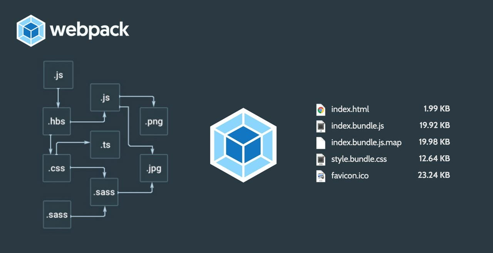
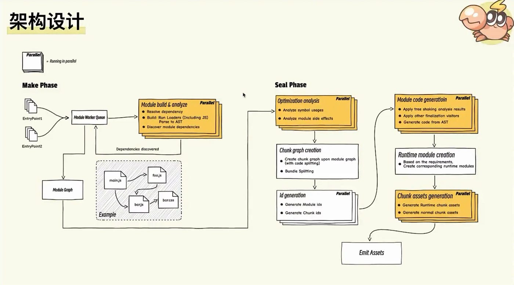
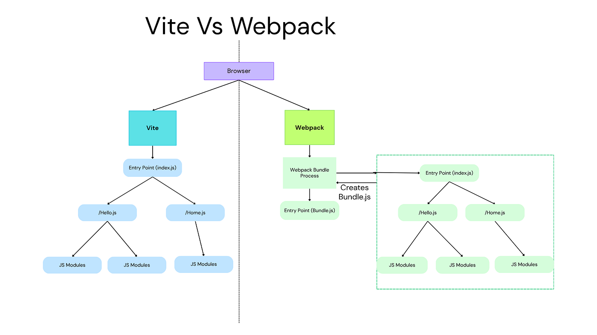
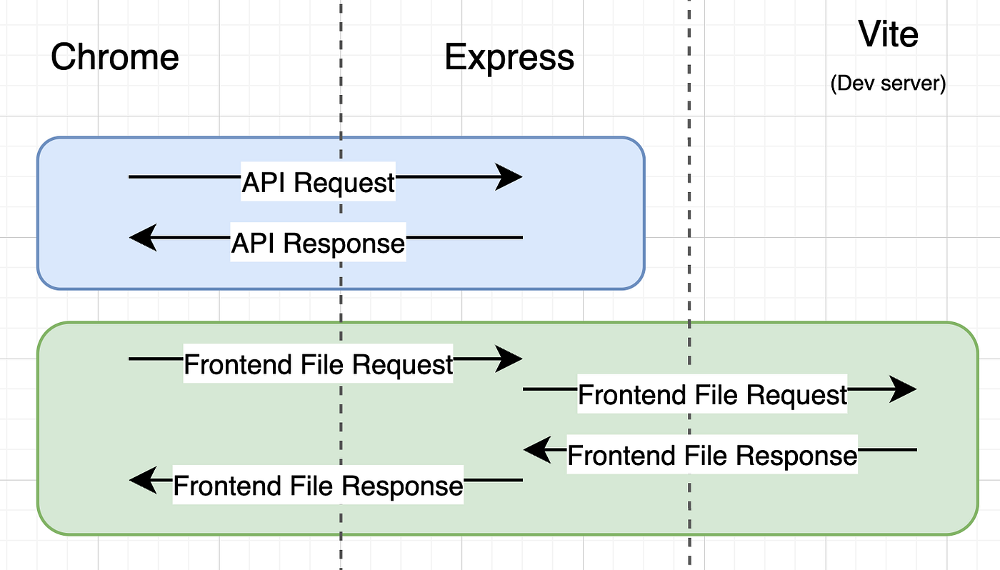
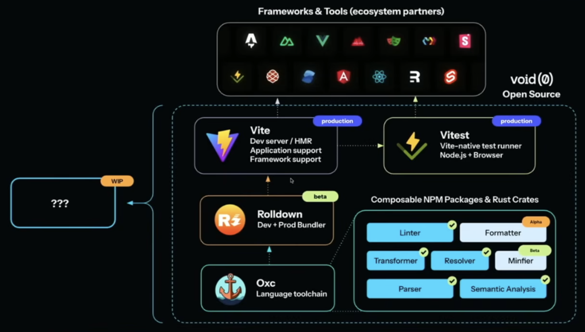

前端打包（bundling / building）在不同工具里的**核心流程**差异很大，主要体现在**开发环境（Dev）**与**生产环境（Prod）**如何处理模块。下面按 2026 年常见栈（**Webpack**、**Vite**（含 Rolldown）、**Rspack**、**Turbopack** 等）做流程对比，便于你按项目阶段选型。

## Webpack / Rspack：传统 Bundle-First

两者架构最接近：Rspack 是用 Rust 重写的 Webpack 兼容实现，流程几乎一致，整体更快。

### 核心流程（Dev 与 Prod 类似，偏全量打包）

1. **入口扫描（Entry）**：从 `entry` 出发，解析 `import` / `require`。
2. **依赖图（Dependency Graph）**：静态分析全项目，形成模块树（含子依赖）。
3. **模块转换（Loaders / Rules）**：按文件类型走 loader（如 ts-loader、css-loader、babel-loader）；Rspack 侧常用内置 SWC 并行加速。
4. **优化（Optimization）**：Tree Shaking、Code Splitting、压缩（Terser / SWC）、side effects 等。
5. **Chunk 与 Runtime**：产出 chunk 并注入 webpack runtime。
6. **输出**：`dist` 下的 bundle、CSS、source map 等。

**Dev 额外行为**：`webpack-dev-server` + HMR；超大仓库里冷启动与 HMR 可能偏慢（需重编受影响模块）。

**Rspack 侧**：Make Phase（并行构建与分析）与 Seal Phase（优化与输出）大量并行 + Rust 多线程，常见宣传为相对 Webpack 数倍量级的提速（具体倍数依项目而定）。

_图：依赖从入口展开为 bundle 的典型示意_

_图：并行化的 Make / Seal 两阶段（示意并行粒度）。_

## Vite：Native ESM 与 Rolldown 统一管道

Vite 早期特点是 **Dev 与 Prod 路径不同**；在 **Vite 8** 一代起，用 **Rolldown**（Rust）推进**统一管道**，让 dev / prod 行为更一致，插件模型也更对齐。

### 开发环境（Dev Server）

1. **轻量起服务**：不做全量预先打包。
2. **按请求编译**：浏览器原生 ESM，Vite 对**被请求的模块**做按需转换。
3. **依赖预打包（Pre-bundling）**：把 `node_modules` 里偏 CJS 的依赖打成 ESM（早期多用 esbuild，后续可向 Rolldown 收敛）。
4. **转换 + HMR**：TS / JSX / CSS 等经插件转换后以 ESM 形式返回；改动通常只波及相关模块，HMR 反馈快。
5. **结果**：浏览器直接跑 ESM，而不是先等一个大 bundle。

### 生产环境（Prod Build）

1. **全量扫描**并建依赖图。
2. **统一打包（Rolldown）**：Tree Shaking、分割、压缩等在 Rust 管线里完成。
3. **输出**：少量 chunk，体积与加载路径可优化。

**Vite + Rolldown 统一后**：dev / prod 共享 Rolldown 管线，并常与 **Oxc** 等 Rust 侧解析/转换配合，减少「双引擎」行为差异；具体提速比例随项目与版本变化，需以实测为准。

_图：Native ESM 按需服务 vs 传统 bundle 的差异（常见对比图）。_

_图：请求到达后再转换模块的典型 Dev 流程。_

_图：The New Stack 等媒体上的 Vite + Rolldown 相关架构示意。_

## Turbopack：增量计算（Incremental）

面向 **Next.js** 等场景，定位接替 Webpack 的 dev 体验。

- **细粒度依赖图**：强调缓存与增量，而非每次全量重算。
- **变更局部重算**：只更新受影响子图（incremental）。
- **Rust + SWC**：解析、转换、打包多在 Rust 栈内完成，冷启动与 HMR 目标极快。
- **Prod**：能力随版本持续演进，选型时以当前 Next.js / Turbopack 发布说明为准。

公开静态「流程图」较少，叙事上多强调 **incremental computation** 与最小重算。

## 其他工具速览

- **esbuild**：Go 实现，单文件转换极快，常见于预打包或库构建；模型相对简单：解析 → 转换 → 输出。
- **Rolldown**：Rust 侧 Rollup 系实现，可与 Vite 集成，强调高性能 bundling 与统一 dev/prod。
- **Bun Bundler**：与 Bun runtime 一体，并发与一体化是卖点之一。

## 对比小结

| 工具              | Dev 模式核心        | Prod 模式核心        | 依赖图 / 构建方式    | 速度优势常见来源   | 典型场景                  |
| ----------------- | ------------------- | -------------------- | -------------------- | ------------------ | ------------------------- |
| Webpack           | 全量打包 + HMR      | 全量打包 + 优化      | 全量静态分析         | 插件生态、历史兼容 | 遗留大型项目、重定制      |
| Rspack            | 全量打包 + 并行 HMR | 全量打包 + Rust 优化 | 全量（Webpack 兼容） | Rust 多线程        | Webpack 迁移、要兼容配置  |
| Vite（旧双引擎）  | Native ESM + 按需   | 多为 Rollup 打包     | dev 按需 / prod 全量 | 浏览器 ESM、预打包 | 新项目常见选择            |
| Vite 8 + Rolldown | Rolldown 管线       | Rolldown 管线        | 统一管线             | Rust 全链路        | 2026 年起新项目可重点评估 |
| Turbopack         | 增量 + 细粒度缓存   | 随版本演进           | 细粒度增量           | Rust + 最小重算    | Next.js 大型应用          |

### 总体趋势（约 2026）

- 从「整包 JS」→「按需 ESM + 预打包」→「Rust 统一管线 + 增量计算」。
- 瓶颈常从「单线程 JS 工具链」转向「多线程原生实现 + 缓存策略」。
- **选型提示**：新项目可优先考虑 **Vite + Rolldown**；要保留 Webpack 配置可试 **Rspack**；**Next.js** 生态关注 **Turbopack** 与官方默认栈。

### 核心要点

- **Bundle-First（Webpack / Rspack）**：dev/prod 都围绕完整依赖图与 chunk，能力全面，大项目下 dev 成本可能偏高。
- **Vite 类**：dev 侧以 ESM + 按需转换为主，prod 再全量优化；Rolldown 统一后减少两套语义差异。
- **Turbopack 类**：强调增量与缓存，适合框架深度集成的超大仓 dev 体验。
- 文中的性能倍数（如「5–23 倍」「10–30 倍」）多来自厂商材料，**务必在你的仓库与硬件上实测**后再做决策。
