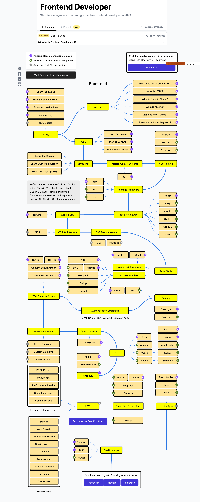
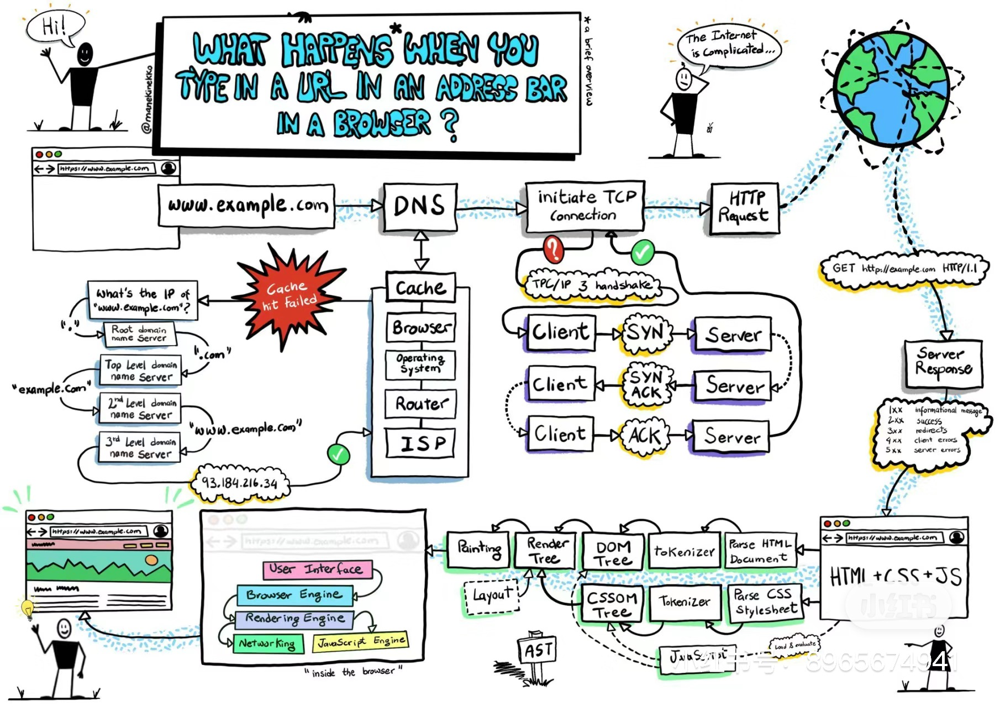
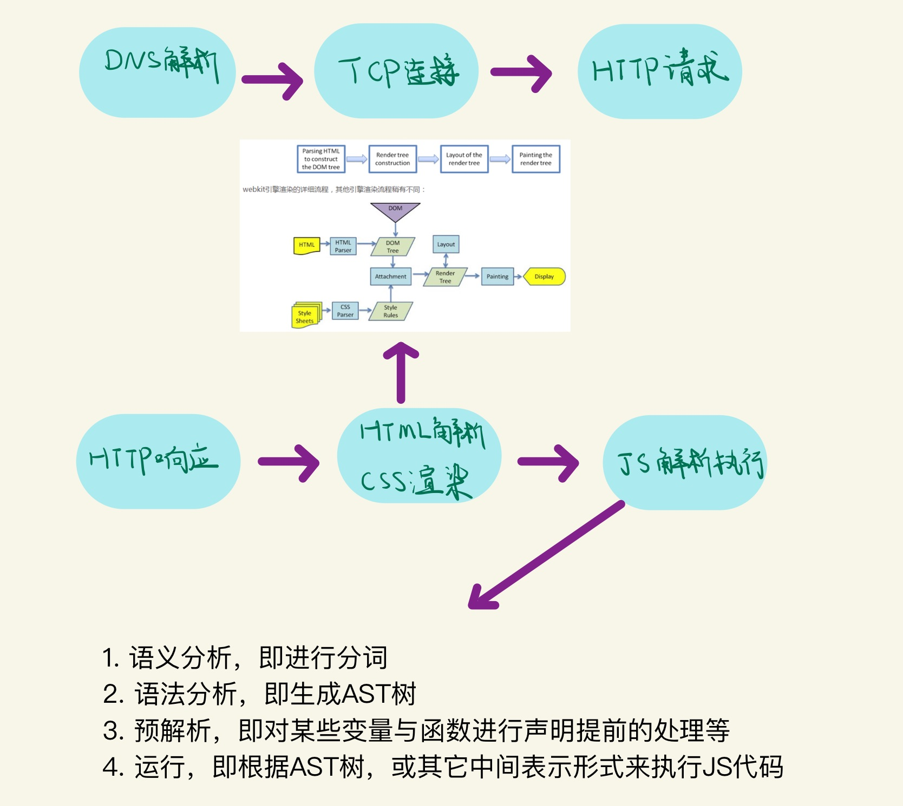
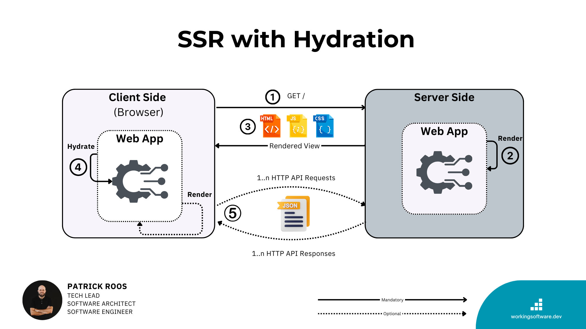
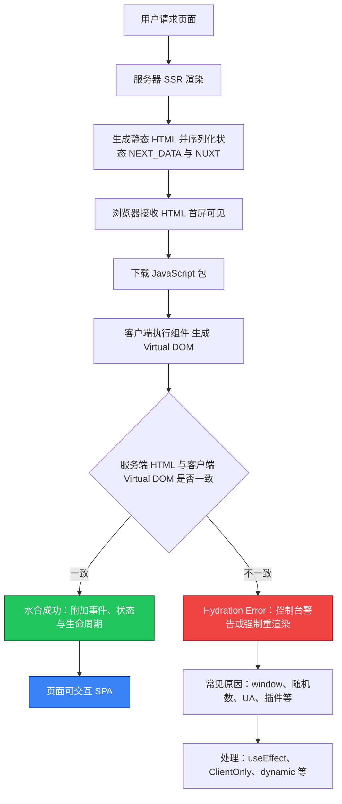

_图：前端技能树 / Roadmap 示意（个人笔记整理）_

我们每天都在上网，我们上网上的是什么？最简单的就是看图片、视频、文字，这些在计算机中统称为**超文本**（Hypertext）。  
访问一个网页，其实可以分为两个部分：**前端**（用户可见的交互前台）和**后端**（服务器逻辑）。

本笔记专注**前端**部分，帮助新手从零建立完整认知。

## 浏览网页到底做了什么？



_图：在浏览器中输入网址后的完整流程（手绘）_

当你在浏览器地址栏输入一个网址并回车后，到底发生了什么？

**这张手绘大图**（非常适合新手）完整展示了整个流程：  
**DNS 解析 → TCP 连接 → HTTP 请求 → 服务器响应 → 浏览器内部解析（HTML/CSS/JS）→ DOM/CSSOM → Render Tree → Layout → Painting → 最终显示**。

### 浏览器内核（Rendering Engine）

负责把网页代码转化为可见页面。2026 年主流内核：

- **Blink**（Chromium）：Chrome、Edge（新版）、Opera 等（占据 70%+ 市场）
- **Gecko**：Firefox
- **WebKit**：Safari（iOS/macOS）

**历史小贴士**：IE（Trident）已于 2022 年 6 月 15 日彻底退役，2026 年企业遗留 IE Mode 也基本结束支持。前端开发者终于不用再为 IE 兼容性头疼了！

### 浏览器 JavaScript 引擎

- Chrome / Edge / Node.js：**V8**（最强大）
- Firefox：SpiderMonkey
- Safari：JavaScriptCore

### 浏览器渲染流程（Critical Rendering Path）



_图：浏览器渲染过程（Critical Rendering Path）_

详细步骤：

- **DOM Tree**：HTML 解析成树形结构
- **CSSOM Tree**：CSS 解析成树形结构
- **Render Tree**：DOM + CSSOM 合并
- **Layout（回流 / Reflow）**：计算每个元素位置和大小
- **Painting（重绘）**：通过 GPU 把内容画到屏幕
- **Composite（合成）**：现代浏览器用图层优化，只更新变化部分

**关键概念**：

- **Reflow（回流）**：改变布局属性（width、height、position 等）时触发，代价最高
- **Repaint（重绘）**：只改变颜色、背景等不影响布局的属性，代价较低
- **优化技巧**：使用 `transform`、`opacity` 触发 GPU 加速；避免频繁操作 DOM；批量修改样式。

## 前端发展简史

### 1. HTML

超文本标记语言，用于定义网页结构。HTML5（2014）新增语义标签、多媒体支持、Canvas、本地存储等。

### 2. HTTP 协议

超文本传输协议（HTTP/1.1 → HTTP/2 → HTTP/3）。

### 3. 浏览器时代

Netscape → Firefox（Gecko）；微软 IE → Edge（现 Chromium）；Google Chrome（Blink）主导市场。

### 4. 浏览器架构

- **壳（Shell）**：用户界面
- **内核**：渲染引擎 + JavaScript 引擎 + DOM API

### 5. JavaScript 相关技术

- JavaScript（JS）与 Java **毫无关系**（仅命名营销）
- **JSX**（React 使用）：JS 语法扩展，看起来像 HTML，更清晰、编译优化
- **TypeScript**：JS 超集，添加静态类型检查，大型项目必备
- **ECMAScript（ES）**：JS 标准，ES6（2015）是里程碑（箭头函数、Promise、模块等）

### 6. V8 引擎与 Node.js

V8 引擎让 JS 能在服务器运行 → **[Node.js](https://nodejs.org/zh-cn/)**

**Node.js 可以做什么**（前端全栈化）：

- Express / Koa 构建 Web 服务器
- Electron 构建桌面应用
- 命令行工具、API、数据库操作等

**npm 与包管理**（2026 年推荐）：

```bash
# 查看当前源
npm get registry
# 切换国内镜像
npm config set registry https://registry.npmmirror.com
```

推荐工具：`nrm` 快速切换镜像源。

### 7. CSS

层叠样式表。原生 CSS 无变量/函数 → 出现预处理器：

- **Sass/SCSS**（最流行）：变量、嵌套、混入、函数
- **Less**：语法更接近 CSS

现代替代：**Tailwind CSS**（原子类）、**CSS Modules**、**Styled Components**（CSS-in-JS）。

### 8. 静态 vs 动态网页 + 现代渲染策略

| 策略 | 全称                            | 生成时机           | 优点           | 缺点           | 适用场景     |
| ---- | ------------------------------- | ------------------ | -------------- | -------------- | ------------ |
| CSR  | Client-Side Rendering           | 浏览器执行 JS      | 交互丰富       | 首屏慢、SEO 差 | 后台管理系统 |
| SSR  | Server-Side Rendering           | 每次请求服务器渲染 | SEO 好、首屏快 | 服务器压力大   | 新闻、电商   |
| SSG  | Static Site Generation          | 构建时预生成       | 最快、安全     | 不适合实时内容 | 博客、文档站 |
| ISR  | Incremental Static Regeneration | 构建时 + 按需更新  | 兼顾速度与动态 | 配置稍复杂     | 大型内容站   |

框架支持：**Next.js**（React）、**Nuxt**（Vue）、**Astro**（内容站）。

### 9. 同步 vs 异步加载

- **同步**：阻塞加载，体验差
- **异步**：**AJAX**（现用 Fetch / Axios）→ 不阻塞页面，局部更新

现代：`async/await` + React Query / SWR。

### 10. 模块化规范

- **CommonJS**：Node.js 默认（`require`）
- **ES6 Module**：浏览器原生支持（`import/export`）

### 11. Babel

JS 编译器，把 ES6+ / JSX / TypeScript 转成浏览器兼容代码。

### 12. 打包工具（2026 推荐）

- **Vite**（最推荐新项目）：开发极快、热更新秒级
- **Webpack**：功能最全，但构建较慢
- **Turbopack**（Next.js 默认）：Rust 编写，超快

**作用**：模块打包、代码压缩、Tree Shaking、Sass → CSS、ES6+ → ES5。

## 现代前端补充（2026 视角）

**核心三件套**：HTML（语义化 + 无障碍）、CSS（Flex/Grid + 变量）、JavaScript（ES6+）。

**流行框架**：

- React + Next.js（生态最强）
- Vue 3 + Nuxt
- Svelte / SvelteKit（性能极高）
- Angular（企业级）

**必备技能**：

- Git + GitHub
- TypeScript
- 状态管理（Zustand / Pinia）
- 测试（Vitest / Playwright）
- 性能优化（Core Web Vitals）
- PWA（离线可用）

**学习路径建议**（新手友好）：

1. HTML + CSS + JS（1–2 个月，多做小项目）
2. TypeScript + Git + 一个框架（React 或 Vue）
3. 构建工具 + API + 部署（Vercel / Netlify）
4. 真实项目实践

**前端永远在变，但基础永不过时**。框架是工具，理解原理才能游刃有余。

### 水合（Hydration）



_图：SSR with Hydration 流程示意（来源 [workingsoftware.dev](https://www.workingsoftware.dev)，已保存至本站 `source/images/frontend-what-2026/`）_

图解说明（SSR with Hydration 流程）：

- **左侧（Client Side）**：浏览器收到 HTML 后进行 Hydrate 操作，让静态 HTML 变成可交互的 Web App。
- **右侧（Server Side）**：服务器渲染生成 HTML + JS + CSS，并可选地返回 JSON 数据。
- **关键步骤**：① 用户请求 → ② 服务器 Render → ③ 返回 Rendered View → ④ 客户端 Hydrate → ⑤ 数据交互。

水合（Hydration）是现代前端框架（如 Next.js、Nuxt.js）在**服务端渲染（SSR）**模式下实现「快速首屏 + 交互性」的核心技术。它是 SSR 与 CSR（客户端渲染）的桥梁，让静态 HTML 瞬间「活」起来，成为可交互的单页应用（SPA）。

#### 水合到底是什么？（一步步拆解）

1. **服务器端渲染（SSR）阶段**  
   用户请求页面 → 服务器运行框架代码（React/Vue）→ 生成**完整的静态 HTML**（包含内容、样式）。  
   同时把必要的**状态数据**序列化成 `<script>` 标签（Next.js 用 `__NEXT_DATA__` 或 `window.__NUXT__`；Nuxt 用 `__NUXT__`）。  
   浏览器直接收到可立即显示的 HTML → **首屏极快 + SEO 友好**。

2. **客户端水合（Hydration）阶段**  
   浏览器加载 JS 包 → 框架**再次**在浏览器里运行相同的组件代码（但这次只生成 Virtual DOM）。  
   框架将 Virtual DOM **与已存在的真实 DOM 逐节点对比**（Reconciliation）。  
   如果完全匹配 → **附加**事件监听器、响应式状态、生命周期钩子等，让静态 HTML 变成可交互应用。  
   这个「附加生命」的过程就叫 **Hydration**（像给干枯的植物浇水，让它恢复活力）。

3. **为什么需要水合？**
   - 纯 SSR：HTML 很快但无交互（点击没反应）。
   - 纯 CSR：交互强但首屏白屏 + SEO 差。
   - SSR + Hydration = 两者兼得。

**注意**：水合只发生在 SSR/Universal Rendering 模式下。纯静态站点（SSG）或纯客户端渲染（CSR）不需要水合。

### 为什么经常出现 Hydration Error？



**核心原因**：服务器渲染出的 HTML 与客户端首次渲染（hydrate 前的 Virtual DOM）**不一致**（mismatch）。  
框架检测到差异后会报错（开发模式下控制台警告，生产环境可能导致闪烁或功能失效）。

#### 常见触发场景（2026 年最新实践）

- **浏览器专属 API 在渲染时被调用**：`window`、`document`、`localStorage`、`navigator` 等（服务器上不存在）。
- **非确定性值**：`Math.random()`、`new Date()`、`uuid`、浏览器指纹等（服务器和客户端结果不同）。
- **条件渲染差异**：根据 `userAgent`、`window.innerWidth` 等客户端独有信息渲染不同内容。
- **HTML 结构不合法**：`<p>` 里嵌 `<div>`、`<a>` 里嵌 `<a>` 等（React/Vue 严格校验）。
- **第三方库/扩展**：浏览器插件（如 ColorZilla）注入属性、CSS-in-JS 样式不一致、字体加载时机不同。
- **状态未正确序列化**：`useState` 初始值在服务器和客户端不一致。

**后果**：

- 开发时：控制台红字 + 警告。
- 生产时：框架可能强制客户端重新渲染整个子树 → 增加 TTI（Time to Interactive）、卡顿、LCP 变差。

### 解决 Hydration Error 的通用方案

1. **把客户端专属逻辑移到 `useEffect` / `onMounted`**（只在浏览器执行）。
2. **使用框架提供的 SSR 安全工具**：
   - Next.js：`dynamic(() => import(...), { ssr: false })` 或 React 19 的新特性。
   - Nuxt.js：`<ClientOnly>` 组件。
3. **状态持久化**：用 `useState`、`useAsyncData` 等框架 composable（自动序列化）。
4. **临时压制**（不推荐长期使用）：`suppressHydrationWarning={true}`（Next.js）或 Vue 的 `v-html`。
5. **现代最佳实践**：Partial Hydration / Islands Architecture（下面框架对比中详述）。

### Next.js vs Nuxt.js 水合机制对比（2026 年最新）

两者底层原理一致，但实现方式、工具和优化方向有明显差异：

| 维度                  | **Next.js (React + App Router)**                                                                                                  | **Nuxt.js (Vue 3 + Nuxt 4)**                                                              | 谁更友好？                    |
| --------------------- | --------------------------------------------------------------------------------------------------------------------------------- | ----------------------------------------------------------------------------------------- | ----------------------------- |
| **核心框架**          | React 19 + Server Components (RSC)                                                                                                | Vue 3 + Nitro 引擎                                                                        | -                             |
| **水合范围**          | **选择性水合**（Selective Hydration）<br>RSC 默认只在服务器运行，完全无需水合；只有标记 `'use client'` 的 Client Component 才水合 | **渐进式 + Islands**<br>默认全水合，但支持 `<NuxtIsland>` 和 `.island.vue` 实现零 JS 岛屿 | Nuxt 在静态部分更激进         |
| **错误提示**          | Next.js 15 大幅改进：直接高亮出错代码 + 修复建议                                                                                  | 详细警告 + Vue DevTools 可视化追踪                                                        | Next.js 15 领先               |
| **客户端专属组件**    | `dynamic({ ssr: false })` 或 `'use client'`                                                                                       | `<ClientOnly fallback="加载中...">`（最简单）                                             | Nuxt 更简洁                   |
| **懒加载 / 延迟水合** | React Lazy + Suspense + `loading.js`                                                                                              | 内置 **Lazy Hydration**（实验特性）+ `<Lazy>`                                             | Nuxt 更原生                   |
| **数据获取安全**      | Server Component 直接 `fetch`（无水合风险）<br>Client Component 用 `use` hook                                                     | `useAsyncData`、`useFetch`、`useState`（自动处理序列化）                                  | 两者都很安全                  |
| **性能极致优化**      | RSC + Partial Hydration + React Compiler（实验）                                                                                  | **Nuxt Islands**（`<NuxtIsland>`）+ Server-Only 组件 + Lazy Hydration                     | Nuxt 在高流量静态内容场景更优 |
| **典型使用场景**      | 复杂交互重应用（Dashboard、电商交互页）                                                                                           | 内容型网站、营销页、需要大量静态岛屿的站点                                                | -                             |

#### Next.js 水合亮点（2026）

- **React Server Components** 是革命：页面大部分组件默认只在服务器运行，客户端只下载极少 JS → 水合体积大幅下降。
- Next.js 15 优化了 hydration 错误调试，开发体验显著提升。
- 适合需要深度 React 生态的项目。

#### Nuxt.js 水合亮点（2026）

- **Nuxt Islands 架构**（实验但已成熟）：把组件标记为 `.island.vue` 或用 `<NuxtIsland>`，服务器渲染后**完全不需要客户端 JS**，实现真正的「零水合」。
- `<ClientOnly>` + `useState`/`useFetch` 让开发者几乎感觉不到水合的存在。
- Lazy Hydration 让非关键组件（如图表、评论区）延迟到视口出现或空闲时才水合。
- 适合内容密集型站点（博客、文档、营销落地页）。

**小结建议**：

- **新项目**：如果团队熟悉 Vue → 选 Nuxt（Islands + ClientOnly 更直观）；熟悉 React → 选 Next.js（RSC 生态更强）。
- **性能追求**：两者都支持 Partial/Progressive Hydration，Nuxt Islands 在静态内容占比高时优势明显。
- **调试技巧**：永远不要忽略 Hydration 警告！用 `console.log` 对比服务器/客户端渲染结果，或启用框架的 hydration overlay 工具。
