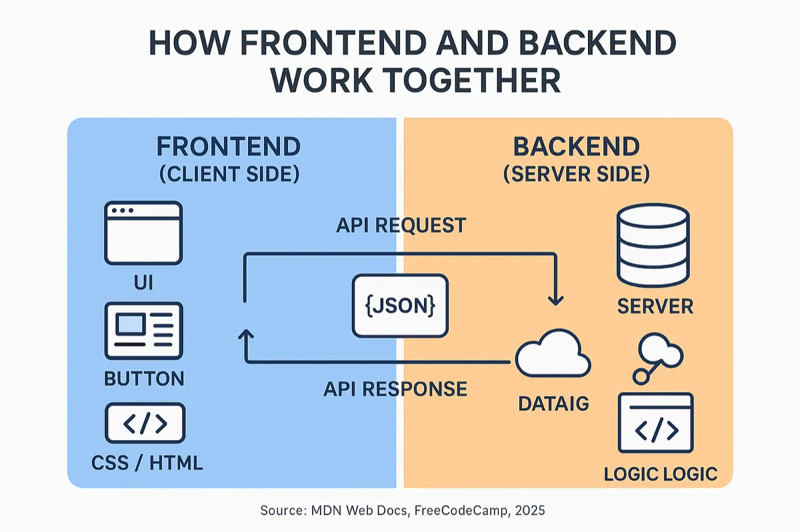
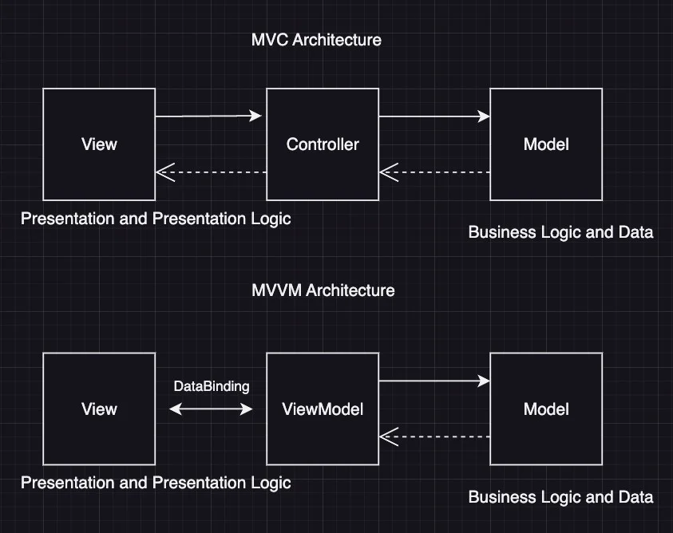
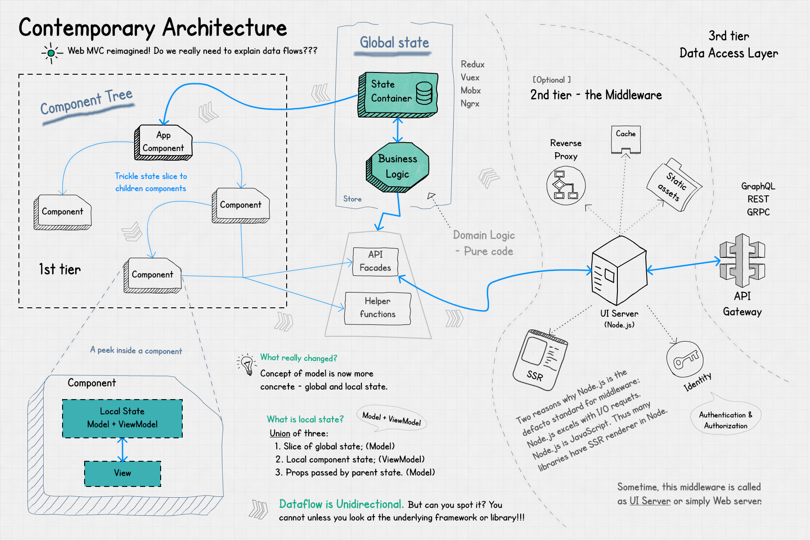
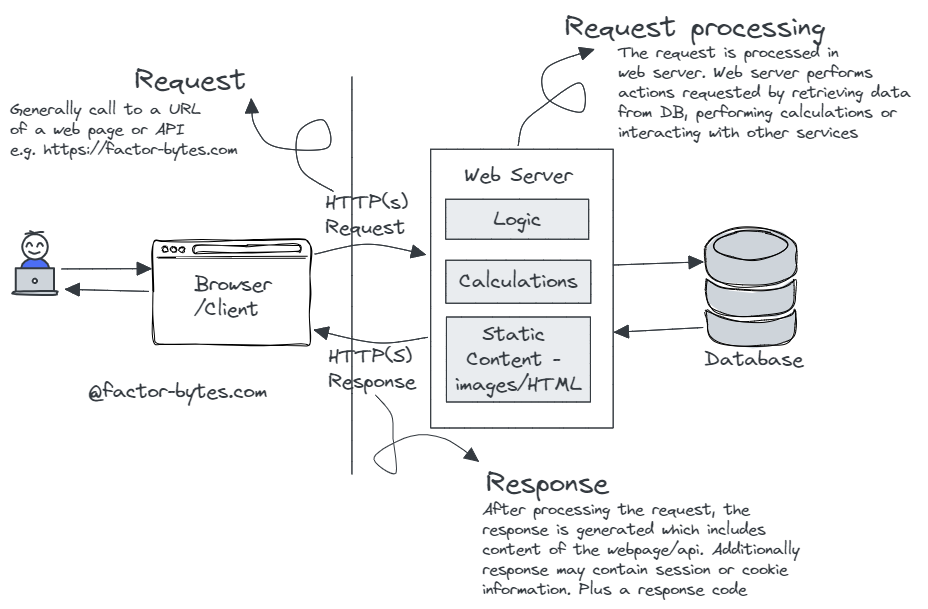
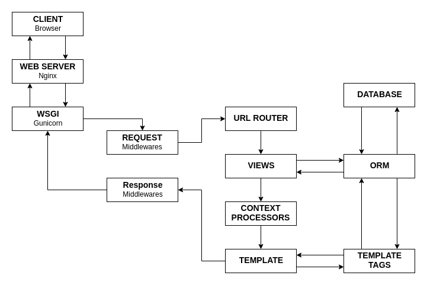

面向初学与回顾的一份**结构化笔记**：从前后端分工、HTTP 与 I/O，到 **REST / GraphQL / RPC** 等接口设计风格，再到 Python 的 WSGI/ASGI、多语言「应用—服务器」边界，以及数据库访问方式与工程实践。

学习路径可参考 [roadmap.sh/backend](https://roadmap.sh/backend)（语言 → Git → 数据库 → API → 测试 → 容器化 → 微服务 → Observability）。

## 前端与后端：为什么底层更「稳」？

典型 **前后端分离** 架构下：浏览器或 App 中的 **Frontend** 负责界面与交互；运行在服务器侧的 **Backend** 负责业务规则、数据与安全。双方通过 **HTTP(S)** 交换数据（常见为 JSON），形态仍是 **请求—响应**。



_图：Frontend / Backend 职责划分_

| 维度               | Frontend（前端）                     | Backend（后端）                                 |
| ------------------ | ------------------------------------ | ----------------------------------------------- |
| **关注点**         | 界面、交互、渲染与客户端状态         | 业务规则、持久化、安全、性能与伸缩              |
| **运行环境**       | 浏览器、移动端宿主（WebView 等）     | 服务器、容器或 Serverless 运行时                |
| **常见工作**       | 组件与路由、调用 API、展示与校验提示 | 设计 API、访问数据库、认证鉴权、领域计算        |
| **技术栈（示例）** | HTML/CSS/JS、React、Vue、Svelte 等   | Go、Java/Spring、Python/Django·FastAPI、Node 等 |
| **通信**           | `fetch`/axios 等发起请求             | 解析请求、执行业务、返回 JSON 等响应体          |

### MVC 与 MVVM 对照（示意图）

服务端分层常用 **MVC**（或 MVT 等变体）；而客户端里 **MVVM** 更利于把界面状态从视图逻辑中抽离。下图概括两者在「谁驱动谁、数据往哪流」上的差异。



_图：MVC vs. MVVM_

**前端 MVVM**

- **View**：页面模板（HTML + 指令），几乎不写业务逻辑。
- **ViewModel**：处理 UI 逻辑、状态管理与 API 调用（如 Vue 的 `setup()`、React Hooks）。
- **Model**：数据模型（通常来自后端 API 返回的 JSON）。
- **要点**：双向绑定，界面变化与数据可自动同步。

**后端 MVC**

- **Controller**：接收 HTTP 请求并协调流程（不宜堆叠复杂业务逻辑）。
- **Model**：数据模型与数据库访问（或经 Repository 层）。
- **Service**（常见扩展）：承载核心业务逻辑。
- **要点**：关注点分离，便于测试与维护。

**完整请求生命周期**



_图：从用户操作到 View / ViewModel、API、后端 Controller / Service / 数据库再返回 JSON 的流程_

> 用户操作 → 前端 View → ViewModel（准备请求）→ API → 后端 Controller → Service / Model → 数据库 → 返回 JSON → 前端 ViewModel 更新状态 → View 渲染。

| 维度             | **前端（Client Side）**                                         | **后端（Server Side）**                                                       |
| ---------------- | --------------------------------------------------------------- | ----------------------------------------------------------------------------- |
| **主要架构模式** | **MVVM**（主流） 也可能用 Flux/Redux、MVI 等                    | **MVC**（最普遍） 也常用 Clean Architecture、DDD、Hexagonal 等                |
| **典型框架**     | Vue.js（官方 MVVM）、React（更接近 Flux）、Angular（MVVM 风格） | Spring Boot（MVC）、Django（MVT）、FastAPI/Laravel（MVC 风格）、NestJS（MVC） |
| **关注点**       | **UI 交互与用户体验**（View 层很重）                            | **业务逻辑、数据处理、安全、并发**（Model + Controller 很重）                 |
| **数据流**       | 双向数据绑定（View ↔ ViewModel 自动同步）                       | 单向请求—响应（HTTP 请求 → Controller → Model → Response）                    |
| **运行环境**     | 浏览器 / 移动端（客户端设备）                                   | 服务器（Server）                                                              |

**趋势（2026）**：前后端分离已是默认；**富客户端**（SPA、SSR/SSG 混合）使前端工程更重，后端则更强调 **稳定的 API、领域服务与可观测性**。**BFF**（Backend for Frontend）常为 Web / iOS / Android 分别聚合接口，降低端侧拼装成本。

多数项目会组合使用：**前端 MVVM + 后端 MVC + HTTP API**。

与此同时，前端工具链与 UI 框架迭代很快，后端技术栈也在更替，但**底层原理仍相对稳定**：HTTP、TCP/Socket、关系型建模与范式、并发与 **I/O 多路复用**，变化幅度远小于界面层。

**后端在做什么**：数据处理、业务规则、持久化、安全与并发；常配合集群、缓存、消息队列、微服务等。**客户端**负责界面；**B/S** 可视为 **C/S** 在 Web 上的一种形态。

## HTTP：一切围绕请求与响应

- **为何是核心**：浏览器与 App 通过 HTTP(S) 与服务器对话（地址栏默认即 `https://`）。
- **版本演进**：HTTP/1.1 → HTTP/2（多路复用）→ **HTTP/3（基于 QUIC，缓解队头阻塞，已广泛落地）**。
- **实践**：用 Chrome DevTools 或 Wireshark 观察握手与报文，将教材中的「三次握手 / 四次挥手」与真实抓包对照。

若需更直观的概念讲解，可检索网络基础类文章或「为什么需要 HTTP」等科普内容。

## 服务器处理模型与 I/O

服务器的核心任务是**在有限资源下承载高并发**，关键在如何调度 **I/O**（网络与磁盘读写）。不同模型在吞吐、延迟与 CPU/内存占用上差异很大。

### 四种常见模型

| 模型                         | 要点                                                                     | 典型场景                       |
| ---------------------------- | ------------------------------------------------------------------------ | ------------------------------ |
| **单线程阻塞**               | 读写会阻塞，一次处理一条连接                                             | 学习、极低并发                 |
| **多进程 / 多线程**          | 一连接一线程（或进程），并发上来后上下文切换与内存成本高                 | 传统模型、中小并发             |
| **I/O 多路复用（事件驱动）** | 少量线程监听大量连接，`select` / `poll` / `epoll` / `kqueue`，就绪再处理 | Nginx、Node（libuv）、Redis 等 |
| **多路复用 + 多线程/协程**   | 复用负责等事件，业务落在多核或轻量协程                                   | Go（goroutine + netpoller）等  |

**趋势（2026）**：高并发场景普遍采用**异步 + 协程/轻量线程**；Nginx 常见形态为 **Master + 多个 Worker**（Worker 数常接近 CPU 核数），Worker 内事件循环处理大量连接。

### 典型 Web 处理链

文字链路：**客户端** → TCP 建连 → **反向代理（如 Nginx）** → **应用进程（业务逻辑）** → 响应。

下图便于建立直觉：



_图：客户端到 Web 服务器与数据库的请求—响应关系（手绘 sketchnote，来源 factor-bytes.com 博文配图，已本地化存档）_

请求进入应用后的**逻辑链**（以 Python 为例，其他框架类似）：

`Client → Web Server → WSGI/ASGI → 请求中间件 → 路由 → 视图/Handler → ORM/DB → 响应中间件 → Response`



_图：请求经 WSGI/ASGI、中间件、路由到视图与 ORM 的链路（Medium 示意图，已本地化存档）_

### 实践小结

- **低并发**：阻塞或多线程即可。
- **高并发**：**I/O 多路复用 + 事件驱动**，并配合多进程/多 Worker 或多协程用满多核。

## Socket：更贴近协议栈的一层

- **服务端**：`socket()` → `bind()` → `listen()` → `accept()`
- **客户端**：`socket()` → `connect()`（触发三次握手）

建议用 Python `socket` 或 Go `net/http` 手写最小 HTTP 服务，配合 Ruslan Spivak 的 [「Let’s Build a Web Server」系列](https://ruslanspivak.com/lsbaws-part1/)（从 Part 1 读起，文内可跳转 Part 2/3；[配套示例代码](https://github.com/rspivak/lsbaws)），把字节流与报文格式联系起来。

## Python：WSGI 与 ASGI

**WSGI**（PEP 3333）是 Python 生态中的**同步** Web 接口标准：在「Web 服务器」与「Python 应用」之间约定统一调用方式，避免早期各框架与各服务器互不兼容。

**动机**：把框架（Django、Flask 等）与服务器（Gunicorn、uWSGI 等）**解耦**——任意 WSGI 服务器可托管任意 WSGI 应用。

**接口要点**：

- 应用是可调用对象（函数或带 `__call__` 的类）。
- 参数：`environ`（请求元数据）、`start_response`（写状态行与响应头）。
- 返回值：可迭代对象，元素为 **bytes** 响应体。

```python
from wsgiref.simple_server import make_server


def simple_app(environ, start_response):
    status = "200 OK"
    response_headers = [("Content-type", "text/plain")]
    start_response(status, response_headers)
    return [b"Hello world!\n"]


server = make_server("127.0.0.1", 9991, simple_app)
server.serve_forever()
```

**ASGI**：异步继任者，支持 `async/await`、WebSocket、流式响应等；新项目常见 **FastAPI + Uvicorn**。生产上多为 **Nginx → Uvicorn（或支持 ASGI 的进程模型）→ 应用**。

### 其他语言的「应用—服务器」边界

| 语言        | 常见等价物                 | 说明                                             |
| ----------- | -------------------------- | ------------------------------------------------ |
| **Python**  | WSGI / ASGI                | PEP 规范，函数式调用约定                         |
| **Java**    | Servlet API                | 容器（Tomcat/Jetty 等）与 Spring 等框架解耦      |
| **Ruby**    | Rack                       | `[status, headers, body]`，与 WSGI 极像          |
| **Go**      | `net/http.Handler`         | 标准库即主战场，框架多作薄封装                   |
| **Node.js** | `http` / `https` / `http2` | 事件驱动，框架直接建立在运行时之上               |
| **PHP**     | FastCGI、PHP-FPM           | 与 Nginx/Apache 进程模型配合                     |
| **通用**    | CGI / FastCGI              | 更底层、更通用，性能与开发体验通常弱于上述现代栈 |

**部署直觉**：Python 侧常显式出现「WSGI/ASGI 服务器」这一层；Java 常打包进 Servlet 容器；Go/Node 则更常「进程即服务」或由反向代理统一接入。

## Web 框架在解决什么问题？

框架收敛**路由、解析、校验、序列化、中间件、依赖注入**等重复劳动，降低错误率与安全风险，让你专注业务。

**2026 常见选型示例**（仅作地图，非排名）：

- Python：**FastAPI**（ASGI、OpenAPI、Pydantic）
- Go：**Gin** 或 `net/http` + **sqlc** 等
- Java：**Spring Boot**
- Node.js：**NestJS**

## 后端接口设计：常见 API 风格

**接口如何暴露**与业务如何组织同样重要：公共 API、内部微服务、复杂查询、实时推送等场景，适用的风格往往不同。下文按常见模式归纳（2026 年仍具代表性）。

### REST（Representational State Transfer，RESTful API）

基于 HTTP，用标准方法（GET、POST、PUT、DELETE、PATCH 等）操作**资源**，是最普及的一类风格。

**优点**：

- 概念直观、资料与中间件生态极丰富。
- **无状态（Stateless）**，利于水平扩展与 HTTP 缓存。
- 多格式（以 JSON 为主），浏览器与移动端友好。
- URL 与资源建模清晰，自描述性强。

**缺点**：

- **Over-fetching / Under-fetching**：一次响应可能偏大，或需多轮请求才能拼齐关联数据（也可能在 ORM 懒加载下放大为 N+1）。
- **版本治理**常要单独设计（路径 `/v1/`、Header、子域等）。
- 不适合表达任意复杂嵌套查询，也不擅长「服务端主动推送」。

**适用**：公共 API、第三方集成、典型 CRUD、移动/Web 后端；**对外暴露 HTTP API 时仍是默认首选之一**。

### GraphQL

由客户端用**查询语言**描述所需字段与嵌套结构，运行时按 Schema 解析执行。

**优点**：

- **按需取数**，减少无效字段与往返次数；嵌套关联一次拉齐。
- **强类型 Schema**，Introspection 便于工具链与文档。
- **Subscription** 可做实时推送；新增字段通常向后兼容。

**缺点**：

- 学习与运维成本高于 REST；服务端需处理解析、权限与性能（典型如 **N+1**，常用 DataLoader 等优化）。
- HTTP 层缓存不如 REST 自然；需限制查询深度/复杂度以防滥用。

**适用**：后台复杂聚合、多端（Web + 移动）共享一套 BFF、前端需求变化快的项目。

### RPC（Remote Procedure Call，远程过程调用）

语义是「像调本地函数一样调远端」，常见 **JSON-RPC / XML-RPC**；工程上更常提 **gRPC**（HTTP/2 + Protocol Buffers）。

**优点**（尤其 gRPC）：

- **二进制序列化 + HTTP/2**，吞吐与延迟表现好；支持 **Streaming**。
- **IDL（如 `.proto`）驱动代码生成**，多语言对齐契约。
- 适合服务间强类型、高频调用。

**缺点**：

- 契约变更需协同发布；二进制协议**调试不如 JSON 直观**。
- 浏览器侧需 **gRPC-Web** 或网关转换；**不适合作为面向公众的「人类友好」API**。

**适用**：**微服务内部调用**、低延迟链路、流式场景；gRPC 在 2026 年仍是服务间通信的主流选项之一。

### SOAP（Simple Object Access Protocol）

以 **XML** 为主的早期企业级 Web 服务栈，常配合 WSDL 描述契约。

**优点**：配套安全、事务与互操作规范（如 WS-Security 等）成熟，适合强合规行业。

**缺点**：报文冗长、解析与带宽成本高；开发与迭代灵活性不如 REST/JSON。

**适用**：遗留系统集成、强监管场景；**新项目较少从零选用**，多为对接与维护。

### 其他补充模式

- **WebSocket**：全双工长连接，适合聊天、协作、实时大屏；要处理连接数、心跳与鉴权。
- **Webhook**：事件驱动回调（如支付、Git 集成）；接收方需公网可达与安全校验（签名、重试幂等）。
- **tRPC**：TypeScript 全栈下**端到端类型安全 RPC**；生态绑定 TS，常与 Next.js 等搭配。

### 总结对比（2026 视角）

| 设计模式      | 性能 | 灵活性 | 学习难度 | 浏览器友好 | 实时               | 典型场景       | 备注               |
| ------------- | ---- | ------ | -------- | ---------- | ------------------ | -------------- | ------------------ |
| **REST**      | 中   | 中     | 低       | 优         | 弱                 | 公共 API、CRUD | 对外首选之一       |
| **GraphQL**   | 中   | 高     | 中       | 优         | 可（Subscription） | 复杂查询、BFF  | 注意复杂度与缓存   |
| **gRPC**      | 高   | 中低   | 中高     | 需网关/Web | 强（流）           | 内部微服务     | 对内极常用         |
| **SOAP**      | 低   | 低     | 高       | 中         | 弱                 | 遗留/合规      | 新系统少见         |
| **WebSocket** | 高   | 中     | 中       | 优         | 强                 | 实时双向       | 与 HTTP API 常并存 |

**选型提示**：

- **对外/公共 HTTP API** → 优先 **REST**（简单、可缓存、生态成熟）。
- **前端聚合与灵活查询** → **GraphQL**（或与 REST 混用）。
- **服务与服务** → **gRPC**（性能、流、契约）。
- **全栈 TypeScript** → 可看 **tRPC**。
- **实时** → **WebSocket** / **SSE**，或与 gRPC Streaming 按栈选择。

没有放之四海而皆准的「最好」，只有「最合适」：需在**团队栈、客户端形态、性能 SLO、演进与运维成本**之间权衡；**对外 REST + 对内 gRPC + 前端 BFF（GraphQL 或 REST）**一类的混合架构在实践中很常见。

## 数据库：从总览到具体方式

连接数据库时，普遍配合**连接池**与**依赖注入**（或等价的装配方式）；关系型数据库可围绕范式、索引、事务、复制与一致性（CAP 等）系统学习，深读推荐《数据密集型应用系统设计》（DDIA）。

### 方式总览

| 方式                    | 抽象程度 | 性能 | 类型安全       | 开发效率 | SQL 控制力 | 典型场景             |
| ----------------------- | -------- | ---- | -------------- | -------- | ---------- | -------------------- |
| **Full ORM**            | 最高     | 中   | 高             | 最高     | 较低       | 快速 CRUD、原型      |
| **Micro-ORM**           | 中低     | 很高 | 高             | 中       | 高         | 手写 SQL + 自动映射  |
| **Query Builder**       | 低–中    | 高   | 中–高          | 中       | 高         | 动态条件、复杂 JOIN  |
| **SQL 生成（sqlc 等）** | 中       | 高   | 最高（编译期） | 中高     | 高         | Go/TS 等偏工程化团队 |
| **Raw SQL + 模型类**    | 中       | 高   | 高（靠手写）   | 中高     | 最高       | 性能路径、复杂报表   |
| **Raw SQL**             | 最低     | 最高 | 低             | 慢       | 最高       | 极致优化、一次性脚本 |

**共识**：简单路径用 ORM；热点与复杂查询用 Raw、Builder 或 sqlc；**始终参数化查询 + 连接池**；数据访问可收敛到 **Repository/DAL**，便于替换实现。

### Query Builder（查询构建器）

用链式 API 拼 SQL，减少字符串拼接，利于防注入与组合条件。常见：SQLAlchemy Core（Python）、Knex / **Kysely** / Drizzle 查询层（TS）、jOOQ（Java）。

### Micro-ORM

只负责**结果 → 结构体/对象**映射，SQL 仍由你写。例：.NET **Dapper**、Go **sqlx**。

### SQL-First / 代码生成

把 `.sql` 或 schema 作为真相来源，生成类型安全的访问代码。Go 侧 **sqlc** 很典型；TS 侧常见 **Prisma**（schema-first）、**Drizzle** 等。

### Raw SQL + Pydantic / Struct

手写 SQL，边界用 Pydantic、dataclass 或 Go struct 承接，适合中大型项目中的「可控薄层」。

### 其他

低代码/自动 API（如部分「DB 直出 REST」工具）、NoSQL/向量库官方驱动、.NET **LINQ** 等，属于另一条工具链，不与传统 ORM 一一对应。

**混合模式**很常见：ORM 覆盖大部分 CRUD，20% 关键路径用 Raw/sqlc/Builder。

## 多语言 CRUD 入门（Item 示例）

实体示例字段：`id`、`name`、`description`、`price`（PostgreSQL）。可按语言拆小项目练习「分层 + 持久化」。

| 栈                        | 目录/分层思路                                      | 运行或备注                       |
| ------------------------- | -------------------------------------------------- | -------------------------------- |
| **FastAPI + SQLModel**    | `main.py`、`models.py`、`database.py`、`crud.py`   | `uvicorn main:app --reload`      |
| **Gin + GORM**（或 sqlc） | `handlers/`、`models/`、`database/`                | 性能敏感可优先 sqlc              |
| **Spring Boot + JPA**     | `entity` / `repository` / `service` / `controller` | `application.yml` 配数据源与 JPA |
| **NestJS + TypeORM**      | `entity`、`service`、`module`、`dto`               | `TypeOrmModule.forRoot()` 等     |

## 网关、架构趋势与安全

- **网关**：转发与治理流量；**API Gateway** 常承担路由、鉴权、限流、熔断、协议转换（Kong、Traefik、Envoy 等）。
- **趋势**：容器与 Kubernetes、OpenTelemetry + Prometheus + Grafana、消息队列（Kafka/RabbitMQ）、Serverless、WebSocket/SSE、AI 辅助开发与 RAG 等。
- **安全基线**：HTTPS、JWT/OAuth、OWASP Top 10。

## 学习路径与小结

1. **原理**：HTTP → Socket 直觉 → WSGI/ASGI 与部署拓扑 → 再进框架。
2. **接口**：按场景选对 **REST / GraphQL / RPC** 等风格，再谈路由与版本治理。
3. **动手**：先手写最小服务，再用框架做带分页、缓存、认证的 CRUD。
4. **数据库**：先会一种混合策略（ORM + 少量 Raw/sqlc），再按项目扩大。
5. **纵深**：选一主语言（如 Python 或 Go）长期做项目，配合 DDIA 与系统设计资料。

**一句话**：后端的价值在**可靠地处理并发与状态**；把协议、I/O、**对外接口形态**、应用边界和数据访问分层弄清楚，框架与协议切换成本会低很多。
