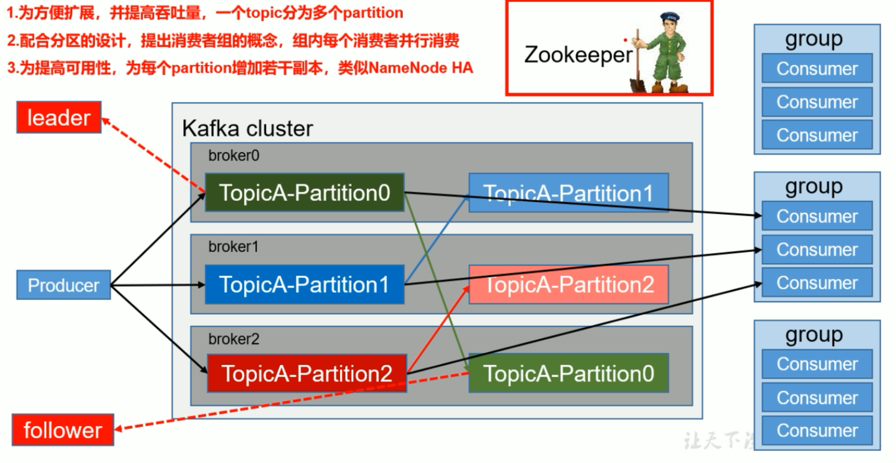

# 认识KafKa

## 1.什么是KafKa：

kafka是一种高吞吐量的分布式发布订阅消息**消息队列**，有如下特性：

- 通过O(1)的磁盘数据结构提供消息的持久化，这种结构对于即使数以TB的消息存储也能够保持长时间的稳定性能。
- 高吞吐量：即使是非常普通的硬件kafka也可以支持每秒数十万的消息。
- 支持通过kafka服务器和消费机集群来分区消息。
- 支持Hadoop并行数据加载。

Kafka的目的是提供一个发布订阅解决方案，它可以处理消费者规模的网站中的所有动作流数据。 这种动作（网页浏览，搜索和其他用户的行动）是在现代网络上的许多社会功能的一个关键因素。 这些数据通常是由于吞吐量的要求而通过处理日志和日志聚合来解决。 对于像Hadoop的一样的日志数据和离线分析系统，但又要求实时处理的限制，这是一个可行的解决方案。kafka的目的是通过Hadoop的并行加载机制来统一线上和离线的消息处理，也是为了通过集群机来提供实时的消费。


在Kafka有几个比较重要的概念：

- broker

  用于标识每一个Kafka服务，当然同一台服务器上可以开多个broker,只要他们的broker id不相同即可

- Topic

  消息主题，从逻辑上区分不同的消息类型

- Partition

  用于存放消息的队列，存放的消息都是有序的，同一主题可以分多个partition，如分多个partiton时，同样会以如partition1存放1,3,5消息,partition2存放2,4,6消息。

- Produce

  消息生产者，生产消息，可指定向哪个topic，topic哪个分区中生成消息。

- Consumer

  消息消费者，消费消息，同一消息只能被同一个consumer group中的consumer所消费。consumer是通过offset进行标识消息被消费的位置。当然consumer的个数取决于此topic所划分的partition，如同一group中的consumer个数大于partition的个数，多出的consumer将不会处理消息。

https://github.com/confluentinc/confluent-kafka-python

使用文档：https://docs.confluent.io/current/clients/confluent-kafka-python/index.html

**Producer**

```python
from confluent_kafka import Producer

# bootstrap.servers 对应的服务器地址，可以有多个mybroker
p = Producer({'bootstrap.servers': 'mybroker1,mybroker2'})

def delivery_report(err, msg):
    """ Called once for each message produced to indicate delivery result.
        Triggered by poll() or flush(). """
    if err is not None:
        print('Message delivery failed: {}'.format(err))
    else:
        print('Message delivered to {} [{}]'.format(msg.topic(), msg.partition()))

for data in some_data_source:
    # Trigger any available delivery report callbacks from previous produce() calls
    p.poll(0)

    # Asynchronously produce a message, the delivery report callback
    # will be triggered from poll() above, or flush() below, when the message has
    # been successfully delivered or failed permanently.
    p.produce('mytopic', data.encode('utf-8'), callback=delivery_report)

# Wait for any outstanding messages to be delivered and delivery report
# callbacks to be triggered.
p.flush()
```

**High-level Consumer**

```python
from confluent_kafka import Consumer, KafkaError


c = Consumer({
    'bootstrap.servers': 'mybroker', # Producer中对应的bootstrap.servers 对应的服务器地址
    'group.id': 'mygroup', 
    'auto.offset.reset': 'earliest' # topic的一些配置
})

c.subscribe(['mytopic']) # 指定消费的topic，与生产时的topic一致

while True:
    msg = c.poll(1.0)

    if msg is None:
        continue
    if msg.error():
        print("Consumer error: {}".format(msg.error()))
        continue

    print('Received message: {}'.format(msg.value().decode('utf-8')))

c.close()
```

## 2.kafka特征：

### 1.在设置一个分区的时候，生产和消费的顺序是一致的，因为只有一个分区。而设置多个分区时，消费获取分区时候是无序的，因此导致生产和消费之间顺序不一致。**分区之间是无序的，分区内的消息是有序的。**

### 2.为了解决多个分区导致的生产与消费之间的顺序不一致，我们需要向指定的分区生产以及消费，代码如下：

**Producer**

```python
from confluent_kafka import Producer

# bootstrap.servers 对应的服务器地址，可以有多个mybroker
p = Producer({'bootstrap.servers': 'mybroker1,mybroker2'})

def delivery_report(err, msg):
    """ Called once for each message produced to indicate delivery result.
        Triggered by poll() or flush(). """
    if err is not None:
        print('Message delivery failed: {}'.format(err))
    else:
        print('Message delivered to {} [{}]'.format(msg.topic(), msg.partition()))

for data in some_data_source:
    # Trigger any available delivery report callbacks from previous produce() calls
    p.poll(0)

    # Asynchronously produce a message, the delivery report callback
    # will be triggered from poll() above, or flush() below, when the message has
    # been successfully delivered or failed permanently.
    # 修改此处设定partition= n, n代表几个分区
    p.produce('mytopic', data.encode('utf-8'), partition=3, callback=delivery_report)

# Wait for any outstanding messages to be delivered and delivery report
# callbacks to be triggered.
p.flush()
```

**High-level Consumer**

```python
from confluent_kafka import Consumer, KafkaError


c = Consumer({
    'bootstrap.servers': 'mybroker', # Producer中对应的bootstrap.servers 对应的服务器地址
    'group.id': 'mygroup', 
    'auto.offset.reset': 'earliest' # topic的一些配置
})

#c.subscribe(['mytopic']) # 指定消费的topic，与生产时的topic一致
# 此处修改，需要消费的分区
tp = TopicPartition("mytopic", 0, 0) # 第一个0是分区，第二个0是auto.offset.reset，不能为负数
c.assign([tp])
c.seek(tp)

while True:
    msg = c.poll(1.0)

    if msg is None:
        continue
    if msg.error():
        print("Consumer error: {}".format(msg.error()))
        continue

    print('Received message: {}'.format(msg.value().decode('utf-8')))

c.close()
```

### 3.在订阅消费模式下（c.subscribe(['mytopic'])），kafka保证每条消息在同一个Consumer Group中只会被某一个Consumer消费，就是同一个组下面的Consumer，A消费了，B就不会消费。

### 4.一个消费者可以同时消费多个topic

### 5.消费者的数量应不多于该topic分区的数量，否则多余的消费者必定无法收到消息

### 6.多个消费者，消费同一个分区，消费到的数据由生产的发往那个分区决定的


# kafka原理

## 基础架构



1. Producer **：**消息生产者，就是向kafka broker发消息的客户端；
2. Consumer **：**消息消费者，向kafka broker取消息的客户端；
3. Consumer Group（CG）：**消费者组，由多个consumer组成。**消费者组内每个消费者负责消费不同分区的数据，一个分区只能由一个消费者消费；消费者组之间互不影响。**所有的消费者都属于某个消费者组，即**消费者组是逻辑上的一个订阅者**。
4. Broker ：一台kafka服务器就是一个broker。一个集群由多个broker组成。一个broker可以容纳多个topic。
5. Topic ：可以理解为一个队列，生产者和消费者面向的都是一个**topic**；
6. Partition：为了实现扩展性，一个非常大的topic可以分布到多个broker（即服务器）上，一个topic可以分为多个partition，每个partition是一个有序的队列；
7. Replica：**副本，为保证集群中的某个节点发生故障时，该节点上的partition数据不丢失，且kafka仍然能够继续工作，kafka提供了副本机制，一个topic的每个分区都有若干个副本，一个**leader**和若干个**follower。
8. leader：每个分区多个副本的“主”，生产者发送数据的对象，以及消费者消费数据的对象都是leader。
9. follower：每个分区多个副本中的“从”，实时从leader中同步数据，保持和leader数据的同步。leader发生故障时，某个follower会成为新的follower。

## kafka工作流程及文件存储机制


Kafka中消息是以**topic**进行分类的，生产者生产消息，消费者消费消息，都是面向topic的。

topic是逻辑上的概念，而partition是物理上的概念，每个partition对应于一个log文件，该log文件中存储的就是producer生产的数据。Producer生产的数据会被不断追加到该log文件末端，且每条数据都有自己的offset。消费者组中的每个消费者，都会实时记录自己消费到了哪个offset，以便出错恢复时，从上次的位置继续消费。

### 文件储存机制


由于生产者生产的消息会不断追加到log文件末尾，为防止log文件过大导致数据定位效率低下，Kafka采取了**分片**和**索引**机制，将每个partition分为多个segment。每个segment对应两个文件——“.index”文件和“.log”文件。这些文件位于一个文件夹下，该文件夹的命名规则为：topic名称+分区序号。例如，first这个topic有三个分区，则其对应的文件夹为first-0,first-1,first-2。


“.index”文件存储大量的索引信息，“.log”文件存储大量的数据，索引文件中的元数据指向对应数据文件中message的物理偏移地址。比如1-237

## 分区策略

#### 生产者Producer

producer发送的数据封装成一个**ProducerRecord**对象。

（1）指明 partition 的情况下，直接将指明的值直接作为 partiton 值；

（2）没有指明 partition 值但有 key 的情况下，将 key 的 hash 值与 topic 的 partition 数进行取余得到 partition 值；

（3）既没有 partition 值又没有 key 值的情况下，第一次调用时随机生成一个整数（后面每次调用在这个整数上自增），将这个值与 topic 可用的 partition 总数取余得到 partition 值，也就是常说的 round-robin 算法。

#### 消费者consumer

一个consumer group中有多个consumer，一个 topic有多个partition，所以必然会涉及到partition的分配问题，即确定那个partition由哪个consumer来消费。

Kafka有两种分配策略，一是roundrobin（默认的），一是range。

## 数据可靠性保证


**副本数据同步策略**

| **方案**                        | **优点**                                           | **缺点**                                            |
| ------------------------------- | -------------------------------------------------- | --------------------------------------------------- |
| **半数以上完成同步，就发送ack** | 延迟低                                             | 选举新的leader时，容忍n台节点的故障，需要2n+1个副本 |
| **全部完成同步，才发送ack**     | 选举新的leader时，容忍n台节点的故障，需要n+1个副本 | 延迟高                                              |

Kafka选择了第二种方案，原因如下：

1.同样为了容忍n台节点的故障，第一种方案需要2n+1个副本，而第二种方案只需要n+1个副本，而Kafka的每个分区都有大量的数据，第一种方案会造成大量数据的冗余。

2.虽然第二种方案的网络延迟会比较高，但网络延迟对Kafka的影响较小。

### 投票的机制：

比如说3台机器，推选一个leader，每个人手里都有一票，可以投自己，发现一个人只要半数以上的票就已经可以成为leader

### ISR

​    采用第二种方案之后，设想以下情景：leader收到数据，所有follower都开始同步数据，但有一个follower，因为某种故障，迟迟不能与leader进行同步，那leader就要一直等下去，直到它完成同步，才能发送ack。这个问题怎么解决呢？

​    Leader维护了一个动态的in-sync replica set (ISR)，意为和leader保持同步的follower集合。当ISR中的follower完成数据的同步之后，leader就会给follower发送ack。如果follower长时间未向leader同步数据，则该follower将被踢出ISR，该时间阈值由**replica.lag.time.max.ms**参数设定。Leader发生故障之后，就会从ISR中选举新的leader。

### ack应答机制

对于某些不太重要的数据，对数据的可靠性要求不是很高，能够容忍数据的少量丢失，所以没必要等ISR中的follower全部接收成功。

所以Kafka为用户提供了三种可靠性级别，用户根据对可靠性和延迟的要求进行权衡，选择以下的配置。

**acks**参数配置：

**acks**：

0：producer不等待broker的ack，这一操作提供了一个最低的延迟，broker一接收到还没有写入磁盘就已经返回，当broker故障时有可能**丢失数据**；

1：producer等待broker的ack，partition的leader落盘成功后返回ack，如果在follower同步成功之前leader故障，那么将会**丢失数据**

-1（all）：producer等待broker的ack，partition的leader和follower全部落盘成功后才返回ack。但是如果在follower同步完成后，broker发送ack之前，leader发生故障，那么会

## 自动提交offset

为了使我们能够专注于自己的业务逻辑，Kafka提供了自动提交offset的功能。 

自动提交offset的相关参数：

**enable.auto.commit**：是否开启自动提交offset功能

**auto.commit.interval.ms**：自动提交offset的时间间隔

## producer发送消息过程


Kafka的Producer发送消息采用的是**异步发送**的方式。在消息发送的过程中，涉及到了两个线程——main线程和Sender线程，以及一个线程共享变量——RecordAccumulator。main线程将消息发送给RecordAccumulator，Sender线程不断从RecordAccumulator中拉取消息发送到Kafka broker。

## 拦截器原理

Producer拦截器(interceptor)是在Kafka 0.10版本被引入的，主要用于实现clients端的定制化控制逻辑。

对于producer而言，interceptor使得用户在消息发送前以及producer回调逻辑前有机会对消息做一些定制化需求，比如修改消息等。同时，producer允许用户指定多个interceptor按序作用于同一条消息从而形成一个拦截链(interceptor chain)。Intercetpor的实现接口是org.apache.kafka.clients.producer.ProducerInterceptor，其定义的方法包括：

（1）configure(configs)

获取配置信息和初始化数据时调用。

（2）onSend(ProducerRecord)：

该方法封装进KafkaProducer.send方法中，即它运行在用户主线程中。Producer确保在消息被序列化以及计算分区前调用该方法。用户可以在该方法中对消息做任何操作，但最好保证不要修改消息所属的topic和分区，否则会影响目标分区的计算。

（3）onAcknowledgement(RecordMetadata, Exception)：

该方法会在消息从RecordAccumulator成功发送到Kafka Broker之后，或者在发送过程中失败时调用。并且通常都是在producer回调逻辑触发之前。onAcknowledgement运行在producer的IO线程中，因此不要在该方法中放入很重的逻辑，否则会拖慢producer的消息发送效率。

（4）close：

关闭interceptor，主要用于执行一些资源清理工作

如前所述，interceptor可能被运行在多个线程中，因此在具体实现时用户需要自行确保线程安全。另外倘若指定了多个interceptor，则producer将按照指定顺序调用它们，并仅仅是捕获每个interceptor可能抛出的异常记录到错误日志中而非在向上传递。这在使用过程中要特别留意。