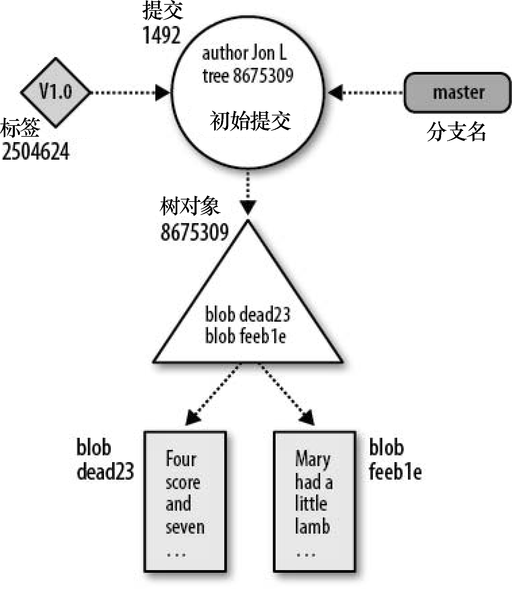
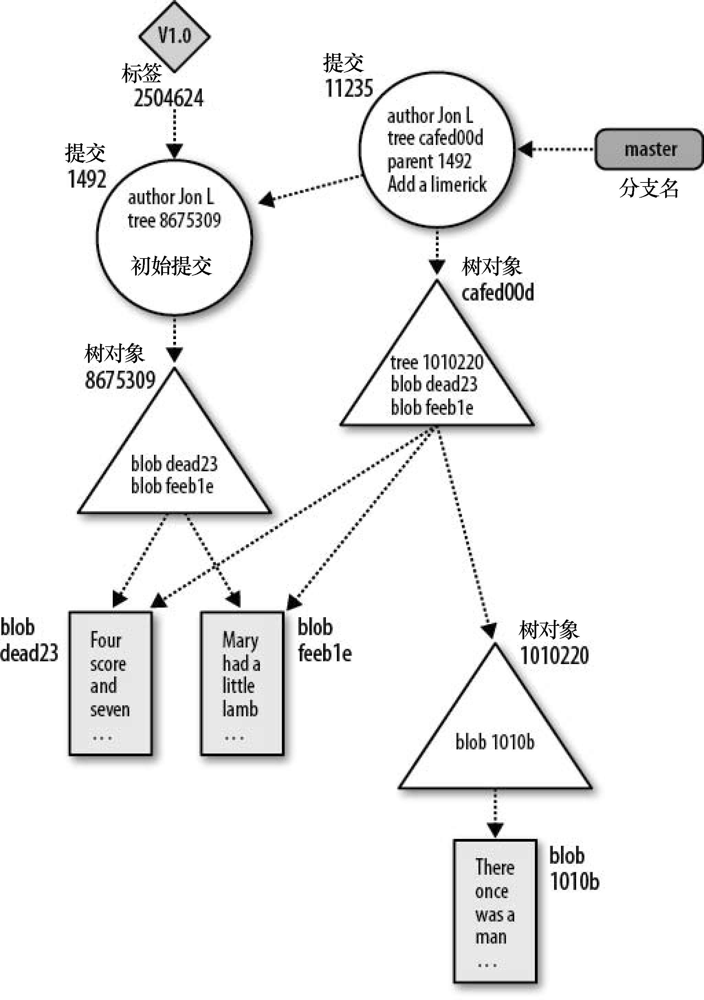
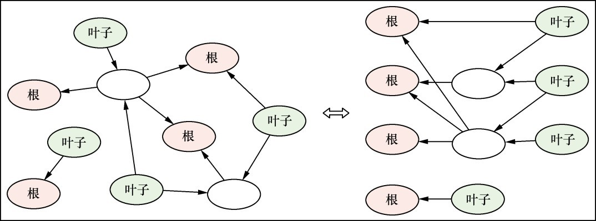

日常用 `git add` / `commit` / `merge` 时，背后其实是对象库、索引和引用在协作。把这几块串起来之后，很多「为什么这样设计」「冲突从哪来」会好理解很多。下面按原理到实践的线索整理一份笔记，方便自己以后复习，也欢迎你对照本地仓库动手试几条底层命令验证。

## 基本原理

Git 维护两个主要的数据结构：**对象库（object store）**和**索引（index）**。

- 对象库是 Git 版本库的核心。它包含原始数据、提交信息、作者与时间等元数据，以及用来重建任意版本或分支所需的信息。
- 索引是一个临时的、动态的二进制文件（`.git/index`），描述整个版本库在某个时刻的目录结构——可以来自历史中的某次提交，也可以是你正在准备的「下一次提交」的状态。

### Git 对象库

Git 在对象库里只放四种类型的对象：**blob（块）**、**tree（目录树）**、**commit（提交）**、**tag（标签）**。

**Blob（文件内容）**

文件的每个版本对应一个 blob。blob 即「二进制大对象」，内容当作黑盒保存；**不包含文件名**，文件名由 tree 记录。

**Tree（目录树）**

一层目录的信息：记录 blob 的标识符、路径名以及目录内文件的元数据；可递归引用子 tree，形成完整目录层次。

**Commit（提交）**

保存每次变更的元数据：作者、提交者、日期、说明等。每个提交指向一棵 **tree**，表示该提交时刻的快照；并指向**父提交**（合并提交可有多个父提交）。

**Tag（标签）**

给某个对象（通常是某次提交）起一个可读的名字；轻量标签与附注标签的行为下面单说。

#### 文件与树

执行 `git add` 时，Git 会为加入的每个**文件内容**创建对象，但**不会立刻为整棵树**新建 tree 对象；更常见的是先更新**索引**。索引跟踪路径名与对应的 blob；`git add`、`git rm`、`git mv` 等会更新索引。

- `git write-tree`：把**当前暂存区（索引）**写成一棵 tree 对象，并打印其哈希。
- `git cat-file -p <hash>`：按对象哈希查看内容（可能是 commit、tree、blob 或 tag 对象）。
- `git ls-files -s`：查看暂存区中的模式、SHA-1 与文件名。常见模式包括：
  - **100644**：普通文件
  - **100755**：可执行文件
  - **120000**：符号链接
  - **160000**：Git 子模块

#### 提交

手动演示底层流程时，可以串联：

1. `git write-tree`：由当前索引得到 tree 的哈希。
2. `git commit-tree <tree-hash> -p <parent> -m "message"`：由 tree 与父提交生成新的 commit 对象。

日常开发中这些步骤由 **`git commit`** 自动完成。查看最近一次提交的完整字段可用：

```bash
git show --pretty=fuller
```

提交对象通常包含：关联的 tree、作者与提交者及时间戳、提交说明等。

#### 标签

附注标签会携带标签名、类型、指向的对象、打标签的人与时间、附注文字等；轻量标签只是指向某提交的引用，没有独立标签对象。

在 Git 中常见两类标签：

1. **轻量标签（Lightweight）**：仅是指向某提交的引用，无额外元数据。
2. **附注标签（Annotated）**：独立对象，可含签名与更完整的元数据，适合发布版本标记。

### 可寻址内容名称

对象库是**内容寻址**存储：每个对象的名称由**对象完整内容**经哈希（经典资料多写 SHA-1；若仓库启用 SHA-256 则对应新算法）得到。内容一变，哈希就变，新版本会作为新对象入库；未改动的文件仍复用旧 blob。

可以用唯一前缀反查完整哈希，例如：

```bash
git rev-parse <短前缀>
```

### Git 追踪的是内容

对象以**内容的哈希**为键，而不是以「磁盘上的路径」为键。路径与文件名由索引与 tree 维护；**Git 追踪的是内容**，同一内容只会存一份 blob。

### 路径名与内容

Git 需要一份明确的文件列表来描述版本库，但**列表不必「按文件名当主键」来设计**。实践中，**文件名被视为与内容分开的一段数据**；重建目录结构时，由路径 + blob 共同完成。

### 文件打包

除松散对象外，Git 会用 **pack 文件**节省空间：对相似内容可做增量存储，并维护索引以便按哈希定位。这与「按内容相似度找差异候选」的打包策略有关，细节属于实现优化，只需知道：**传输与存储常走 pack，逻辑模型仍是对象图**。

与合并、差异相关的常见说法包括：三向合并、最长公共子序列式的行级 diff、delta 压缩、内容寻址等——日常开发只需建立概念对应，不必手写算法。



*图：初始提交场景下的对象关系（示意）*



*图：多次提交后对象与引用的变化（示意）*

## 多任务开发：`git worktree`

同一仓库可以检出多个工作目录，互不干扰，适合一边修线上 bug、一边在长分支上开发：

```bash
git worktree add ../JobCleanerBugFix master
cd ../JobCleanerBugFix
git pull origin master
# … 修改 …
git add xxx.py yyy.py
git commit -m '修复bug'
git push origin master:bugfix
```

## Hook

Git 在特定时机可以执行自定义脚本，常见钩子名包括 `pre-commit`、`commit-msg`、`pre-push` 等。团队里也会用 **pre-commit** 这类框架统一管理检查（如 Python 项目的 `git-pylint-commit-hook` 等）。

### pre-commit 工具示例

```bash
pip install pre-commit
```

在仓库根目录添加 `.pre-commit-config.yaml`，例如：

```yaml
repos:
  - repo: local
    hooks:
      - id: run-local-script
        name: Run Local Script
        entry: bash your_script.sh
        language: system
        files: \.py$
        stages: [commit]
        always_run: true
```

- `files: \.py$`：只对 Python 文件生效。
- `stages: [commit]`：在提交阶段运行。
- `always_run: true`：每次尽量都跑一遍（按你团队策略调整）。

安装钩子：

```bash
pre-commit install
# 输出类似：pre-commit installed at .git/hooks/pre-commit
```

## Git 的 reflog

**引用日志（reflog）**记录 HEAD 与分支引用在一段时间内的移动及原因，默认保留期常见为约 90 天量级（具体以配置为准），可用于找回「以为丢了」的提交。

常用：

```bash
git reflog
git log -g
# 或 git log --walk-reflog
```

## 历史记录查询

除 `git log` 各参数外，可以结合路径、`--since` 等缩小范围；需要按内容搜历史时，下面「差异」一小节会提到 `-S` 等用法。

## 历史版本与缩写 SHA

每个提交都有由内容决定的哈希标识。不必每次写满 40 位十六进制，**一般给出若干位前缀即可**（过短可能在超大仓库里碰撞，实践中常取 8～10 位或视项目规模再加长）。

## 历史的版本关系：有向无环图（DAG）

在分布式版本控制里，提交历史通常建模为 **DAG**：节点是提交，边表示父子关系（父在子之前）。**根节点**没有父提交；**叶节点**没有子节点，常对应某分支当前的最新提交。合并两个原本独立的历史时，可能出现多个根；**孤儿分支**等场景也会产生特殊根。



*图：用 DAG 表示修订关系时，根、叶与分支指针的含义（示意）*

## `.git` 目录与重要文件

常见顶层结构示意：

```text
├── FETCH_HEAD
├── HEAD
├── ORIG_HEAD
├── config
├── description
├── hooks/
├── index
├── info/
├── logs/
├── objects/
├── packed-refs
└── refs/
```

**目录简述**

- **objects/**：松散对象与 pack 的存放位置，是版本数据的物理所在。
- **refs/**：分支、标签等引用；`refs/heads/`、`refs/tags/` 等。
- **hooks/**：钩子脚本。
- **logs/**：引用变更历史（与 `git reflog` 等相关）。
- **info/**：额外信息（如排除规则等，视仓库而定）。

**文件简述**

- **HEAD**：当前检出位置（分支名或某次提交的 SHA）。
- **ORIG_HEAD**：部分危险操作（如 `reset`、`merge`）前保存的 HEAD，便于理解「操作前在哪」。
- **FETCH_HEAD**：最近一次 `fetch` 拉到的引用信息（多远程时更有用）。
- **config**：本仓库配置（远程、用户信息等）。
- **index**：暂存区快照。

### 工作区文件的三种状态

- **已追踪（Tracked）**：已纳入版本库或已在索引中；新文件用 `git add` 纳入追踪。
- **被忽略（Ignored）**：由 `.gitignore` 等规则排除。
- **未追踪（Untracked）**：工作区有、但既未追踪也不在忽略规则里。

停止追踪某文件但保留工作区副本：

```bash
git rm --cached <file>
```

## 分支与标签

分支是**一串提交**的符号名，通常指向该线最新提交。新建提交会在 DAG 上增加节点并移动分支指针。

标签是给某次修订起的**固定名字**（如 `v1.3-rc3`），便于发布与回滚对照；标签指向不变（除非强制改标签，一般不这么做）。

### 分支命名规则（摘要）

- 可用 `/` 分层，但**不能以 `/` 结尾**。
- 不能以 `-` 开头。
- 用 `/` 分段时，段不能以 `.` 开头。
- 不能出现 `..`，以及空格、`~`、`^`、`:`、`?`、`*`、`[` 等 Git 中有特殊含义的字符等（以官方文档为准）。

### 引用的全名

本地分支多在 `refs/heads/` 下，标签在 `refs/tags/` 下；大量引用可打包在 `packed-refs`。`HEAD` 常为符号引用，例如指向 `refs/heads/main`。远程跟踪分支常见如 `refs/remotes/origin/main`。命令行可用：

```bash
git show-ref
```

查看全名与哈希。

## 版本结点与特殊引用（摘要）

- **FETCH_HEAD**：强调「最近一次 fetch 从各 URL 拉到了什么」，拉取后会被更新。
- **ORIG_HEAD**：部分会移动 HEAD 的操作前保存的位置，便于理解回滚上下文（与 reflog 配合使用）。

## 差异

`git diff` 关注**树与树/索引与工作区**之间的差异，不必先讲「文件曾经叫什么」；`git log` 则擅长讲**历史如何演进**。

按内容在历史中搜索增删（示例）：

```bash
git diff -S"octopus" master~50
```

`-S<string>` 关注引入或删除某字符串的提交；`master~50` 表示从当前 `master` 往回数父提交（具体范围以你分支名为准）。

追踪某文件中**某函数**随历史的变化：

```bash
git log -L :<funcname>:path/to/file
```

## 合并

### 常见合并情形

1. **Fast-forward**：目标分支历史只是被合并分支历史的「前缀」时，可直接前移指针，不必产生合并提交。
2. **递归 / 三方合并**：有分叉时找共同祖先，合并两边的改动，通常产生一个合并提交。
3. **Octopus**：一次合并多个分支时使用。
4. **ours**：策略上保留当前侧内容（按场景慎用，先读文档）。
5. **subtree**：与子目录、外部仓库合并相关的策略，适合特定目录树场景。

### 冲突标记

冲突文件中常见：

- `<<<<<<<` 到 `=======`：一侧（常为当前分支）。
- `=======` 到 `>>>>>>>`：另一侧（常为合并进来的分支）。

以你本地配置与工具提示为准，手工编辑后 `git add` 标记已解决。

### 合并策略与 `pull` 行为

新版本 Git 默认合并策略有演进（如 **ort** 与早期的 **recursive** 等），细节以当前 `git help merge` 为准。

`git pull` 可以理解为 `fetch` + 合并或 rebase，可通过配置影响行为，例如：

- `pull.rebase false`：合并时产生合并提交（在需要时）。
- `pull.rebase true`：在拉取后对本分支提交做 rebase。
- `pull.ff only`：只允许快进，否则失败，避免意外合并提交。

### merge 与 rebase 的图形直觉

起始类似：

```text
main:    A --- B --- C
                  \
feature:           X --- Y --- Z
```

**Merge**：在 `main` 上合并 `feature` 时，常得到包含 `C` 与 `Z` 两个父提交的新提交 `M`。

**Rebase**：把 `X、Y、Z` 在 `C` 之上**重放**为 `X'、Y'、Z'`，历史更线性，但改写已推送过的提交需要团队约定（常需 `force-with-lease` 等安全选项）。

## `.gitignore`

**只对未跟踪的文件生效**；已被追踪的文件要停止追踪需用 `git rm --cached` 等配合规则调整。

## 核心要点

- Git 的核心是 **blob / tree / commit / tag** 对象 + **索引**；日常命令多在更新索引与移动引用。
- 对象名由**内容**决定，相同内容共享存储；路径名由 tree 与索引维护。
- **分支**是移动的指针，**标签**多指向固定提交；历史是 **DAG**。
- **`.git`** 下 `objects`、`refs`、`index`、`HEAD` 等各司其职，排查「状态不对」时可从这里理解。
- **合并与 rebase** 改变历史的方式不同：合并保留分叉与合并提交，rebase 追求线性重放。
- **reflog / hooks / worktree** 分别服务恢复、自动化与多工作区并行开发。
