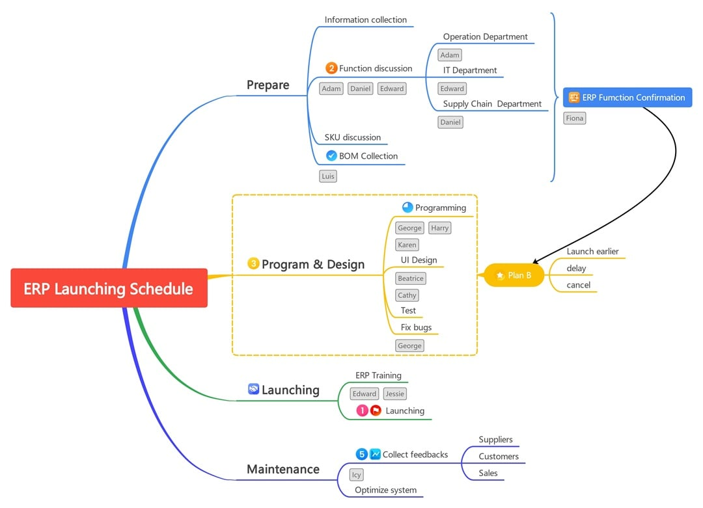
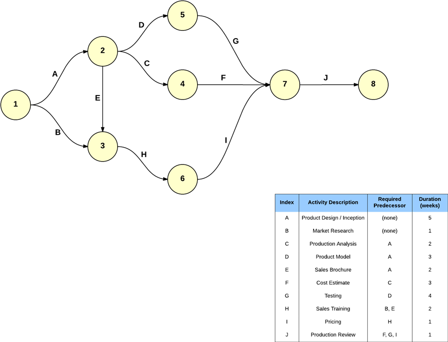
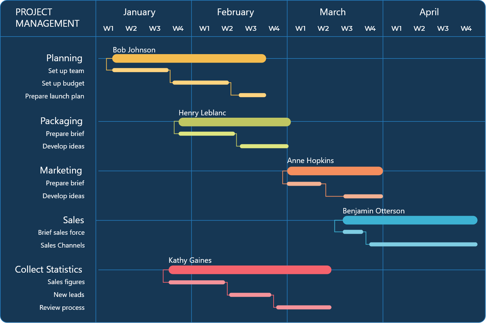
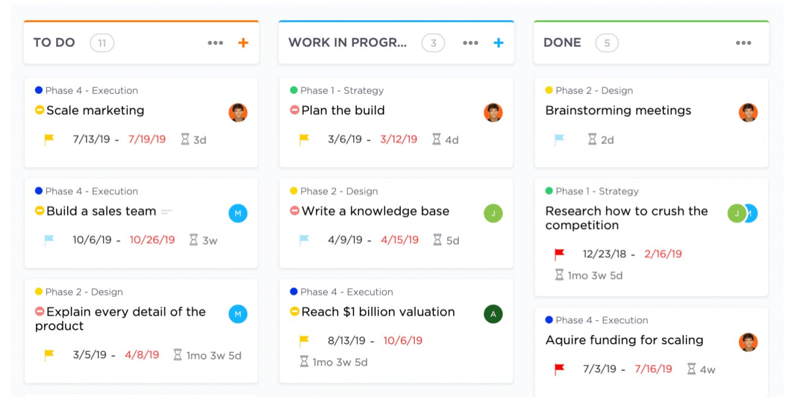
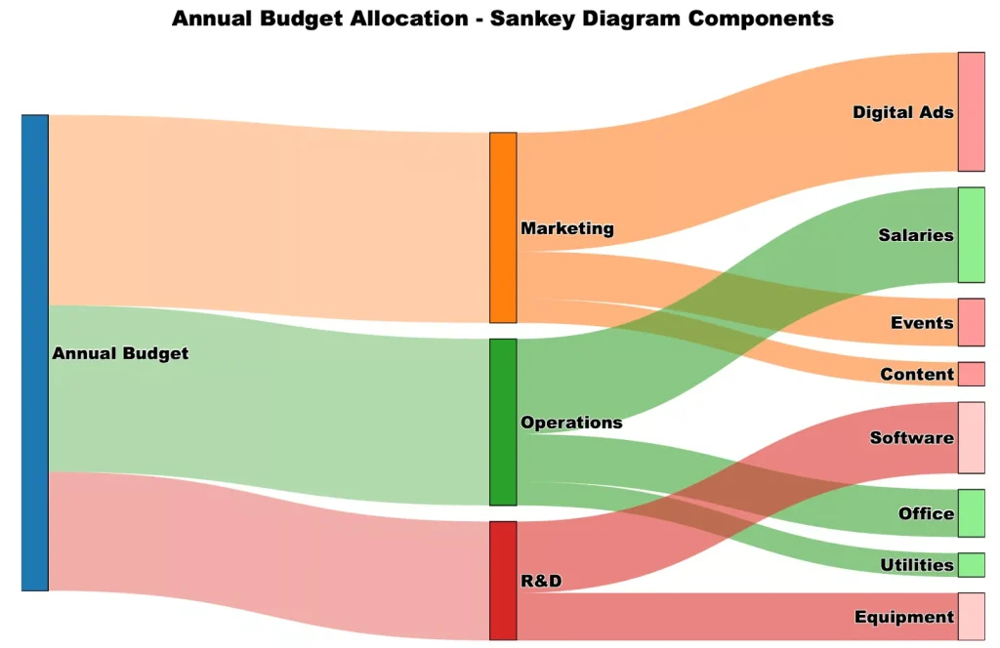
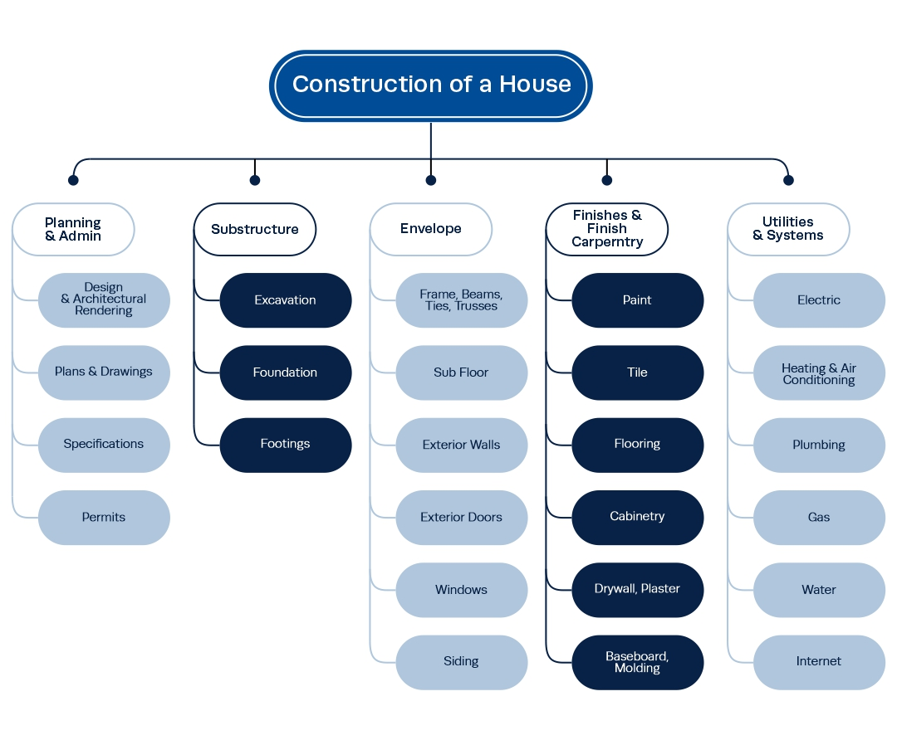
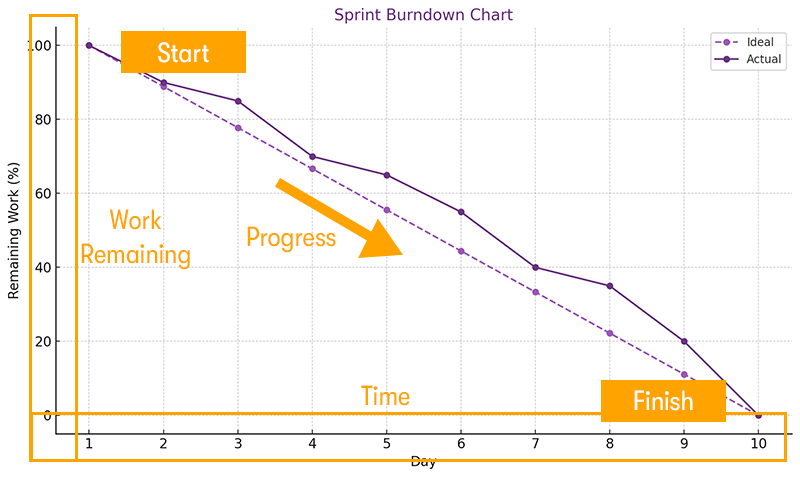
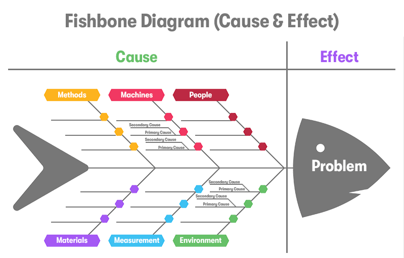
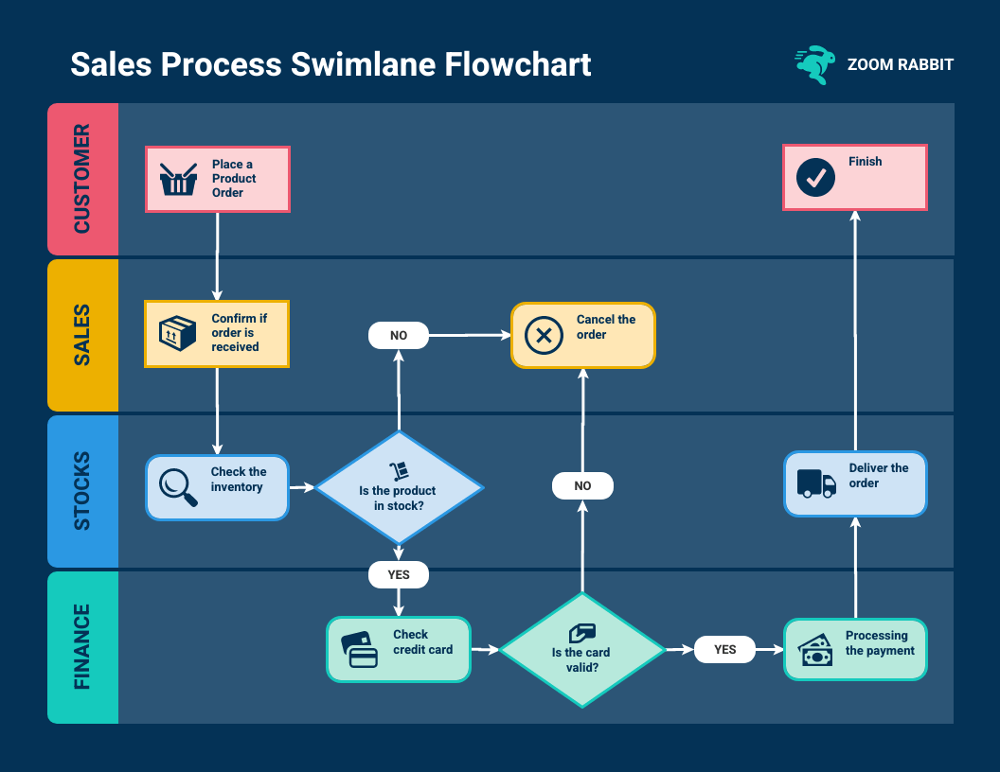

开会时白板画了半天，对方还是问「所以依赖关系在哪」——多半不是画得不够细，而是**图形类型和当下问题不匹配**。下面按「先定范围、再排时间与依赖、再看流动与资源、最后做分解与归因」的顺序，整理九种常见可视化；每种配**本地保存的示意图**和一句**示例说明**，便于你对照选用。若你也在梳理**工作流与可复用交付**，可顺带对照 [Agent Skills：AI 时代的可复用能力封装](https://zhang-jane.github.io/post/cd4fa45f.html)；技术栈与协作形态若在变，脉络可参考 [AI 技能大爆发：VibeCoding、Agent、MCP、OpenClaw 与 Skills 的发展史](https://zhang-jane.github.io/post/e85097cc.html)。

**读完可以带走：**

- 九种图形各自对应的「核心问题」与典型视觉特征。
- 每张图下有一条可套到自己项目里的**示例说明**（软件、建筑、营销、预算等常见场景均可类比）。
- 文末**组合建议**：简单项目与复杂/不确定项目分别优先哪些图。

文中示意图均为教学/产品公开素材。

## 思维导图（Mind Map）——项目范围与脑暴

思维导图常用于**项目启动**时的脑暴和范围分解：**中心主题向外放射**，一层层展开子项，适合把「大而空」的目标拆成可讨论的分支，再导出为 WBS、清单或排期。

_图：项目范围/日程类思维导图结构示意（中心主题 + 分支层次）。_

**示例说明**：以 **ERP 系统上线**为例，可从「准备 → 设计 → 发布 → 维护」拉出主分支，再在每支下挂数据、培训、回滚等子题，适合**复杂项目**先对齐「我们到底要覆盖哪些范围」再细化任务。

## PERT 图（网络图 + 关键路径）——依赖与不确定性

PERT 用**节点与箭线**表示任务先后与汇合：**关键路径**上任意延误会拖垮整体工期，图中常用**粗线或高亮**标出。它和「只列任务表」的差别是：显式回答**谁先谁后、哪里是瓶颈路径**。

_图：活动节点、箭线与关键路径的典型画法。_

**示例说明**：**产品开发**里程碑多、依赖交错时，可画 PERT 网络并配**活动表**（前置任务、乐观/最可能/悲观工期），便于评审时对齐「真正卡在哪一串」；三时估算公式仍为：**预期时间 =（乐观 + 4 × 最可能 + 悲观）÷ 6**。

## 甘特图（Gantt Chart）——时间进度与里程碑

甘特图**横轴为时间**，用条形长度表示任务持续区间，常叠加**进度百分比、里程碑、依赖箭头**。管理者用它回答：**谁在什么时间段做什么、并行与空档在哪里**。

_图：任务条、时间刻度与阶段关系的典型布局。_

**示例说明**：多任务项目管理模板中，可按**周/月**排期，标注负责人与里程碑，用于向干系人同步「当前落到时间轴的哪一段」；与看板相比，甘特更偏**日历上的承诺**，看板更偏**列内流动**。

## 看板（Kanban Board）——工作流与 WIP

看板用**列 + 卡片**表示状态迁移（如 To Do / In Progress / Done），并常用 **WIP 上限**限制在制品，暴露瓶颈。要素仍可记：**视觉信号、列、WIP、承诺点、交付点**；从承诺到交付的时间即**提前期**。发布与协作若走自动化，可与 [Actions + Hexo 博客自动部署](https://zhang-jane.github.io/post/6a366505.html) 一样理解「可视化 + 限制并行 + 明确完成」。

_图：按阶段分列的任务卡与标签、截止等信息的典型排布。_

**示例说明**：**产品开发**看板可按「需求 → 开发 → 测试 → 发布」分列，每张卡带截止与优先级；团队对齐的是**现在卡在哪一列**，而不是一次性排满全年甘特。

## 桑基图（Sankey Diagram）——资源、预算与流量

桑基图中**箭头（带）宽度与流量成比例**，适合表示**分配、转化、损耗**：预算从科目流出、人力从岗位流入产出、用户从步骤流向下一步等。守恒直觉：**汇入与汇出宽度在语义上对应**（视具体定义而定）。

_图：从一组节点到另一组节点的分流与合流。_

**示例说明**：**项目实施**阶段可做人力或任务量的**流量分析**（例如需求来源 → 各模块消耗 → 缺陷回流），用于汇报「资源大头耗在哪里、是否结构失衡」。

## WBS 图（Work Breakdown Structure）——工作分解结构

WBS 把项目从**可交付成果**一层层拆成**更小、可管理、可指派**的工作包，呈**树状层次**，直到满足「可估算、可验证」的粒度。它和思维导图都「自上而下」，但 WBS 更强调**交付物边界**与**编号体系**，常作为范围基线输入进度与成本。

_图：顶层目标向下拆到阶段与工作包。_

**示例说明**：**房屋建造**类项目常按「规划 → 基础 → 围护 → 装修 → 系统」拆 WBS，再挂到甘特或里程碑；软件项目则常按**子系统/模块/迭代**拆包。

## 燃尽图（Burndown Chart）——敏捷剩余工作量

燃尽图用**折线**表示**剩余工作量随迭代时间下降**；常画一条**理想斜线**与**实际线**对比，用于每日站会与迭代复盘：剩余是否按预期下降、是否需调整范围或人力。

_图：纵轴多为剩余故事点或任务量，横轴为 Sprint 内时间。_

**示例说明**：**Sprint** 内跟踪「剩余工作百分比」或故事点，若实际线长期高于理想线，需讨论范围、依赖或障碍；与甘特互补——甘特偏**计划条**，燃尽偏**迭代内收敛速度**。

## 鱼骨图（Fishbone / Ishikawa）——根因分析

鱼骨图从**问题（鱼头）**向两侧伸出**大骨（主因类别）**与**小骨（具体原因）**，常用 **6M**（人、机、料、法、环、测等，可按行业替换）。适合在**缺陷、事故、延期**之后做结构化归因，避免只停在表面结论。

_图：经典因果骨架，类别可自定义。_

**示例说明**：上线故障复盘时，按 **6M** 罗列可能原因，再逐条验证或做试验；与桑基不同，鱼骨回答**「为什么发生」**，桑基常回答**「量如何分配与流动」**。

## 泳道图（Swimlane Flowchart）——跨角色流程

泳道图在**流程图**基础上为每个**部门或角色**画一条「泳道」，步骤落在对应泳道内，**顺序与责任**一目了然，适合**销售、采购、审批、发布**等跨系统、跨人的链路。

_图：客户、销售、库存、财务等角色分列，箭头表示顺序与交接。_

**示例说明**：**销售订单**从意向到开票，可画出客户、销售、仓储、财务各自动作与交接点，再据此优化 SLA 或自动化接口；写 RACI 时也可与泳道对照。

## 怎么选：一句话对照 + 组合建议

| 若你最想问……             | 优先考虑      |
| ------------------------ | ------------- |
| 范围与层次怎么展开       | 思维导图、WBS |
| 任务先后与关键路径       | PERT          |
| 谁在何时做、里程碑在哪   | 甘特图        |
| 工作卡在流程哪一段       | 看板          |
| 资源/预算/流量占比与去向 | 桑基图        |
| 迭代内剩余工作是否收敛   | 燃尽图        |
| 问题根因与分类           | 鱼骨图        |
| 跨角色步骤与交接         | 泳道图        |

**使用建议（可按项目裁剪）：**

- **简单项目**：优先 **看板 + 甘特 + WBS**，够用即可，少叠图种。
- **复杂或高不确定项目**：**PERT + 思维导图 + 鱼骨图（风险/根因）**，计划与复盘各有一套「语言」。
- **资源与预算分析**：**桑基图 + 燃尽图**（敏捷迭代与资源结构一起看）。
- **对外汇报**：常选**简化甘特或里程碑** + **泳道图**讲清责任与时间线。

没有「万能图」。常见做法是：用**思维导图或 WBS** 定范围，用**甘特或看板**落地执行，用**桑基/燃尽**做资源与节奏对话，用**PERT** 处理强依赖网络，用**鱼骨/泳道**做根因与跨角色对齐。若全栈交付里还在权衡接口与运行时，可再读 [全栈开发技术选型：Nuxt Nitro 与 Python 后端如何取舍](https://zhang-jane.github.io/post/64818318.html) 中的维度表，与本文「先定义问题再选表示法」是同一套决策习惯。
